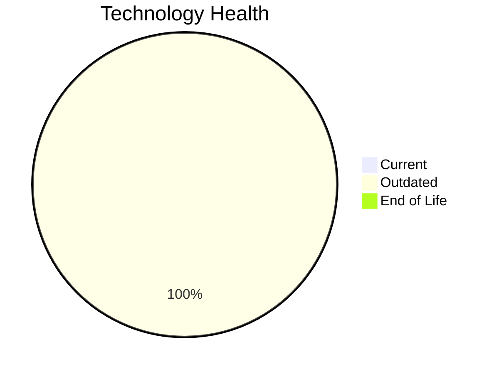

# Application Report: LegacyFinApp-026

**ID:** app026  
**Generated:** 2026-05-06

## Overview

| Attribute | Value |
|-----------|-------|
| Business Unit | Finance |
| Deployment | On-Premise |
| Business Criticality | Critical |
| Users | 150 |
| Servers | sv38 |
| Architecture | 1-Tier |
| Containerized | No |
| CI/CD | No |

## Technology Stack

| Component | Technology | Status |
|-----------|-----------|--------|
| Operating System | AIX 7.2 | 🟡 OUTDATED |
| Database | DB2 | 🟡 OUTDATED |
| Language | FORTRAN 2018 | 🟡 OUTDATED |

## Complexity Assessment

**Score:** 6/10 — **MEDIUM**  
**Confidence:** 8/10

> Complexity score 6/10 (MEDIUM). 3 outdated component(s), Critical business criticality.

| Factor | Score |
|--------|-------|
| Technology Age & EOL | 6/10 |
| Integration Complexity | 3/10 |
| Infrastructure Scale | 4/10 |
| Business Criticality | 9/10 |
| Code & Architecture | 10/10 |
| Data Complexity | 8/10 |

## Modernization Scenarios

### Applicable Scenarios

#### ✅ Operating System Update

- **Priority:** High
- **Effort:** Low
- **Effects:** security
- **Cost:** €1,157 (one-time)
- **Savings:** €500/year
- **Reasoning:** OS (AIX 7.2) is OUTDATED; update to a current, supported version.

#### ✅ Switch to standard Linux Operating System

- **Priority:** Medium
- **Effort:** Medium
- **Effects:** agility, security, cost
- **Cost:** €347 (one-time)
- **Savings:** €400/year
- **Reasoning:** OS (AIX 7.2) is proprietary/commercial; consider migrating to standard Linux.

#### ✅ Application Migration to Cloud Infrastructure (Lift & Shift)

- **Priority:** High
- **Effort:** Low
- **Effects:** security, agility
- **Cost:** €5,783 (one-time)
- **Savings:** €2,700/year
- **Reasoning:** Application is on-premise; cloud migration could reduce infrastructure costs.

#### ✅ Application Containerization

- **Priority:** High
- **Effort:** High
- **Effects:** agility, cost, sustainability
- **Cost:** €115,653 (one-time)
- **Savings:** €90,000/year
- **Reasoning:** Application is not containerized; containerization could improve portability and deployment efficiency.

#### ✅ Application Refactoring and De-coupling

- **Priority:** High
- **Effort:** High
- **Effects:** agility, cost, sustainability
- **Cost:** €289,133 (one-time)
- **Savings:** €135,000/year
- **Reasoning:** Architecture is 1-Tier; refactoring to microservices could improve maintainability.

#### ✅ Upgrade Legacy Databases

- **Priority:** High
- **Effort:** Medium
- **Effects:** security, agility
- **Cost:** €11,565 (one-time)
- **Savings:** €10,000/year
- **Reasoning:** Database (DB2) is outdated; upgrade recommended.

#### ✅ Switch DB Engine to open-source database solution

- **Priority:** High
- **Effort:** Medium
- **Effects:** cost
- **Cost:** N/A (one-time)
- **Savings:** N/A
- **Reasoning:** IBM Db2 requires commercial licensing; migration to PostgreSQL or another OSS DB is recommended.

#### ✅ Update outdated components

- **Priority:** High
- **Effort:** High
- **Effects:** security, agility, cost
- **Cost:** N/A (one-time)
- **Savings:** N/A
- **Reasoning:** Components need updating. Outdated: AIX 7.2, DB2, FORTRAN 2018.

### Other Scenarios

| Scenario | Status | Reason |
|----------|--------|--------|
| Switch to ARM-based CPU | LACK_OF_DATA | CPU architecture not documented in application data. |
| Applications Server replacement | NOT_APPLICABLE | No application server component identified. |

## Financial Summary

| Metric | Value |
|--------|-------|
| Total One-Time Investment | €423,638 |
| Total Annual Savings | €238,600 |
| Break-Even | 1.8 years |
