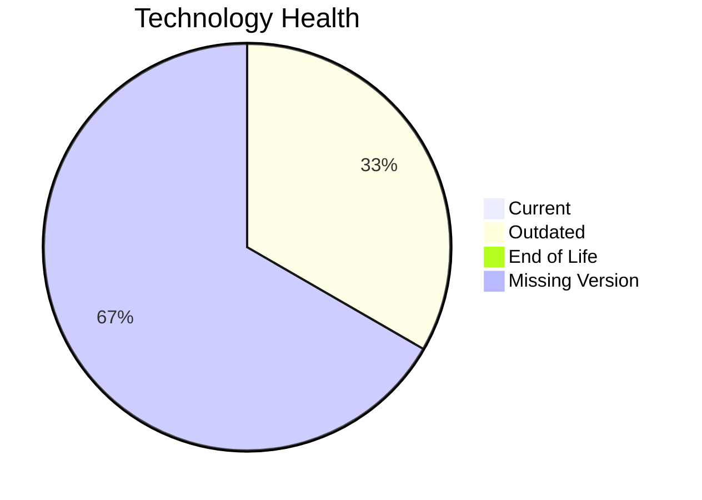

# Application Report: LegacyFinApp-026

**ID:** app026  
**Generated:** 2026-05-17

## Overview

| Attribute | Value |
|-----------|-------|
| Owner | N/A |
| Environment | On-Premise |
| Business Criticality | Critical |
| Users | 150 |
| Servers | 1 |

## Technology Stack

| Component | Technology | Version | Status |
|-----------|-----------|---------|--------|
| Operating System | AIX | 7.2 | 🟡 OUTDATED |
| Database | DB2 | 2 | ⚪ NO_KNOWLEDGE |
| Language | FORTRAN | 2018 | ⚪ NO_KNOWLEDGE |
| Framework | N/A | N/A | ⚪ NO_KNOWLEDGE |
| App Server | N/A | N/A | ⚪ NO_KNOWLEDGE |

## Complexity Assessment

**Score:** 6/10 — **MEDIUM**  
**Confidence:** 6

| Factor | Score | Notes |
|--------|-------|-------|
| Technology Age | 5/10 | One component is outdated. |
| Integration | 3/10 | Limited integration footprint with 1 external interfaces and 0 APIs. |
| Infrastructure | 5/10 | Moderate infrastructure footprint with 1 servers and 2 environments. |
| Business Criticality | 10/10 | Business criticality is Critical. |
| Architecture | 10/10 | not containerized, no CI/CD, legacy monolithic characteristics. |
| Data | 8/10 | 1 database engine(s), 1500 GB storage, database version not fully known. |

## Modernization Scenarios

### Applicable Scenarios

#### ✅ Operating System Update

- **Priority:** High
- **Effort:** Low
- **Effects:** security
- **Cost:** €1157 (one-time)
- **Savings:** €500/year
- **Reasoning:** AIX 7.2 is assessed as OUTDATED, which triggers an OS update scenario.

#### ✅ Switch to standard Linux Operating System

- **Priority:** Medium
- **Effort:** Medium
- **Effects:** agility, security, cost
- **Cost:** €347 (one-time)
- **Savings:** €400/year
- **Reasoning:** AIX 7.2 is a proprietary Unix platform and a candidate for Linux standardization.

#### ✅ Application Migration to Cloud Infrastructure (Lift & Shift)

- **Priority:** High
- **Effort:** Low
- **Effects:** security, agility
- **Cost:** €5783 (one-time)
- **Savings:** €2700/year
- **Reasoning:** Application still runs on-premises or in a hybrid footprint, so lift-and-shift to public cloud remains applicable.

#### ✅ Application Refactoring and De-coupling

- **Priority:** High
- **Effort:** High
- **Effects:** agility, cost, sustainability
- **Cost:** €289133 (one-time)
- **Savings:** €135000/year
- **Reasoning:** Architecture and integration signals point to a tightly coupled design that would benefit from refactoring.

#### ✅ Switch DB Engine to open-source database solution

- **Priority:** High
- **Effort:** Medium
- **Effects:** cost
- **Cost:** €0 (one-time)
- **Savings:** €0/year
- **Reasoning:** DB2 is a proprietary database platform and a candidate for open-source migration.

### Not Applicable / Other

| Scenario | Status | Reason |
|----------|--------|--------|
| Switch to ARM-based CPU | LACK_OF_DATA | CPU architecture is not documented in the workbook, so ARM suitability cannot be assessed confidently. |
| Applications Server replacement | NOT_APPLICABLE | No application server is recorded for this application. |
| Application Containerization | BLOCKED | Legacy Unix / monolithic runtime characteristics make direct containerization unsuitable without prior refactoring. |
| Upgrade Legacy Databases | LACK_OF_DATA | Database engine/version details are insufficient to determine upgrade need. |
| Update outdated components | LACK_OF_DATA | Application component versions are too incomplete for a confident assessment. |

## Financial Summary

| Metric | Value |
|--------|-------|
| Total One-Time Cost | €296420 |
| Total Yearly Savings | €138600 |
| Break-Even | 2.1 years |
