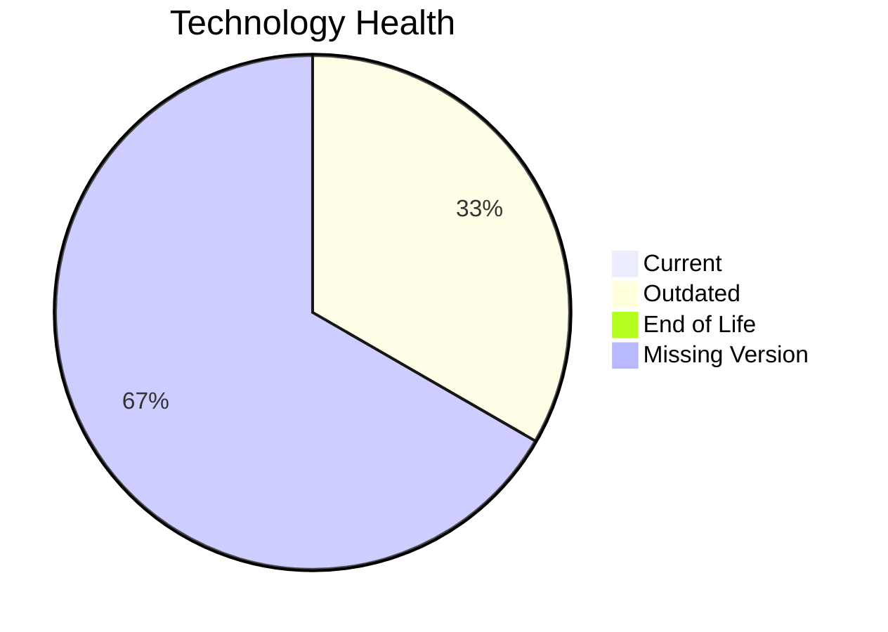

# Application Report: LegacyFinApp-026

**ID:** app026
**Generated:** 2026-05-11

## Overview

| Attribute | Value |
|-----------|-------|
| Owner | Finance |
| Environment | On-Premise |
| Business Criticality | Critical |
| Users | 150 |
| Servers | 1 |

## Technology Stack

| Component | Technology | Version | Status |
|-----------|-----------|---------|--------|
| Operating System | AIX | AIX 7.2 | 🟡 OUTDATED |
| Database | DB2 | DB2 | ⚪ NO_KNOWLEDGE |
| Language | FORTRAN 2018 | FORTRAN 2018 | ⚪ NO_KNOWLEDGE |
| Framework | N/A | N/A | ⚪ |
| App Server | N/A | N/A | ⚪ |

## Complexity Assessment

**Score:** 5/10 — **MEDIUM**
**Confidence:** 7

Technology age score 5/10 (EOL=0, outdated=1, unknown=2); integration score 2/10 (interfaces=1, api_endpoints=0); infrastructure score 2/10 (servers=1, environments=2); business criticality score 9/10 (Critical, users=150); architecture score 8/10 (architecture=1-Tier, CI/CD=No, containerized=No); data score 7/10 (db_count=1, db_storage_gb=1500).

## Modernization Scenarios

### Applicable Scenarios

#### ✅ Operating System Update

- **Priority:** High
- **Effort:** Low
- **Effects:** security
- **Cost:** €1006 (one-time)
- **Savings:** €500/year
- **Reasoning:** Operating system is outdated or end-of-life per technology assessment.

#### ✅ Switch to standard Linux Operating System

- **Priority:** Medium
- **Effort:** Medium
- **Effects:** agility, security, cost
- **Cost:** €302 (one-time)
- **Savings:** €400/year
- **Reasoning:** Application runs on proprietary Unix OS and can be standardized to Linux.

#### ✅ Application Migration to Cloud Infrastructure (Lift & Shift)

- **Priority:** High
- **Effort:** Low
- **Effects:** security, agility
- **Cost:** €5028 (one-time)
- **Savings:** €2700/year
- **Reasoning:** On-premise deployment indicates lift-and-shift opportunity to cloud.

#### ✅ Application Refactoring and De-coupling

- **Priority:** High
- **Effort:** High
- **Effects:** agility, cost, sustainability
- **Cost:** €251420 (one-time)
- **Savings:** €135000/year
- **Reasoning:** Architecture and integration profile indicate decoupling/refactoring opportunity.

#### ✅ Switch DB Engine to open-source database solution

- **Priority:** High
- **Effort:** Medium
- **Effects:** cost
- **Cost:** N/A
- **Savings:** N/A
- **Reasoning:** Proprietary database engine creates open-source migration opportunity.

### Not Applicable / Other

| Scenario | Status | Reason |
|----------|--------|--------|
| Switch to ARM-based CPU | LACK_OF_DATA | CPU architecture (x86/x64/ARM) is not provided in source data. |
| Applications Server replacement | NOT_APPLICABLE | No application server component is used. |
| Application Containerization | LACK_OF_DATA | Containerization prerequisites are unclear from source data. |
| Upgrade Legacy Databases | LACK_OF_DATA | Database version/support information is incomplete. |
| Update outdated components | LACK_OF_DATA | Component version data is incomplete for full assessment. |

## Financial Summary

| Metric | Value |
|--------|-------|
| Total One-Time Cost | €257756 |
| Total Yearly Savings | €138600 |
| Break-Even | 1.9 years |
