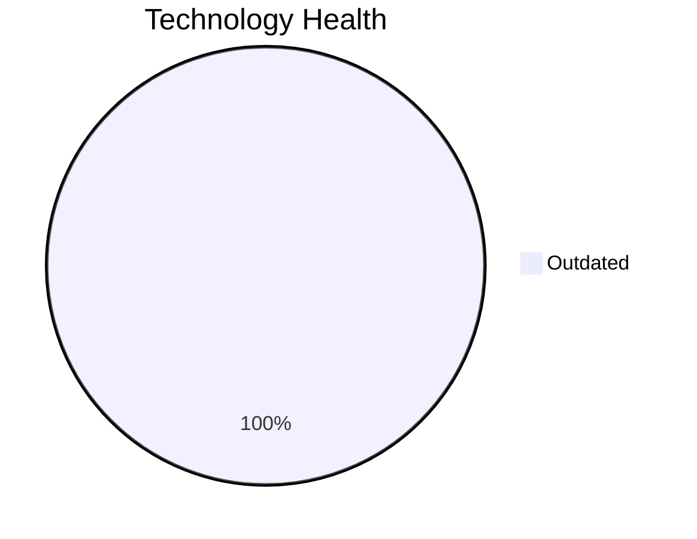

# Application Report: LegacyFinApp-026

**ID:** app026  
**Generated:** 2026-05-05

## Overview

| Attribute | Value |
|-----------|-------|
| Business Unit | Finance |
| Deployment Type | On-Premise |
| Business Criticality | Critical |
| Users | 150 |
| Servers | sv38 |
| Environments | 2 |
| Architecture | 1-Tier |
| Containerized | No |
| CI/CD | No |
| Solution Type | Custom made |
| Data Classification | Confidential |

> Legacy financial modeling system for complex calculations and risk assessments

## Technology Stack

| Component | Technology | Version | Status |
|-----------|-----------|---------|--------|
| Os | AIX | 7.2 | 🟡 OUTDATED |
| Database | IBM Db2 | unknown | 🟡 OUTDATED |
| Language | FORTRAN | 2018 | 🟡 OUTDATED |

## Complexity Assessment

**Score:** 5/10 — **MEDIUM**  
**Confidence:** 7

> Score 5/10 (MEDIUM). EOL components: 0, Outdated: 3. External interfaces: 1. Servers: 1. Criticality: Critical. Architecture: 1-Tier. DB storage: 1500.0GB.

| Factor | Value |
|--------|-------|
| Servers | 1 |
| Environments | 2 |
| External Interfaces | 1 |
| Business Criticality | Critical |
| EOL Technologies | 0 |
| Outdated Technologies | 3 |
| CI/CD | No |
| Containerized | No |

## Modernization Scenarios

### ✅ Applicable Scenarios

#### ✅ Operating System Update

- **Priority:** High
- **Effort:** Low
- **One-Time Cost:** €1,006
- **Yearly Savings:** €500
- **Reasoning:** OS AIX 7.2 is OUTDATED. IBM AIX 7.2 is in its declining support phase. While IBM offers technology refresh updates, AIX 7.2 is aging and not recommended for new deployments. OS update is required.

#### ✅ Switch to Standard Linux OS

- **Priority:** Medium
- **Effort:** Medium
- **One-Time Cost:** €302
- **Yearly Savings:** €400
- **Reasoning:** OS is a proprietary non-standard Unix system (AIX 7.2). Migration to standard Linux (RHEL/Ubuntu) would improve cloud compatibility and reduce licensing costs.

#### ✅ Application Refactoring and De-coupling

- **Priority:** High
- **Effort:** High
- **One-Time Cost:** €251,420
- **Yearly Savings:** €135,000
- **Reasoning:** Application has a 1-tier architecture with limited modularity. Refactoring and decoupling would improve maintainability and cloud-readiness.

#### ✅ Upgrade Legacy Databases

- **Priority:** High
- **Effort:** Medium
- **One-Time Cost:** €10,057
- **Yearly Savings:** €10,000
- **Reasoning:** Database IBM Db2 unknown is OUTDATED. IBM Db2 version not specified. IBM Db2 LTS versions have long support but the version is indeterminate; assessed as OUTDATED based on legacy context. Upgrade is recommended.

#### ✅ Switch DB Engine to Open-Source

- **Priority:** High
- **Effort:** Medium
- **Reasoning:** Application uses IBM Db2, a proprietary licensed database. Migration to PostgreSQL would reduce license costs.

#### ✅ Update Outdated Components

- **Priority:** High
- **Effort:** High
- **Reasoning:** Outdated/EOL application components detected: FORTRAN 2018 (OUTDATED). These should be updated to current supported versions.

### Other Scenarios

| Scenario | Status | Reason |
|----------|--------|--------|
| Switch to ARM-based CPU | ❌ NOT_APPLICABLE | Application runs on proprietary Unix OS (AIX/HP-UX/Solaris) which is excluded from ARM migration. |
| Application Server Replacement | ❌ NOT_APPLICABLE | No application server is used by this application. |
| Application Migration to Cloud (Lift & Shift) | 🔶 PARTIALLY_FULFILLED | Application is on-premise with a legacy/monolithic architecture (1-tier). Lift & Shift is possible but refactoring may b... |
| Application Containerization | ❌ NOT_APPLICABLE | Application uses a proprietary legacy Unix OS (AIX/Solaris) which is excluded from containerization. |

## Financial Summary

| Metric | Value |
|--------|-------|
| Total One-Time Cost | €262,785 |
| Total Yearly Savings | €145,900 |
| Break-Even | 1.8 years |
