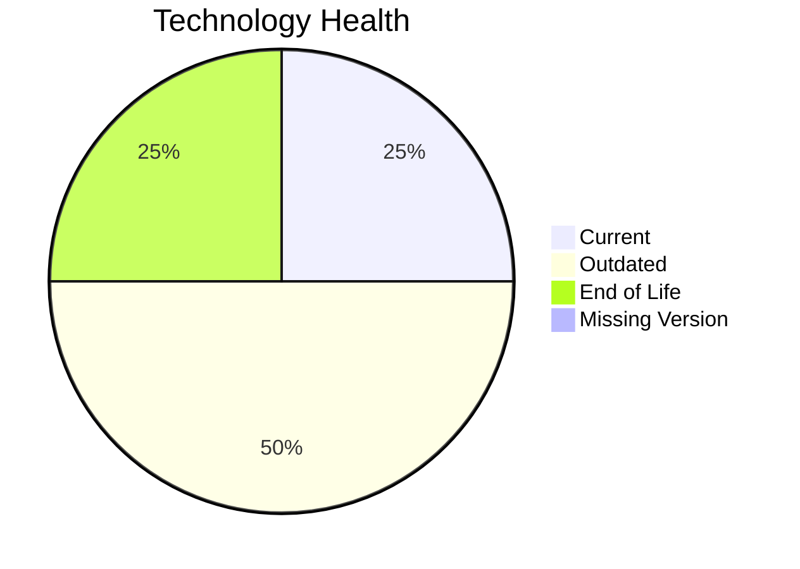

# Application Report: DataWarehouseApp-027

**ID:** app027
**Generated:** 2026-05-18T00:00:00Z

## Overview

| Attribute | Value |
|-----------|-------|
| Owner | BI |
| Environment | AWS, On-premise |
| Business Criticality | High |
| Users | 320 |
| Servers | 2 |

## Technology Stack

| Component | Technology | Version | Status |
|-----------|-----------|---------|--------|
| Operating System | RHEL | 7 | 🔴 EOL |
| Database | SQL Server | 2022 | 🟢 CURRENT_VERSION |
| Language | Java | 11 | 🟡 OUTDATED |
| Framework | N/A | N/A | ⚪ N/A |
| App Server | WebSphere | 8.5 | 🟡 OUTDATED |

## Complexity Assessment

**Score:** 6/10 — **MEDIUM**
**Confidence:** 8

| Factor | Score | Notes |
|--------|-------|-------|
| Technology Age | 7/10 | 1 component(s) are EOL. |
| Integration | 8/10 | 20 external interfaces and 5 API endpoints. |
| Infrastructure | 6/10 | 2 server instance(s) across 3 environment(s). |
| Business Criticality | 7/10 | Criticality is High with 320 users. |
| Architecture | 3/10 | Architecture is 3-Tier; containerized=No; CI/CD=Yes. |
| Data | 6/10 | Database storage is 5000 GB on SQL Server 2022.  |

## Modernization Scenarios

### Applicable Scenarios

#### ✅ Operating System Update

- **Priority:** High
- **Effort:** Low
- **Effects:** security
- **Cost:** €1,157 (one-time)
- **Savings:** €500/year
- **Reasoning:** RHEL 7 is assessed as EOL.

#### ✅ Applications Server replacement

- **Priority:** Medium
- **Effort:** Medium
- **Effects:** agility, cost
- **Cost:** €11,565 (one-time)
- **Savings:** €10,800/year
- **Reasoning:** Websphere 8.5 is assessed as OUTDATED, which directly triggers server replacement.

#### ✅ Application Containerization

- **Priority:** High
- **Effort:** High
- **Effects:** agility, cost, sustainability
- **Cost:** €115,653 (one-time)
- **Savings:** €90,000/year
- **Reasoning:** The application is not yet containerized and the runtime/OS stack is compatible with container packaging.

#### ✅ Application Refactoring and De-coupling

- **Priority:** High
- **Effort:** High
- **Effects:** agility, cost, sustainability
- **Cost:** €289,133 (one-time)
- **Savings:** €135,000/year
- **Reasoning:** Architecture and integration signals indicate a tightly coupled estate that would benefit from refactoring.

#### ✅ Switch DB Engine to open-source database solution

- **Priority:** High
- **Effort:** Medium
- **Effects:** cost
- **Cost:** €N/A (one-time)
- **Savings:** €N/A/year
- **Reasoning:** SQL Server 2022 is a proprietary engine, so moving to an open-source database is a valid modernization option.

#### ✅ Update outdated components

- **Priority:** High
- **Effort:** High
- **Effects:** security, agility, cost
- **Cost:** €N/A (one-time)
- **Savings:** €N/A/year
- **Reasoning:** At least one application runtime component is outdated or end of life.

### Not Applicable / Other

| Scenario | Status | Reason |
|----------|--------|--------|
| Switch to standard Linux Operating System | PARTIALLY_FULFILLED | The application already runs on Linux, but the current distribution/version is outdated or unsupported. |
| Switch to ARM-based CPU | LACK_OF_DATA | CPU architecture is not documented in the workbook, so ARM suitability cannot be confirmed. |
| Application Migration to Cloud Infrastructure (Lift & Shift) | PARTIALLY_FULFILLED | The application is already partly on AWS but still has on-premise deployment, so lift-and-shift is only partially complete. |
| Upgrade Legacy Databases | FULFILLED | SQL Server 2022 is already on a supported modern database release. |

## Financial Summary

| Metric | Value |
|--------|-------|
| Total One-Time Cost | €417,508 |
| Total Yearly Savings | €236,300 |
| Break-Even | 1.8 years |
