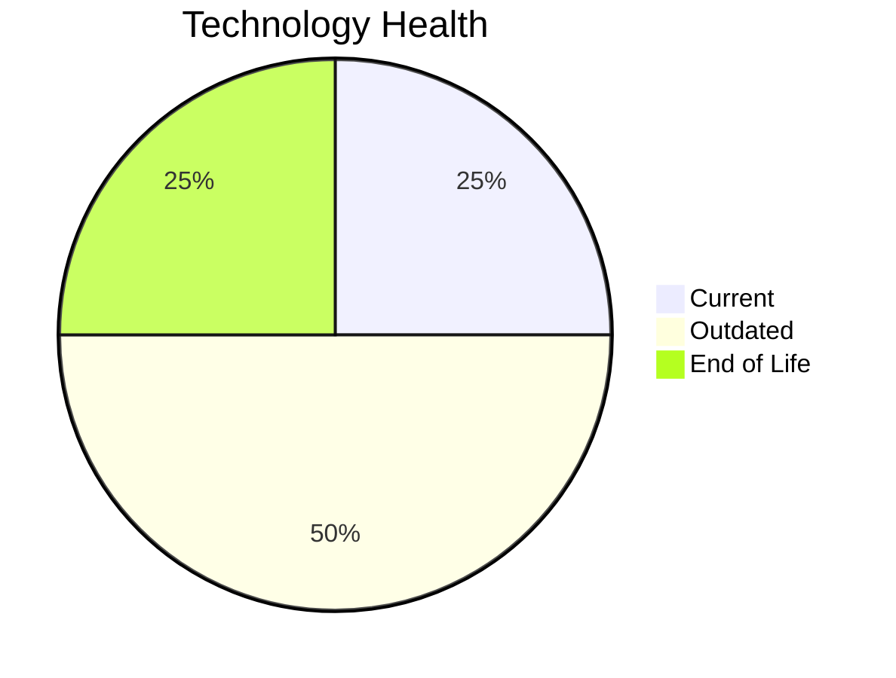

# Application Report: DataWarehouseApp-027

**ID:** app027  
**Generated:** 2026-05-05

## Overview

| Attribute | Value |
|-----------|-------|
| Business Unit | BI |
| Deployment Type | AWS, On-premise |
| Business Criticality | High |
| Users | 320 |
| Servers | sv39, sv40 |
| Environments | 3 |
| Architecture | 3-Tier |
| Containerized | No |
| CI/CD | Yes |
| Solution Type | Custom made |
| Data Classification | Internal |

> Enterprise data warehouse for consolidating business data from multiple sources

## Technology Stack

| Component | Technology | Version | Status |
|-----------|-----------|---------|--------|
| Os | RHEL | 7 | 🔴 EOL |
| Database | SQL Server | 2022 | 🟢 CURRENT_VERSION |
| Language | Java | 11 | 🟡 OUTDATED |
| Application Server | IBM WebSphere | 8.5 | 🟡 OUTDATED |

## Complexity Assessment

**Score:** 7/10 — **HIGH**  
**Confidence:** 7

> Score 7/10 (HIGH). EOL components: 1, Outdated: 2. External interfaces: 20. Servers: 2. Criticality: High. Architecture: 3-Tier. DB storage: 5000.0GB.

| Factor | Value |
|--------|-------|
| Servers | 2 |
| Environments | 3 |
| External Interfaces | 20 |
| Business Criticality | High |
| EOL Technologies | 1 |
| Outdated Technologies | 2 |
| CI/CD | Yes |
| Containerized | No |

## Modernization Scenarios

### ✅ Applicable Scenarios

#### ✅ Operating System Update

- **Priority:** High
- **Effort:** Low
- **One-Time Cost:** €1,330
- **Yearly Savings:** €500
- **Reasoning:** OS RHEL 7 is EOL. RHEL 7 reached End of Maintenance Support on June 30, 2024. No security updates without ELS. OS update is required.

#### ✅ Application Server Replacement

- **Priority:** Medium
- **Effort:** Medium
- **One-Time Cost:** €13,300
- **Yearly Savings:** €9,600
- **Reasoning:** Application server IBM WebSphere 8.5 is OUTDATED. IBM WebSphere 8.5.5 is in extended support until September 2025; approaching end of life. Replacement with a modern server is recommended.

#### ✅ Application Migration to Cloud (Lift & Shift)

- **Priority:** High
- **Effort:** Low
- **One-Time Cost:** €6,650
- **Yearly Savings:** €2,400
- **Reasoning:** Application has hybrid deployment (on-premise + cloud). Remaining on-premise components can be migrated to cloud.

#### ✅ Application Containerization

- **Priority:** High
- **Effort:** High
- **One-Time Cost:** €133,001
- **Yearly Savings:** €80,000
- **Reasoning:** Application is not containerized and runs on a compatible OS (RHEL 7). Containerization would improve deployment consistency and portability.

#### ✅ Switch DB Engine to Open-Source

- **Priority:** High
- **Effort:** Medium
- **Reasoning:** Application uses SQL Server (SQL Server 2022), a proprietary Microsoft database. Migration to PostgreSQL would reduce licensing costs.

#### ✅ Update Outdated Components

- **Priority:** High
- **Effort:** High
- **Reasoning:** Outdated/EOL application components detected: Java 11 (OUTDATED), IBM WebSphere 8.5 (OUTDATED). These should be updated to current supported versions.

### Other Scenarios

| Scenario | Status | Reason |
|----------|--------|--------|
| Switch to Standard Linux OS | ✔️ FULFILLED | Application already runs on a Linux-based OS (RHEL 7). However, OS version is EOL; upgrade (os_update_security_patch) is... |
| Switch to ARM-based CPU | ❓ LACK_OF_DATA | CPU architecture is not explicitly documented in the application record. ARM eligibility cannot be confirmed. |
| Application Refactoring and De-coupling | ❓ LACK_OF_DATA | Insufficient architecture details to determine if full decoupling is needed. |
| Upgrade Legacy Databases | ✔️ FULFILLED | Database SQL Server 2022 is on a current supported version. |

## Financial Summary

| Metric | Value |
|--------|-------|
| Total One-Time Cost | €154,281 |
| Total Yearly Savings | €92,500 |
| Break-Even | 1.7 years |
