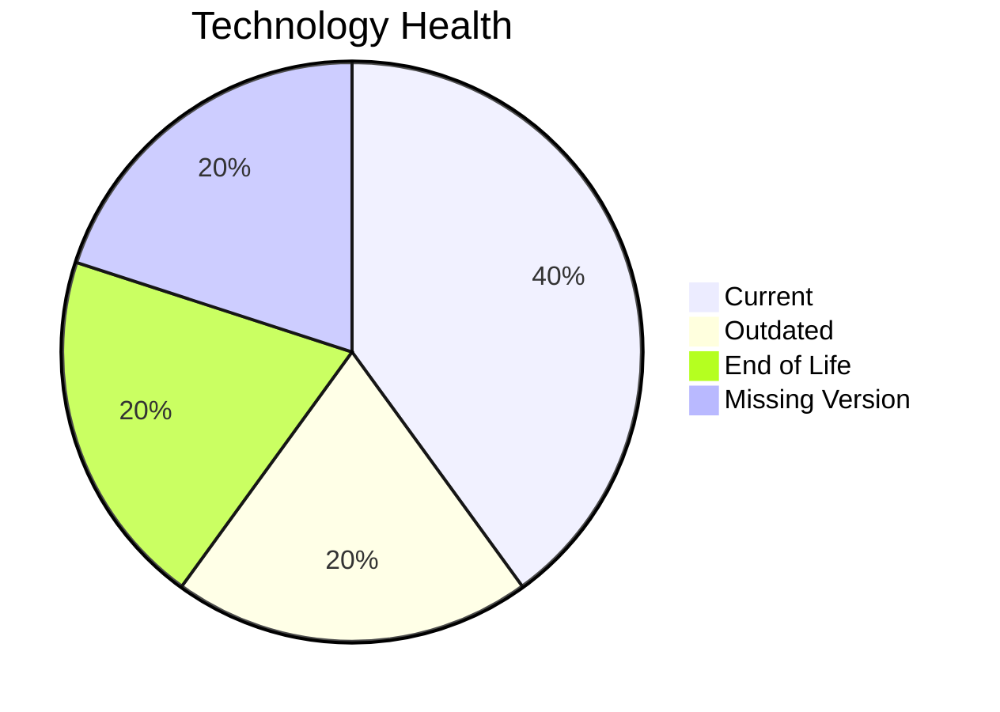

# Application Report: DataWarehouseApp-027

**ID:** app027
**Generated:** 2026-05-14

## Overview

| Attribute | Value |
|-----------|-------|
| Owner | BI |
| Environment | AWS, On-premise |
| Business Criticality | High |
| Users | 320 |
| Servers | sv39, sv40 |

## Technology Stack

| Component | Technology | Status |
|-----------|-----------|--------|
| Operating System | RHEL 7 | 🔴 |
| Database | SQL Server 2022 | 🟢 |
| Language | Java 11 | 🟡 |

## Complexity Assessment

**Score:** 6/10 — **MEDIUM**

## Modernization Scenarios

### ✅ Os Update Security Patch
- **Reasoning:** EOL operating system/server components require security remediation.

### ✅ Switch To Arm Cpu
- **Reasoning:** Cloud-hosted workload with manageable complexity is a candidate for ARM.

### ✅ Application Server Replacement
- **Reasoning:** Legacy application server version should be replaced.

### ✅ App Deployment To Cloud
- **Reasoning:** On-premise deployment model is a direct cloud-migration opportunity.

### ✅ App Containerization
- **Reasoning:** Application is not containerized and can benefit from platform standardization.

## Financial Summary

| Metric | Value |
|--------|-------|
| Total One-Time Cost | €463770 |
| Total Yearly Savings | €264900 |
| Break-Even | 1.8 years |
