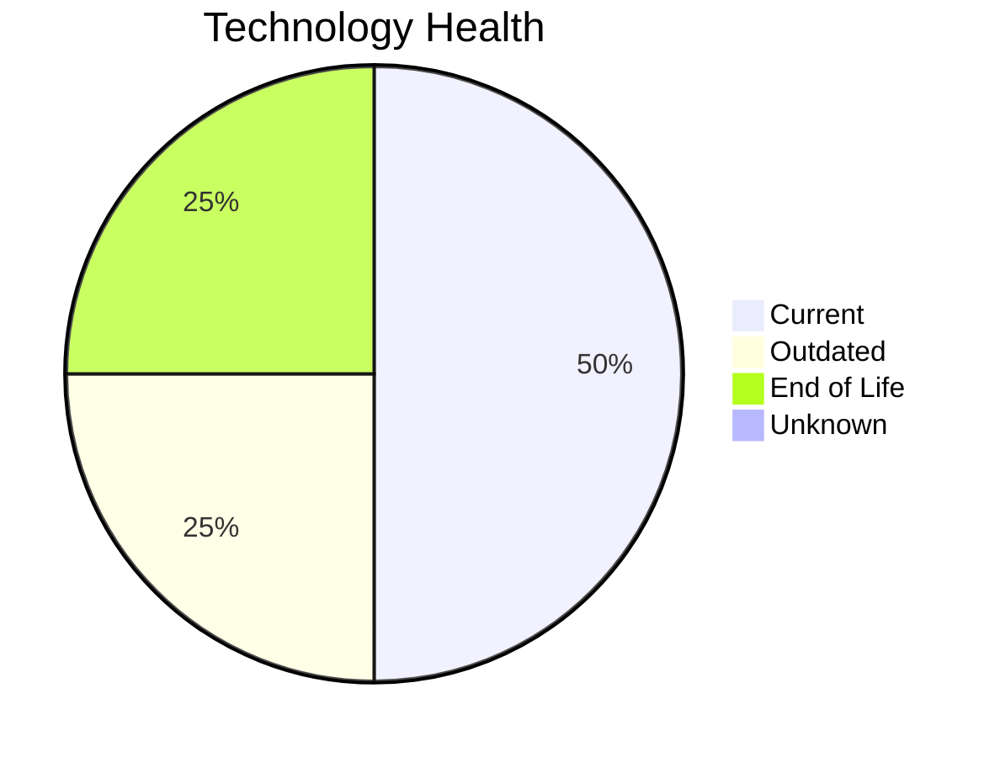

# Application Report: DataWarehouseApp-027

**ID:** app027
**Generated:** 2026-05-14

## Overview

| Attribute | Value |
|-----------|-------|
| Owner | BI |
| Environment | AWS, On-premise |
| Business Criticality | High |
| Users | 320 |
| Servers | 2 |
| Solution Type | Custom made |
| Architecture | 3-Tier |
| Containerized | No |
| CI/CD | Yes |

## Technology Stack

| Component | Technology | Version | Status |
|-----------|-----------|---------|--------|
| Os | RHEL 7 | 7 | 🔴 EOL |
| Database | SQL Server 2022 | Server 2022 | 🟢 CURRENT_VERSION |
| Programming Language | Java 11 | 11 | 🟢 CURRENT_VERSION |
| Application Server | Websphere 8.5 | 8.5 | 🟡 OUTDATED |

## Complexity Assessment

**Score:** 7/10 — **HIGH**
**Confidence:** 8/10

| Factor | Score | Notes |
|--------|-------|-------|
| Technology Age | 7/10 | 1 EOL, 1 outdated components |
| Integration | 9/10 | 20 external interfaces |
| Infrastructure | 6/10 | 2 server(s), 3 environment(s) |
| Business Criticality | 7/10 | High criticality |
| Architecture | 3/10 | Containerized: No, CI/CD: Yes |
| Data | 5/10 | DB: SQL Server 2022 |

## Modernization Scenarios

### Applicable Scenarios

#### ✅ Operating System Update

- **Priority:** High
- **Effort:** Low
- **Effects:** security
- **Cost:** €1,330 (one-time)
- **Savings:** €500/year
- **Reasoning:** Operating system RHEL 7 has reached End of Life and no longer receives security patches. Immediate OS update required.

#### ✅ Applications Server replacement

- **Priority:** Medium
- **Effort:** Medium
- **Effects:** agility, cost
- **Cost:** €13,300 (one-time)
- **Savings:** €9,600/year
- **Reasoning:** Application server Websphere 8.5 is outdated. Replacement with a modern alternative will improve security and reduce licensing costs.

#### ✅ Application Containerization

- **Priority:** High
- **Effort:** High
- **Effects:** agility, cost, sustainability
- **Cost:** €133,001 (one-time)
- **Savings:** €80,000/year
- **Reasoning:** Application is custom-developed, runs on Linux, and is not yet containerized. Good candidate for containerization to improve portability and resource efficiency.

#### ✅ Switch DB Engine to open-source database solution

- **Priority:** High
- **Effort:** Medium
- **Effects:** cost
- **Cost:** €33,250 (one-time)
- **Savings:** €15,000/year
- **Reasoning:** Application uses proprietary database SQL Server 2022. Migration to an open-source alternative would reduce costs.

#### ✅ Update outdated components

- **Priority:** High
- **Effort:** High
- **Effects:** security, agility, cost
- **Cost:** N/A (one-time)
- **Savings:** N/A/year
- **Reasoning:** Application has outdated components: application server Websphere 8.5 is outdated. Update recommended.

### Not Applicable / Other

| Scenario | Status | Reason |
|----------|--------|--------|
| Switch to standard Linux Operating System | ✔️ FULFILLED | Application already runs on standard Linux (RHEL 7). No migration needed. |
| Switch to ARM-based CPU | ⚠️ PARTIALLY_FULFILLED | Application runs on Linux (ARM-compatible) and is custom-developed, but is not yet containerized. AR... |
| Application Migration to Cloud Infrastructure (Lift & Shift) | ⚠️ PARTIALLY_FULFILLED | Application has hybrid deployment (AWS, On-premise). Partial cloud migration is in place; full cloud... |
| Application Refactoring and De-coupling | ⚠️ PARTIALLY_FULFILLED | Application has 3-Tier architecture (moderately decoupled) but is not yet containerized or cloud-nat... |
| Upgrade Legacy Databases | ✔️ FULFILLED | Database SQL Server 2022 is on a current, supported version. No upgrade needed. |

## Financial Summary

| Metric | Value |
|--------|-------|
| Total One-Time Cost | €180,881 |
| Total Yearly Savings | €105,100 |
| Break-Even | 1.7 years |
