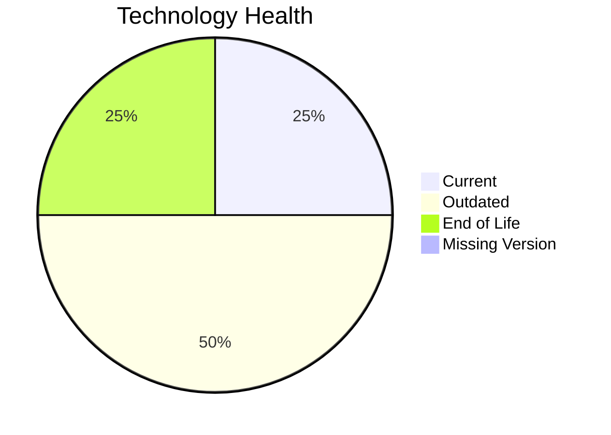

# Application Report: DataWarehouseApp-027

**ID:** app027  
**Generated:** 2026-05-13

## Overview
| Attribute | Value |
|---|---|
| Owner | BI |
| Environment | AWS, On-premise |
| Business Criticality | High |
| Users | 320 |
| Servers | 2 |

## Technology Stack
| Component | Technology | Status |
|---|---|---|
| Operating System | RHEL 7 | 🔴 EOL |
| Language | Java 11 | 🟡 OUTDATED |
| Application Server | Websphere 8.5 | 🟡 OUTDATED |
| Database | SQL Server 2022 | 🟢 CURRENT_VERSION |

## Complexity Assessment
**Score:** 7/10 — **HIGH**  
**Confidence:** Medium

## Modernization Scenarios
| Applicable Scenario | Priority | Cost | Savings/Year |
|---|---|---:|---:|
| Operating System Update | High | €1330 | €500 |
| Applications Server replacement | Medium | €13300 | €9600 |
| Application Containerization | High | €133001 | €80000 |
| Application Refactoring and De-coupling | High | €332502 | €120000 |
| Switch DB Engine to open-source database solution | High | €N/A | €N/A |
| Update outdated components | High | €N/A | €N/A |

## Financial Summary
| Metric | Value |
|---|---:|
| Total One-Time Cost | €480133 |
| Total Yearly Savings | €210100 |
| Break-Even | 2.3 years |
