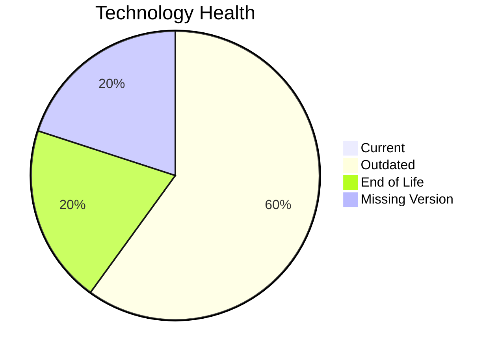

# Application Report: DataWarehouseApp-027

**ID:** app027  
**Generated:** 2026-05-14

## Overview

| Attribute | Value |
|-----------|-------|
| Owner | unknown |
| Environment | AWS, On-premise |
| Business Criticality | High |
| Users | 320 |
| Servers | sv39, sv40 |

## Technology Stack

| Component | Technology | Version | Status |
|-----------|-----------|---------|--------|
| os | RHEL 7 | 7 | 🔴 EOL |
| database | SQL Server 2022 | 2022 | 🟡 OUTDATED |
| language | Java 11 | 11 | 🟡 OUTDATED |
| framework | Framework | unknown | ⚪ NO_KNOWLEDGE |
| app_server | Websphere 8.5 | 8.5 | 🟡 OUTDATED |

## Complexity Assessment

**Score:** 7/10 — **HIGH**  
**Confidence:** 8

**Reasoning:** Tech age 8/10 (1 EOL, 3 outdated components), integrations 20 interfaces and 0 dependencies, infrastructure 2 servers/3 environments, criticality High, architecture score 4/10, data score 7/10.

## Modernization Scenarios

### Applicable Scenarios

#### ✅ Operating System Update
- **Cost:** €1330 (one-time)
- **Savings:** €500/year
- **Reasoning:** RHEL 7 requires upgrade/security patching.
#### ✅ Switch to ARM-based CPU
- **Cost:** €6650 (one-time)
- **Savings:** €1000/year
- **Reasoning:** Cloud-hosted workload can be evaluated for ARM-based instances.
#### ✅ Applications Server replacement
- **Cost:** €13300 (one-time)
- **Savings:** €9600/year
- **Reasoning:** Application server Websphere 8.5 is outdated/EOL.
#### ✅ Application Containerization
- **Cost:** €133001 (one-time)
- **Savings:** €80000/year
- **Reasoning:** Containerization could improve portability and operations.
#### ✅ Upgrade Legacy Databases
- **Cost:** €13300 (one-time)
- **Savings:** €10000/year
- **Reasoning:** Database SQL Server 2022 is legacy/outdated.

### Not Applicable / Other

| Scenario | Status | Reason |
|----------|--------|--------|
| Switch to standard Linux Operating System | FULFILLED | Application already runs on a standard Linux platform. |
| Application Migration to Cloud Infrastructure (Lift & Shift) | PARTIALLY_FULFILLED | Hybrid deployment detected; further cloud migration possible. |
| Application Refactoring and De-coupling | PARTIALLY_FULFILLED | Architecture shows partial decoupling already. |
| Switch DB Engine to open-source database solution | APPLICABLE | Proprietary database engine indicates open-source migration opportunity. |
| Update outdated components | APPLICABLE | Outdated or EOL components identified in technology assessment. |

## Financial Summary

| Metric | Value |
|--------|-------|
| Total One-Time Cost | €167581 |
| Total Yearly Savings | €101100 |
| Break-Even | 1.7 years |
