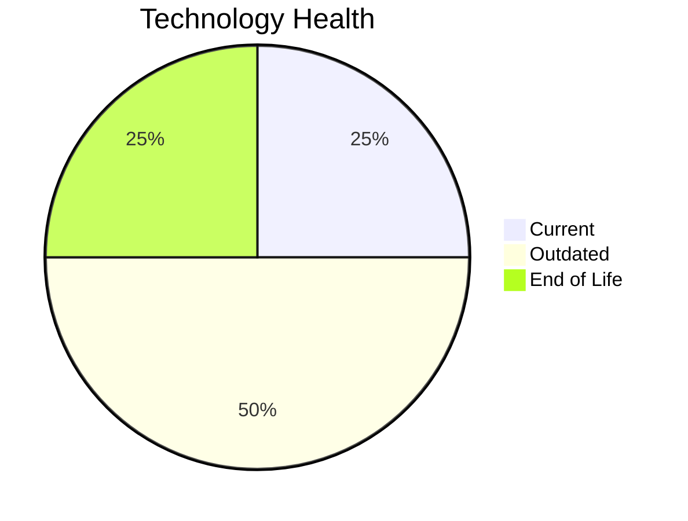

# Application Report: DataWarehouseApp-027

**ID:** app027
**Generated:** 2026-05-14

## Overview

| Attribute | Value |
|-----------|-------|
| Business Unit | BI |
| Business Criticality | High |
| Solution Type | Custom made |
| Deployment Type | AWS, On-premise |
| Users | 320 |
| Servers | 2 |
| External Interfaces | 20 |
| Containerized | No |
| CI/CD Present | Yes |
| Architecture | 3-Tier |

## Technology Stack

| Component | Technology | Version | Status |
|-----------|-----------|---------|--------|
| Os | RHEL | 7 | 🔴 EOL |
| Language | Java | 11 | 🟡 OUTDATED |
| Database | SQL Server | 2022 | 🟢 CURRENT_VERSION |
| App Server | WebSphere | 8.5 | 🟡 OUTDATED |

## Complexity Assessment

**Score:** 7/10 — **HIGH**
**Confidence:** 7

Score 7/10 (HIGH): EOL components=1, Outdated=2, Interfaces=20, Servers=2, Criticality=High, Architecture=3-Tier.

| Factor | Value |
|--------|-------|
| Servers | 2 |
| Environments | 3 |
| Interfaces | 20 |
| EOL Technologies | 1 |
| Outdated Technologies | 2 |
| Business Criticality | High |

## Modernization Scenarios

### Applicable Scenarios

#### ✅ Operating System Update

- **Priority:** High
- **Effort:** Low
- **Effects:** security
- **One-Time Cost:** $1,330
- **Annual Savings:** $500/year
- **Reasoning:** Operating system RHEL 7 is EOL. Update to a current supported OS version is recommended.

#### ✅ Applications Server replacement

- **Priority:** Medium
- **Effort:** Medium
- **Effects:** agility, cost
- **One-Time Cost:** $13,300
- **Annual Savings:** $9,600/year
- **Reasoning:** Application server Websphere 8.5 is outdated. Upgrade or replacement recommended.

#### ✅ Application Containerization

- **Priority:** High
- **Effort:** High
- **Effects:** agility, cost, sustainability
- **One-Time Cost:** $133,001
- **Annual Savings:** $80,000/year
- **Reasoning:** Application is not containerized. Containerization would improve deployment consistency and resource efficiency.

#### ✅ Switch DB Engine to open-source database solution

- **Priority:** High
- **Effort:** Medium
- **Effects:** cost
- **Reasoning:** Database SQL Server 2022 is a proprietary licensed database. Switching to PostgreSQL or another open-source solution would eliminate license costs.

#### ✅ Update outdated components

- **Priority:** High
- **Effort:** High
- **Effects:** security, agility, cost
- **Reasoning:** Application has EOL or very legacy components. Update of outdated programming language and framework components is required.

### Other Scenarios

| Scenario | Status | Reason |
|----------|--------|--------|
| Switch to standard Linux Operating System | ✔️ FULFILLED | Application already runs on a standard Linux distribution: RHEL 7. |
| Switch to ARM-based CPU | ❓ LACK_OF_DATA | CPU architecture is not explicitly documented as x86/x64. Cannot confirm primary trigger for ARM mig... |
| Application Migration to Cloud Infrastructure (Lift & Shift) | ⚠️ PARTIALLY_FULFILLED | Application has hybrid deployment (On-Premise and Cloud: AWS, On-premise). Full cloud migration not ... |
| Application Refactoring and De-coupling | ❌ NOT_APPLICABLE | Application already uses 3-tier architecture. Primary triggers for monolith/tight coupling do not ap... |
| Upgrade Legacy Databases | ✔️ FULFILLED | Database SQL Server 2022 is on a current, supported version. |