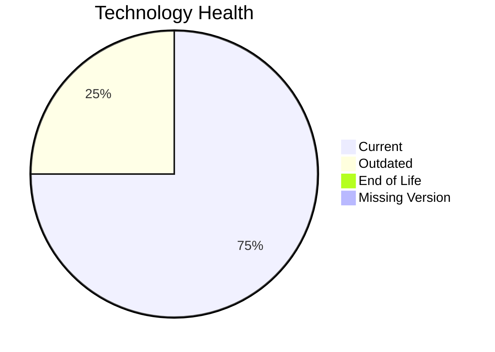

# Application Report: NotificationApp-028

**ID:** app028  
**Generated:** 2026-05-13

## Overview
| Attribute | Value |
|---|---|
| Owner | IT |
| Environment | AWS |
| Business Criticality | Medium |
| Users | 850 |
| Servers | 2 |

## Technology Stack
| Component | Technology | Status |
|---|---|---|
| Operating System | Windows Server 2019 | 🟡 OUTDATED |
| Language | Java 17 | 🟢 CURRENT_VERSION |
| Application Server | Microsoft IIS 10.0 | 🟢 CURRENT_VERSION |
| Database | Oracle 19c | 🟢 CURRENT_VERSION |

## Complexity Assessment
**Score:** 6/10 — **MEDIUM**  
**Confidence:** Medium

## Modernization Scenarios
| Applicable Scenario | Priority | Cost | Savings/Year |
|---|---|---:|---:|
| Operating System Update | High | €1157 | €500 |

## Financial Summary
| Metric | Value |
|---|---:|
| Total One-Time Cost | €1157 |
| Total Yearly Savings | €500 |
| Break-Even | 2.3 years |
