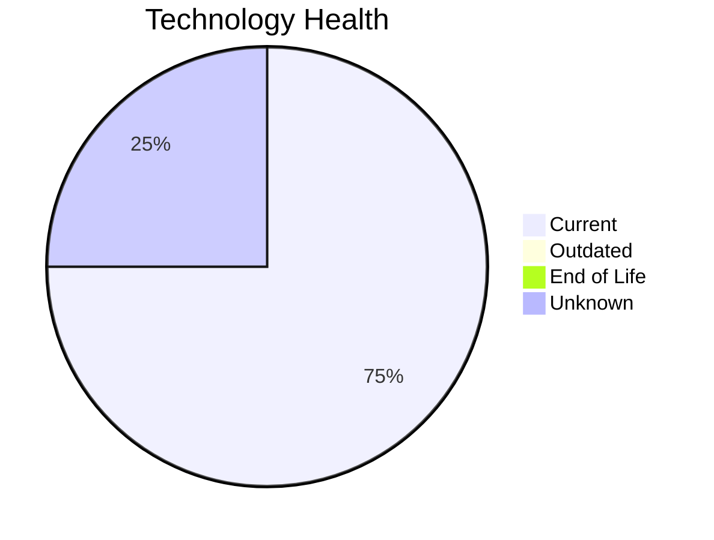

# Application Report: NotificationApp-028

**ID:** app028  
**Generated:** 2026-05-06

## Overview

| Attribute | Value |
|-----------|-------|
| Business Unit | IT |
| Deployment | AWS |
| Business Criticality | Medium |
| Users | 850 |
| Servers | 2 |
| Architecture | unknown |
| Containerized | Yes |
| CI/CD | Yes |

## Technology Stack

| Component | Technology | Status |
|-----------|-----------|--------|
| Operating System | Windows Server 2019 | 🟢 CURRENT_VERSION |
| Database | Oracle 19c | 🟢 CURRENT_VERSION |
| Language | Java 17 | 🟢 CURRENT_VERSION |
| App Server | Microsoft IIS 10.0 | ⚪ NO_KNOWLEDGE |

## Complexity Assessment

**Score:** 6/10 — **MEDIUM**  
**Confidence:** 8/10

> Complexity score 6/10 (MEDIUM). 25 external interfaces.

| Factor | Score |
|--------|-------|
| Technology Age & EOL | 2/10 |
| Integration Complexity | 9/10 |
| Infrastructure Scale | 6/10 |
| Business Criticality | 9/10 |
| Code & Architecture | 3/10 |
| Data Complexity | 8/10 |

## Modernization Scenarios

### Applicable Scenarios

#### ✅ Switch DB Engine to open-source database solution

- **Priority:** High
- **Effort:** Medium
- **Effects:** cost
- **Cost:** N/A (one-time)
- **Savings:** N/A
- **Reasoning:** Oracle database requires expensive licensing; migration to PostgreSQL could reduce costs.

### Other Scenarios

| Scenario | Status | Reason |
|----------|--------|--------|
| Operating System Update | FULFILLED | Operating system is on a current, supported version. |
| Switch to standard Linux Operating System | NOT_APPLICABLE | Windows Server OS; this scenario targets proprietary Unix-like systems. |
| Switch to ARM-based CPU | LACK_OF_DATA | CPU architecture not documented in application data. |
| Applications Server replacement | LACK_OF_DATA | Application server lifecycle status unknown. |
| Application Migration to Cloud Infrastructure (Lift & Shift) | FULFILLED | Application is already deployed on cloud (AWS). |
| Application Containerization | FULFILLED | Application is already containerized. |
| Application Refactoring and De-coupling | LACK_OF_DATA | Architecture not clearly identified. |
| Upgrade Legacy Databases | FULFILLED | Database (Oracle 19c) is on a current, supported version. |
| Update outdated components | NOT_APPLICABLE | No outdated components found. |
