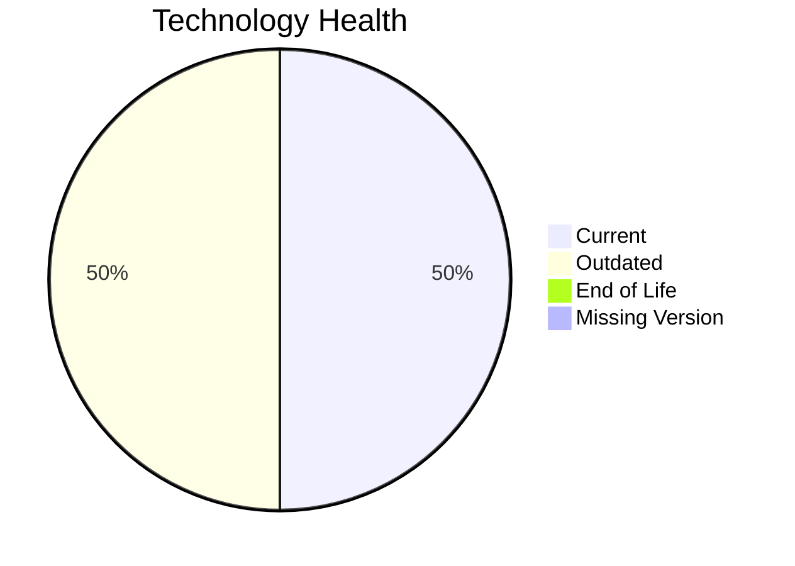

# Application Report: NotificationApp-028

**ID:** app028
**Generated:** 2026-05-11

## Overview

| Attribute | Value |
|-----------|-------|
| Owner | IT |
| Environment | AWS |
| Business Criticality | Medium |
| Users | 850 |
| Servers | 2 |

## Technology Stack

| Component | Technology | Version | Status |
|-----------|-----------|---------|--------|
| Operating System | Windows Server | Windows Server 2019 | 🟡 OUTDATED |
| Database | Oracle | Oracle 19c | 🟡 OUTDATED |
| Language | Java | Java 17 | 🟢 CURRENT_VERSION |
| Framework | N/A | N/A | ⚪ |
| App Server | Microsoft IIS | Microsoft IIS 10.0 | 🟢 CURRENT_VERSION |

## Complexity Assessment

**Score:** 6/10 — **MEDIUM**
**Confidence:** 8

Technology age score 6/10 (EOL=0, outdated=2, unknown=0); integration score 8/10 (interfaces=25, api_endpoints=18); infrastructure score 5/10 (servers=2, environments=3); business criticality score 5/10 (Medium, users=850); architecture score 3/10 (architecture=unknown, CI/CD=Yes, containerized=Yes); data score 7/10 (db_count=1, db_storage_gb=3000).

## Modernization Scenarios

### Applicable Scenarios

#### ✅ Operating System Update

- **Priority:** High
- **Effort:** Low
- **Effects:** security
- **Cost:** €1157 (one-time)
- **Savings:** €500/year
- **Reasoning:** Operating system is outdated or end-of-life per technology assessment.

#### ✅ Upgrade Legacy Databases

- **Priority:** High
- **Effort:** Medium
- **Effects:** security, agility
- **Cost:** €11565 (one-time)
- **Savings:** €10000/year
- **Reasoning:** Database engine is outdated or end-of-life.

### Not Applicable / Other

| Scenario | Status | Reason |
|----------|--------|--------|
| Switch to standard Linux Operating System | NOT_APPLICABLE | Scenario excludes Windows-based operating systems. |
| Switch to ARM-based CPU | BLOCKED | Third-party software dependency may block ARM compatibility changes. |
| Applications Server replacement | BLOCKED | Application server lifecycle for third-party stack is vendor-controlled. |
| Application Migration to Cloud Infrastructure (Lift & Shift) | FULFILLED | Application is already hosted on public cloud infrastructure. |
| Application Containerization | FULFILLED | Application is already containerized. |
| Application Refactoring and De-coupling | BLOCKED | Source code ownership is vendor-controlled for third-party software. |
| Switch DB Engine to open-source database solution | BLOCKED | Database migration path for third-party application is constrained. |
| Update outdated components | BLOCKED | Component lifecycle updates are vendor-managed for third-party software. |

## Financial Summary

| Metric | Value |
|--------|-------|
| Total One-Time Cost | €12722 |
| Total Yearly Savings | €10500 |
| Break-Even | 1.2 years |
