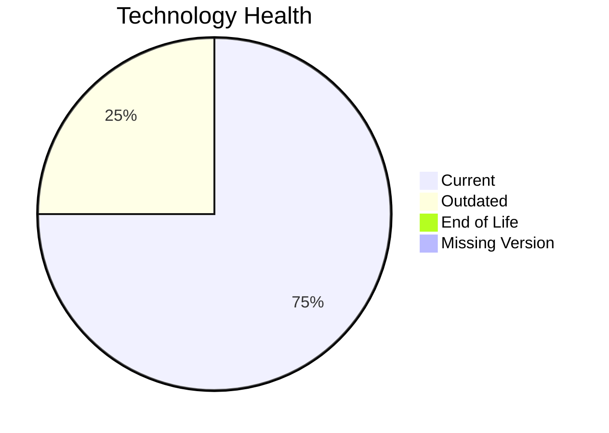

# Application Report: NotificationApp-028

Modernization assessment for NotificationApp-028 based solely on the Excel portfolio row and derived workflow outputs.

**ID:** app028  
**Generated:** 2026-05-07

## Overview

| Attribute | Value |
|-----------|-------|
| Owner | IT |
| Environment | AWS |
| Business Criticality | Medium |
| Users | 850 |
| Servers | sv41, sv42 |

## Technology Stack

| Component | Technology | Version | Status |
|-----------|-----------|---------|--------|
| Operating System | Windows Server | 2019 | 🟢 |
| Database | Oracle Database | 19c | 🟡 |
| Language | Java | 17 | 🟢 |
| Framework | N/A | N/A | ⚪ |
| App Server | Microsoft IIS | 10.0 | 🟢 |

## Complexity Assessment

**Score:** 6/10 — **MEDIUM**  
**Confidence:** 8

| Factor | Score | Notes |
|--------|-------|-------|
| Technology Age | 5/10 | 0 EOL, 1 outdated, 0 unknown lifecycle components. |
| Integration | 8/10 | 25 external interfaces and 18 API endpoints indicate the integration footprint. |
| Infrastructure | 5/10 | 2 listed server instances and 3 environments drive infrastructure coordination. |
| Business Criticality | 5/10 | Business criticality is Medium with approximately 850 users. |
| Architecture | 6/10 | third-party software limits internal modernization control |
| Data | 7/10 | database storage is 3000 GB; large database footprint; proprietary or enterprise database migration complexity |

## Modernization Scenarios

### Applicable Scenarios

No directly applicable scenarios were identified from the available data.

### Not Applicable / Other

| Scenario | Status | Reason |
|----------|--------|--------|
| Operating System Update | FULFILLED | Operating system Windows Server 2019 is already on a supported version. |
| Switch to standard Linux Operating System | NOT_APPLICABLE | The application already runs on Windows; this Linux standardization scenario is not a natural fit. |
| Switch to ARM-based CPU | LACK_OF_DATA | CPU architecture is not present in the Excel input, so the primary ARM migration trigger cannot be confirmed. |
| Applications Server replacement | FULFILLED | Application server Microsoft IIS 10.0 is already current. |
| Application Migration to Cloud Infrastructure (Lift & Shift) | FULFILLED | The application is already hosted on AWS, which fulfills the lift-and-shift cloud target. |
| Application Containerization | FULFILLED | The application is already containerized. |
| Application Refactoring and De-coupling | BLOCKED | The application is third-party software, so internal refactoring is not under customer control. |
| Upgrade Legacy Databases | BLOCKED | Database upgrade looks relevant, but the application is third-party software and may require vendor-managed migration. |
| Switch DB Engine to open-source database solution | BLOCKED | The application is third-party software and database engine substitution is unlikely to be customer-controlled. |
| Update outdated components | BLOCKED | The application is third-party software, so runtime component upgrades are likely vendor-managed. |

## Financial Summary

| Metric | Value |
|--------|-------|
| Total One-Time Cost | €0 |
| Total Yearly Savings | €0 |
| Break-Even | N/A years |
