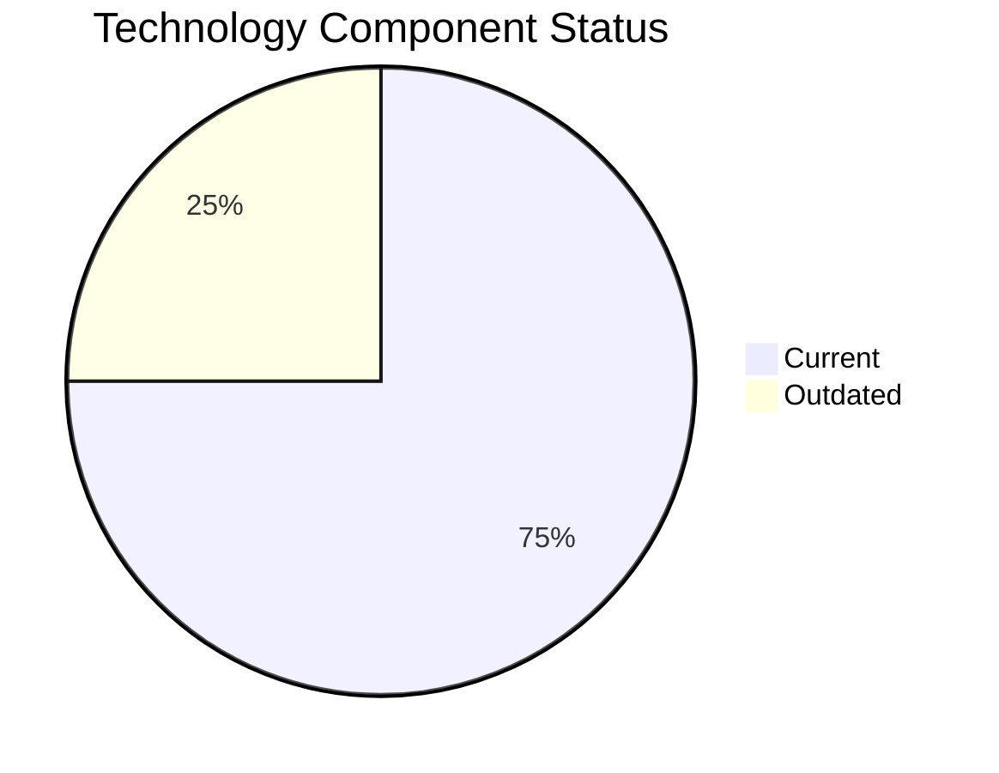

# NotificationApp-028 (app028)

> Analysis timestamp: 2025-07-15T00:00:00Z

## Application Overview

| Attribute | Value |
|-----------|-------|
| **Name** | NotificationApp-028 |
| **Status** | Production |
| **Criticality** | Medium |
| **Users** | 850 |
| **Solution Type** | 3rd party software |
| **Architecture** | unknown |
| **Containerized** | Yes |
| **CI/CD** | Yes |
| **Environments** | 3 |
| **Servers** | sv41, sv42 |
| **External Interfaces** | 25 |

## Technology Stack

| Component | Value | Status |
|-----------|-------|--------|
| **Os** | Windows Server 2019 | ✅ CURRENT_VERSION |
| **Language** | Java 17 | ✅ CURRENT_VERSION |
| **Database** | Oracle 19c | ⚠️ OUTDATED |
| **App Server** | Microsoft IIS 10.0 | ✅ CURRENT_VERSION |

## Technology Health

## Complexity Assessment

**Score: 5/10 — MEDIUM**

1 outdated component(s) require attention; 25 external interfaces drive integration complexity; 2 server(s) across 3 environment(s); Business criticality is Medium.

| Factor | Value |
|--------|-------|
| Servers | 2 |
| Environments | 3 |
| External Interfaces | 25 |
| EOL Technologies | 0 |
| Outdated Technologies | 1 |
| CI/CD Present | Yes |
| Containerized | Yes |

## Modernization Scenarios

| Scenario | Status | Reason |
|----------|--------|--------|
| OS Security Patch | ✅ FULFILLED | Operating system Windows Server 2019 is current and maintained. |
| Switch to Linux | ➖ NOT_APPLICABLE | Application runs on Windows Server 2019; Windows-to-Linux migration is a separat... |
| ARM CPU | 🔧 APPLICABLE | Custom or open source application that can be compiled for ARM architecture. |
| App Server Replace | ✅ FULFILLED | Application server Microsoft IIS 10.0 is current. |
| Cloud Deploy | 🔧 APPLICABLE | Application can be migrated to cloud infrastructure. |
| Containerization | ✅ FULFILLED | Application is already containerized. |
| Refactor/Decouple | 🔧 APPLICABLE | Architecture is unknown; refactoring assessment recommended. |
| DB Upgrade | 🔧 APPLICABLE | Database Oracle 19c is OUTDATED and should be upgraded. |
| Open Source DB | 🔧 APPLICABLE | Database Oracle 19c is proprietary; switching to open source would reduce licens... |
| Update Components | 🔧 APPLICABLE | Application has EOL or outdated components that require updating. |

## Financial Summary

| Metric | Value |
|--------|-------|
| Total Implementation Cost | $296,675.18 |
| Total Annual Savings | $163,700.00 |
| Payback Period | 1.81 years |
| 5-Year Net Benefit | $521,824.82 |

### Applicable Scenario Costs

| Scenario | Impl. Cost | Annual Savings | Payback |
|----------|-----------|----------------|---------|
| ARM CPU | $5,028.39 | $1,000.00 | 5.03 yrs |
| Cloud Deploy | $5,028.39 | $2,700.00 | 1.86 yrs |
| Refactor/Decouple | $251,419.65 | $135,000.00 | 1.86 yrs |
| DB Upgrade | $10,056.79 | $10,000.00 | 1.01 yrs |
| Open Source DB | $25,141.96 | $15,000.00 | 1.68 yrs |
