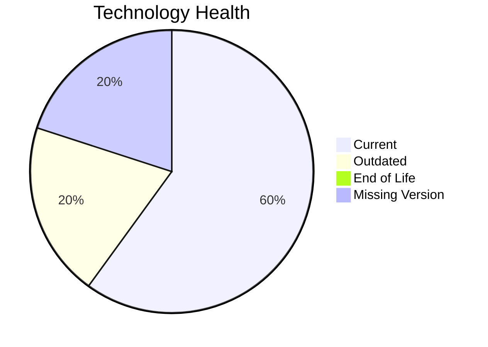

# Application Report: NotificationApp-028

**ID:** app028
**Generated:** 2026-05-14

## Overview

| Attribute | Value |
|-----------|-------|
| Owner | IT |
| Environment | AWS |
| Business Criticality | Medium |
| Users | 850 |
| Servers | sv41, sv42 |

## Technology Stack

| Component | Technology | Status |
|-----------|-----------|--------|
| Operating System | Windows Server 2019 | 🟡 |
| Database | Oracle 19c | 🟡 |
| Language | Java 17 | 🟢 |

## Complexity Assessment

**Score:** 6/10 — **MEDIUM**

## Modernization Scenarios

### ✅ Switch To Arm Cpu
- **Reasoning:** Cloud-hosted workload with manageable complexity is a candidate for ARM.

### ✅ App Refactor Decoupling
- **Reasoning:** High coupling and/or monolithic architecture indicates refactor opportunity.

### ✅ Upgrade Legacy Databases
- **Reasoning:** Database platform is aging and should be upgraded.

### ✅ Serverless Db Migration
- **Reasoning:** API-intensive cloud workload can evaluate serverless DB patterns.

### ✅ Switch Db Engine Postgresql
- **Reasoning:** Licensed DB engine can be modernized to PostgreSQL for cost reduction.

## Financial Summary

| Metric | Value |
|--------|-------|
| Total One-Time Cost | €341177 |
| Total Yearly Savings | €174900 |
| Break-Even | 2.0 years |
