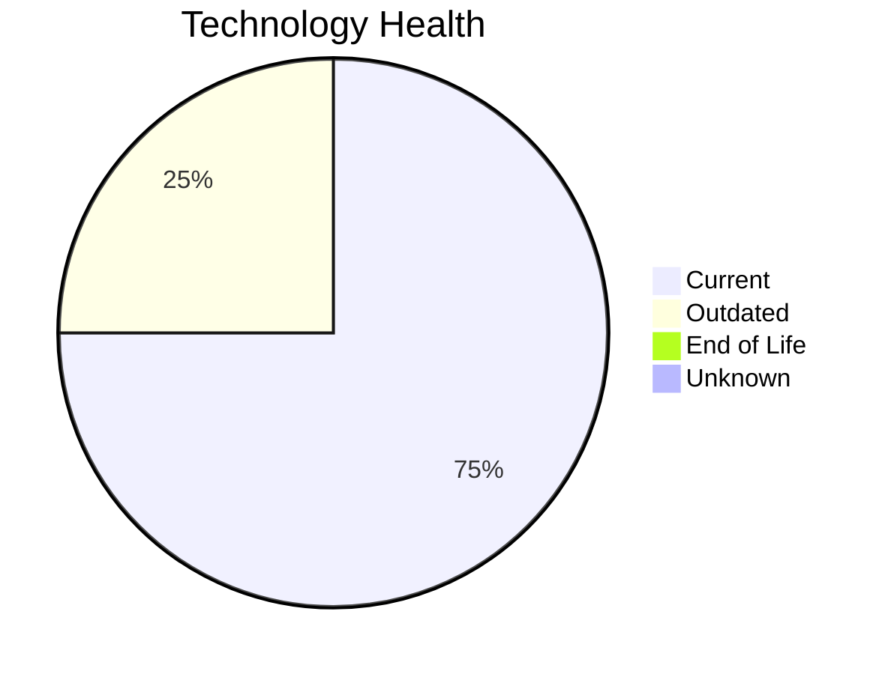

# Application Report: NotificationApp-028

**ID:** app028  
**Generated:** 2026-05-15

## Overview

| Attribute | Value |
|-----------|-------|
| Business Unit | IT |
| Deployment | AWS |
| Business Criticality | Medium |
| Users | 850 |
| Solution Type | 3rd party software |
| Architecture | unknown |
| Containerized | Yes |
| CI/CD | Yes |
| External Interfaces | 25 |

## Technology Stack

| Component | Technology | Status |
|-----------|-----------|--------|
| Operating System | Windows Server 2019 | 🟢 Current |
| Database | Oracle 19c | 🟡 Outdated |
| Language | Java 17 | 🟢 Current |
| App Server | Microsoft IIS 10.0 | 🟢 Current |

## Complexity Assessment

**Score:** 5/10 — **MEDIUM**  
**Confidence:** 8

| Factor | Score | Notes |
|--------|-------|-------|
| Technology Age | 4/10 | 1 outdated component |
| Integration | 8/10 | 25 external interfaces, 0 dependencies — highly integrated |
| Infrastructure | 5/10 | 2 server instances, 3 environments |
| Business Criticality | 6/10 | Business criticality: medium, 850 users |
| Architecture | 3/10 | containerized; CI/CD present |
| Data | 7/10 | Oracle DB — complex licensing and migration; 3000 GB data storage; large data volume |

## Modernization Scenarios

### Applicable Scenarios

#### ✅ Switch to ARM-based CPU

- **Priority:** Medium
- **Effort:** Medium
- **Effects:** cost, sustainability
- **One-time Cost:** €5,028
- **Yearly Savings:** €1,000/year
- **Reasoning:** Application is cloud-deployed and containerized. ARM-based instances (e.g., AWS Graviton) can reduce costs.

#### ✅ Upgrade Legacy Databases

- **Priority:** High
- **Effort:** Medium
- **Effects:** security, agility
- **One-time Cost:** €10,057
- **Yearly Savings:** €10,000/year
- **Reasoning:** Database 'Oracle 19c' is outdated. Upgrading to a current version is recommended.

#### ✅ Switch DB Engine to open-source database solution

- **Priority:** High
- **Effort:** Medium
- **Effects:** cost
- **One-time Cost:** N/A
- **Yearly Savings:** N/A
- **Reasoning:** Oracle DB has high licensing costs. Migrating to PostgreSQL or MySQL would significantly reduce licensing expenses.

#### ✅ Update outdated components

- **Priority:** High
- **Effort:** High
- **Effects:** security, agility, cost
- **One-time Cost:** N/A
- **Yearly Savings:** N/A
- **Reasoning:** Component(s) detected as outdated. Targeted component updates recommended.

### Other Scenarios

| Scenario | Status | Reason |
|----------|--------|--------|
| Operating System Update | ✔️ Fulfilled | OS 'Windows Server 2019' is on a current, supported version with no end-of-life ... |
| Switch to standard Linux Operating System | ➖ N/A | Application runs on Windows (Windows Server 2019). Scenario excludes Windows-bas... |
| Applications Server replacement | 🚫 Blocked | Third-party or SaaS application — app server managed by vendor, replacement not ... |
| Application Migration to Cloud Infrastructure (Lift & Shift) | ✔️ Fulfilled | Application is already deployed in the cloud. |
| Application Containerization | 🚫 Blocked | Third-party/SaaS application. Containerization not feasible — vendor-managed. |
| Application Refactoring and De-coupling | 🚫 Blocked | Third-party/SaaS application — refactoring not feasible. |

## Business Case Summary

| Metric | Value |
|--------|-------|
| Total One-time Cost | €15,085 |
| Total Yearly Savings | €11,000 |
| ROI Break-even | 1.4 years |
