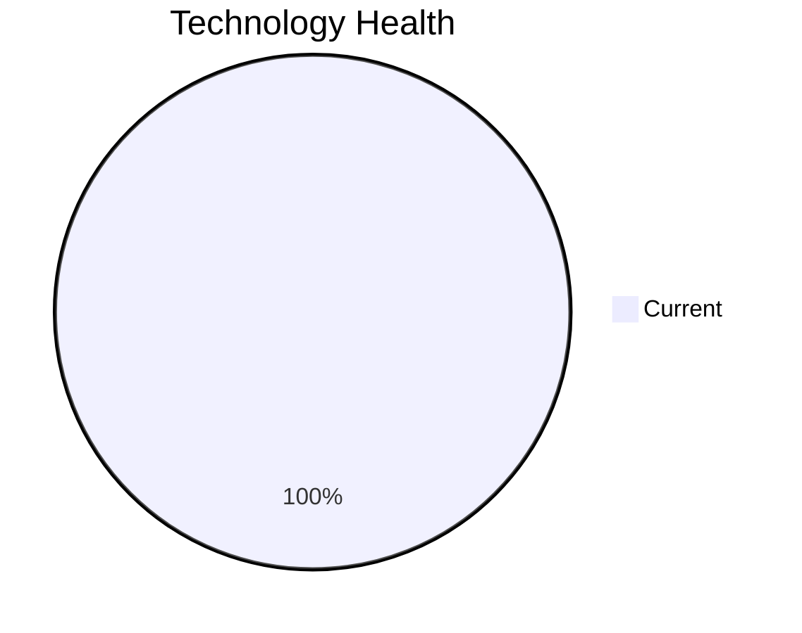

# Application Report: NotificationApp-028

**ID:** app028  
**Generated:** 2026-05-05

## Overview

| Attribute | Value |
|-----------|-------|
| Business Unit | IT |
| Deployment Type | AWS |
| Business Criticality | Medium |
| Users | 850 |
| Servers | sv41, sv42 |
| Environments | 3 |
| Architecture | unknown |
| Containerized | Yes |
| CI/CD | Yes |
| Solution Type | 3rd party software |
| Data Classification | Internal |

> Centralized notification system for sending emails, SMS, and push notifications across all applications

## Technology Stack

| Component | Technology | Version | Status |
|-----------|-----------|---------|--------|
| Os | Windows Server | 2019 | 🟢 CURRENT_VERSION |
| Database | Oracle Database | 19c | 🟢 CURRENT_VERSION |
| Language | Java | 17 | 🟢 CURRENT_VERSION |
| Application Server | Microsoft IIS | 10.0 | 🟢 CURRENT_VERSION |

## Complexity Assessment

**Score:** 5/10 — **MEDIUM**  
**Confidence:** 7

> Score 5/10 (MEDIUM). EOL components: 0, Outdated: 0. External interfaces: 25. Servers: 2. Criticality: Medium. Architecture: unknown. DB storage: 3000.0GB.

| Factor | Value |
|--------|-------|
| Servers | 2 |
| Environments | 3 |
| External Interfaces | 25 |
| Business Criticality | Medium |
| EOL Technologies | 0 |
| Outdated Technologies | 0 |
| CI/CD | Yes |
| Containerized | Yes |

## Modernization Scenarios

_No directly applicable modernization scenarios identified for this application._

### Other Scenarios

| Scenario | Status | Reason |
|----------|--------|--------|
| Operating System Update | ✔️ FULFILLED | Operating system Windows Server 2019 is current and supported. |
| Switch to Standard Linux OS | ❌ NOT_APPLICABLE | Application runs on Windows OS. Scenario is excluded for Windows-based systems. |
| Switch to ARM-based CPU | ❌ NOT_APPLICABLE | Third-party application; ARM compatibility depends on vendor support, which is not confirmed. |
| Application Server Replacement | ❌ NOT_APPLICABLE | SaaS/3rd-party application; application server is vendor-managed. |
| Application Migration to Cloud (Lift & Shift) | ✔️ FULFILLED | Application is already hosted on cloud (AWS). Lift & Shift is not needed. |
| Application Containerization | ✔️ FULFILLED | Application is already containerized. |
| Application Refactoring and De-coupling | ❌ NOT_APPLICABLE | Third-party software; internal architecture cannot be refactored by the customer. |
| Upgrade Legacy Databases | ✔️ FULFILLED | Database Oracle Database 19c is on a current supported version. |
| Switch DB Engine to Open-Source | ❌ NOT_APPLICABLE | Third-party application; database selection may be vendor-mandated. |
| Update Outdated Components | ❌ NOT_APPLICABLE | Third-party software; component versions (language runtime, framework) are vendor-managed and not upgradeable by the cus... |

## Financial Summary

_No applicable scenarios with financial data for this application._
