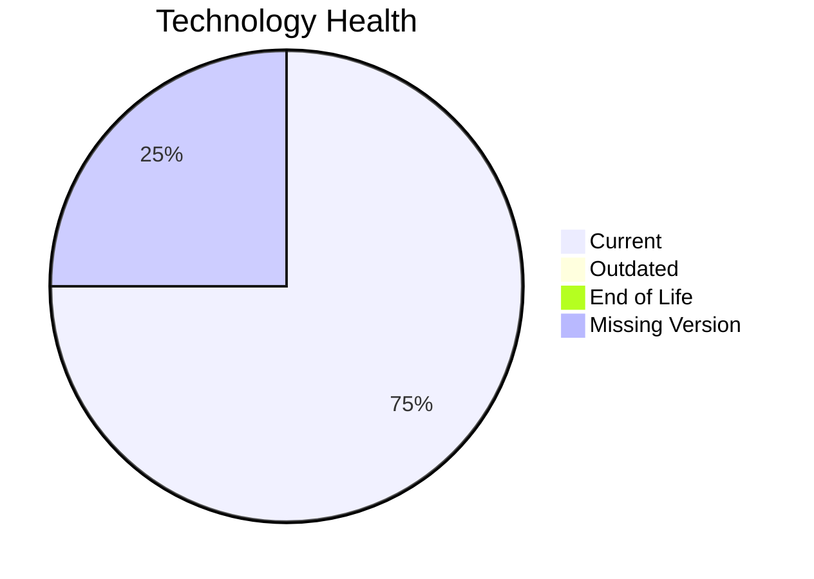

# Application Report: NotificationApp-028

**ID:** app028
**Generated:** 2026-04-24

## Overview

| Attribute | Value |
|-----------|-------|
| Owner | IT |
| Business Unit | IT |
| Deployment Type | AWS |
| Business Criticality | Medium |
| Users | 850 |
| Servers | 2 |
| Architecture | unknown |
| Solution Type | 3rd party software |
| CI/CD | Yes |
| Containerized | Yes |

## Technology Stack

| Component | Technology | Version | Status |
|-----------|-----------|---------|--------|
| Operating System | Windows Server 2019 | Windows Server 2019 | 🟢 CURRENT_VERSION |
| Language | Java 17 | Java 17 | 🟢 CURRENT_VERSION |
| Database | Oracle 19c | Oracle 19c | 🟢 CURRENT_VERSION |
| App Server | Microsoft IIS 10.0 | Microsoft IIS 10.0 | ⚪ NO_KNOWLEDGE |

## Complexity Assessment

**Score:** 5/10 — **MEDIUM**
**Confidence:** 7

**Reasoning:** Tech age score 2/10 (0 EOL, 0 outdated components). Integration score 9/10 (25 external interfaces). Infrastructure score 5/10 (2 servers, 3 environments). Business criticality score 5/10 (criticality: Medium). Architecture score 4/10 (architecture: unknown, containerized: Yes, CI/CD: Yes). Data score 6/10 (3000GB storage).

### Contributing Factors

| Factor | Value |
|--------|-------|
| Servers | 2 |
| Environments | 3 |
| External Interfaces | 25 |
| EOL Technologies | 0 |
| Outdated Technologies | 0 |
| CI/CD | Yes |
| Containerized | Yes |

## Modernization Scenarios

### Applicable Scenarios

_No applicable scenarios identified._

### Not Applicable / Other

| Scenario | Status | Reason |
|----------|--------|--------|
| Operating System Update | FULFILLED | Operating system 'Windows Server 2019' is currently supported and up to date.... |
| Switch to standard Linux Operating System | NOT_APPLICABLE | Exclusion criterion: Application runs on Windows-based OS.... |
| Switch to ARM-based CPU | NOT_APPLICABLE | Exclusion: SaaS or 3rd party application; ARM migration not applicable.... |
| Applications Server replacement | LACK_OF_DATA | Lifecycle data for application server 'Microsoft IIS 10.0' is not available.... |
| Application Migration to Cloud Infrastructure (Lift & Shift) | FULFILLED | Application is already deployed on cloud: 'AWS'.... |
| Application Containerization | FULFILLED | Application is already containerized.... |
| Application Refactoring and De-coupling | NOT_APPLICABLE | Exclusion: SAP/SaaS/3rd party application - source code not under customer contr... |
| Upgrade Legacy Databases | FULFILLED | Database 'Oracle 19c' is on a currently supported version.... |
| Switch DB Engine to open-source database solution | NOT_APPLICABLE | Exclusion: 3rd party application - database migration not under customer control... |
| Update outdated components | NOT_APPLICABLE | Exclusion: 3rd party software - component versions are vendor-managed.... |

## Financial Summary

| Metric | Value |
|--------|-------|
| Total One-Time Cost | €0 |
| Total Yearly Savings | €0 |
| Break-Even | N/A |
