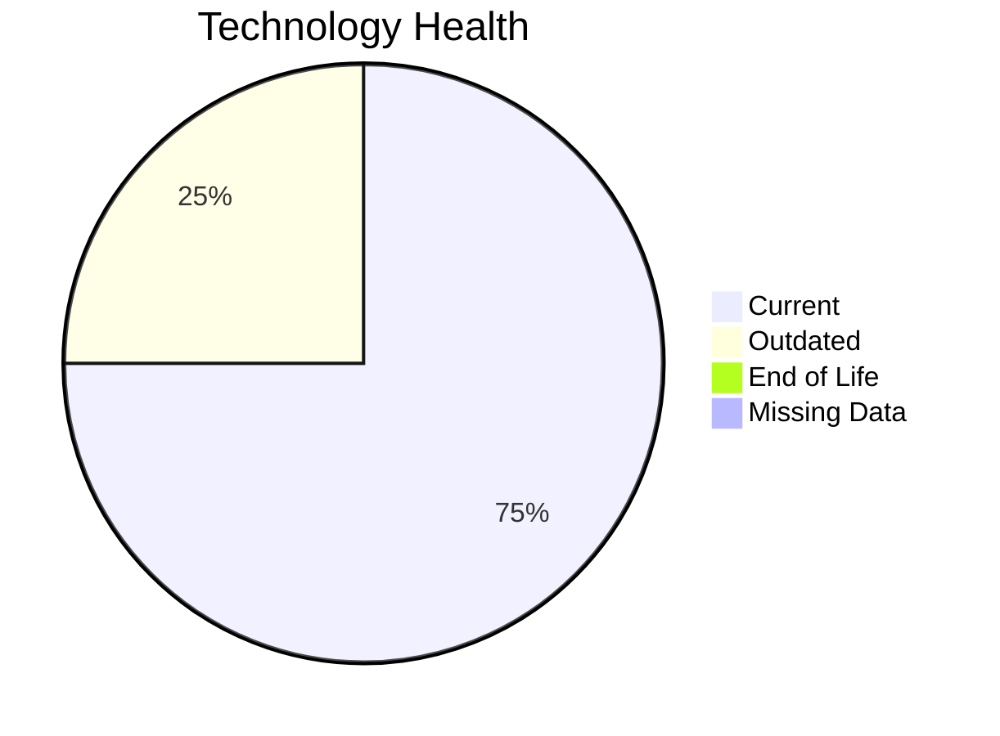

# Application Report: NotificationApp-028

**ID:** app028  
**Generated:** 2026-05-07

## Overview

| Attribute | Value |
|-----------|-------|
| Business Unit | IT |
| Deployment Type | AWS |
| Business Criticality | Medium |
| Users | 850 |
| Servers | 2 |
| Solution Type | 3rd party software |

**Description:** Centralized notification system for sending emails, SMS, and push notifications across all applications

## Technology Stack

| Component | Technology | Status |
|-----------|-----------|--------|
| Os | Windows Server 2019 | 🟢 CURRENT_VERSION |
| Database | Oracle 19c | 🟢 CURRENT_VERSION |
| Language | Java 17 | 🟢 CURRENT_VERSION |
| App_Server | Microsoft IIS 10.0 | 🟡 OUTDATED |

## Complexity Assessment

**Score:** 5/10 — **MEDIUM**  
**Confidence:** 9/10

**Reasoning:** Technology age: 4/10 (0 EOL, 1 outdated components) | Integration: 10/10 (25 external interfaces) | Infrastructure: 4/10 (2 servers, 3 environments) | Criticality: 5/10 (medium) | Architecture: 2/10 (containerized: yes, CI/CD: yes) | Data: 6/10 (3000 GB storage)

### Contributing Factors

| Factor | Value |
|--------|-------|
| Servers | 2 |
| Databases | 1 |
| Environments | 3 |
| Interfaces | 25 |
| EOL Technologies | 0 |
| Outdated Technologies | 1 |
| Containerized | Yes |
| CI/CD Present | Yes |

## Modernization Scenarios

### Applicable Scenarios

#### ✅ Application Refactoring and De-coupling

- **Priority:** High
- **Effort:** High
- **Effects:** agility, cost, sustainability
- **Cost:** $251,419.65 (one-time)
- **Savings:** $135,000.00/year
- **Reasoning:** Triggered by: Architecture is Tightly Coupled

#### ✅ Update outdated components

- **Priority:** High
- **Effort:** High
- **Effects:** security, agility, cost
- **Cost:** $0.00 (one-time)
- **Savings:** $0.00/year
- **Reasoning:** Triggered by: Used Application Server is legacy or outdated (e.g. Weblogic 10.x, Websphere 7.x, JBoss EAP 5.x, Tomcat 6.x, IIS 6.x)

### Other Scenarios

| Scenario | Status | Reason |
|----------|--------|--------|
| Operating System Update | ✔️ FULFILLED | Fulfilled: Operating system is on a current, supported version with no end-of-li... |
| Switch to standard Linux Operating System | ❌ NOT_APPLICABLE | No primary triggers matched for this application. |
| Switch to ARM-based CPU | ❌ NOT_APPLICABLE | No primary triggers matched for this application. |
| Applications Server replacement | ✔️ FULFILLED | Fulfilled: Application server is already containerized and optimized |
| Application Migration to Cloud Infrastructure (Lift & Shift) | ✔️ FULFILLED | Fulfilled: Application is already hosted on a Public Cloud provider |
| Application Containerization | ✔️ FULFILLED | Fulfilled: Application is already containerized |
| Upgrade Legacy Databases | ✔️ FULFILLED | Fulfilled: All database components are on a current, supported version with no e... |
| Switch DB Engine to open-source database solution | ✔️ FULFILLED | Fulfilled: Database engine is already an open-source alternative with no commerc... |

## Financial Summary

| Metric | Value |
|--------|-------|
| Total One-Time Cost | $251,419.65 |
| Total Yearly Savings | $135,000.00 |
| Break-Even | 1.86 years |

---

*This report was automatically generated from application portfolio analysis.*
