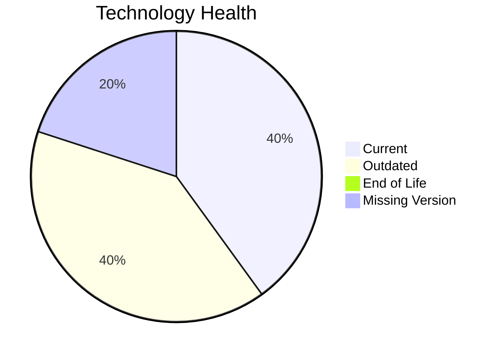

# Application Report: APIGatewayApp-030

**ID:** app030
**Generated:** 2026-05-14

## Overview

| Attribute | Value |
|-----------|-------|
| Owner | IT |
| Environment | AWS |
| Business Criticality | High |
| Users | 1800 |
| Servers | sv44, sv45 |

## Technology Stack

| Component | Technology | Status |
|-----------|-----------|--------|
| Operating System | RHEL 8 | 🟡 |
| Database | MySQL 5.7 | 🟡 |
| Language | Go 1.19 | 🟢 |

## Complexity Assessment

**Score:** 6/10 — **MEDIUM**

## Modernization Scenarios

### ✅ Switch To Arm Cpu
- **Reasoning:** Cloud-hosted workload with manageable complexity is a candidate for ARM.

### ✅ App Refactor Decoupling
- **Reasoning:** High coupling and/or monolithic architecture indicates refactor opportunity.

### ✅ Upgrade Legacy Databases
- **Reasoning:** Database platform is aging and should be upgraded.

### ✅ Serverless Db Migration
- **Reasoning:** API-intensive cloud workload can evaluate serverless DB patterns.

## Financial Summary

| Metric | Value |
|--------|-------|
| Total One-Time Cost | €312264 |
| Total Yearly Savings | €159900 |
| Break-Even | 2.0 years |
