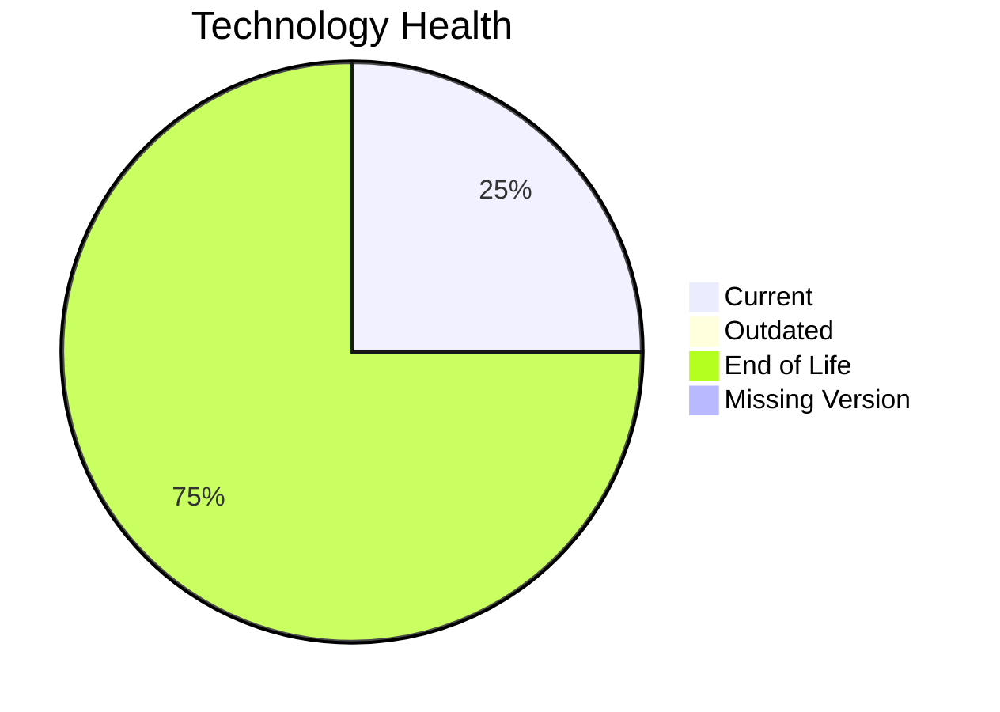

# Application Report: APIGatewayApp-030

Modernization assessment for APIGatewayApp-030 based solely on the Excel portfolio row and derived workflow outputs.

**ID:** app030  
**Generated:** 2026-05-07

## Overview

| Attribute | Value |
|-----------|-------|
| Owner | IT |
| Environment | AWS |
| Business Criticality | High |
| Users | 1800 |
| Servers | sv44, sv45 |

## Technology Stack

| Component | Technology | Version | Status |
|-----------|-----------|---------|--------|
| Operating System | RHEL | 8 | 🟢 |
| Database | MySQL | 5.7 | 🔴 |
| Language | Go | 1.19 | 🔴 |
| Framework | N/A | N/A | ⚪ |
| App Server | GlassFish | 3.0 | 🔴 |

## Complexity Assessment

**Score:** 8/10 — **HIGH**  
**Confidence:** 8

| Factor | Score | Notes |
|--------|-------|-------|
| Technology Age | 9/10 | 3 EOL, 0 outdated, 0 unknown lifecycle components. |
| Integration | 8/10 | 30 external interfaces and 50 API endpoints indicate the integration footprint. |
| Infrastructure | 5/10 | 2 listed server instances and 4 environments drive infrastructure coordination. |
| Business Criticality | 8/10 | Business criticality is High with approximately 1800 users. |
| Architecture | 8/10 | 3-tier architecture is more modular than 1-tier or 2-tier; application stack contains EOL runtime components |
| Data | 7/10 | database storage is 80 GB; database platform is EOL |

## Modernization Scenarios

### Applicable Scenarios

#### ✅ Applications Server replacement

- **Priority:** Medium
- **Effort:** Medium
- **Effects:** agility, cost
- **Cost:** €15295 (one-time)
- **Savings:** €9600/year
- **Reasoning:** Application server Glassfish 3.0 is eol.

#### ✅ Upgrade Legacy Databases

- **Priority:** High
- **Effort:** Medium
- **Effects:** security, agility
- **Cost:** €15295 (one-time)
- **Savings:** €10000/year
- **Reasoning:** Database platform MySQL 5.7 is eol.

#### ✅ Update outdated components

- **Priority:** High
- **Effort:** High
- **Effects:** security, agility, cost
- **Cost:** N/A (one-time)
- **Savings:** N/A/year
- **Reasoning:** At least one language/framework/application-server component is outdated or end of life.

### Not Applicable / Other

| Scenario | Status | Reason |
|----------|--------|--------|
| Operating System Update | FULFILLED | Operating system RHEL 8 is already on a supported version. |
| Switch to standard Linux Operating System | FULFILLED | The application already runs on a supported standard Linux distribution. |
| Switch to ARM-based CPU | LACK_OF_DATA | CPU architecture is not present in the Excel input, so the primary ARM migration trigger cannot be confirmed. |
| Application Migration to Cloud Infrastructure (Lift & Shift) | FULFILLED | The application is already hosted on AWS, which fulfills the lift-and-shift cloud target. |
| Application Containerization | FULFILLED | The application is already containerized. |
| Application Refactoring and De-coupling | PARTIALLY_FULFILLED | The application already shows some modular traits, but the source does not prove a fully decoupled architecture. |
| Switch DB Engine to open-source database solution | FULFILLED | Database engine MySQL 5.7 is already open-source aligned. |

## Financial Summary

| Metric | Value |
|--------|-------|
| Total One-Time Cost | €30590 |
| Total Yearly Savings | €19600 |
| Break-Even | 1.6 years |
