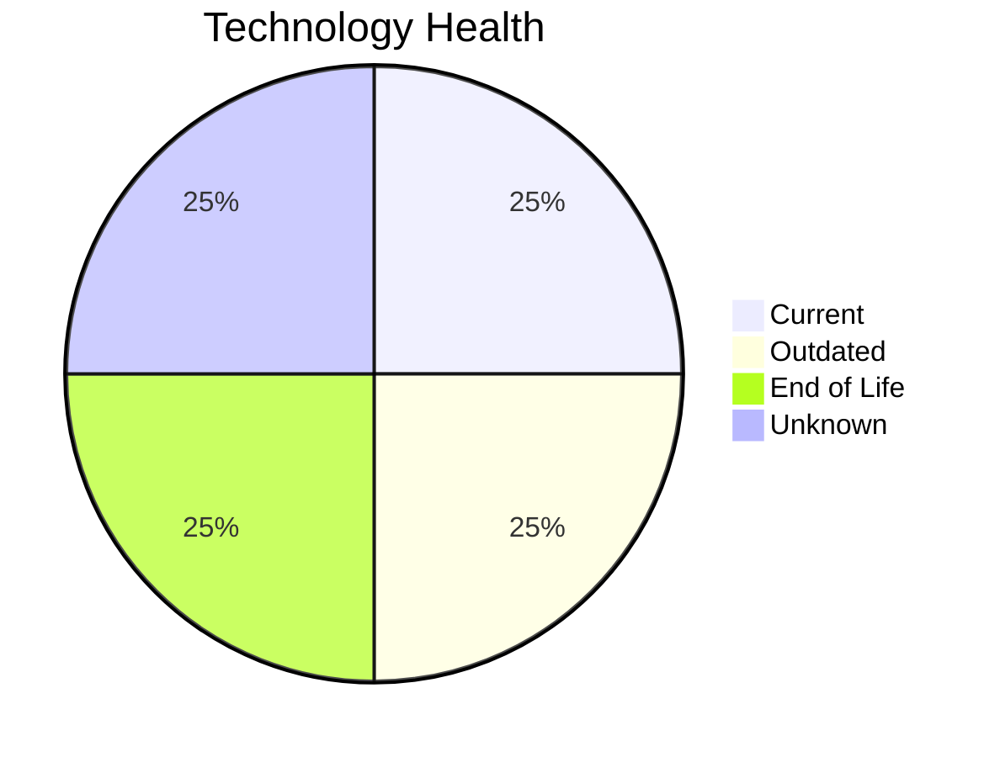

# Application Report: APIGatewayApp-030

**ID:** app030  
**Generated:** 2026-05-06

## Overview

| Attribute | Value |
|-----------|-------|
| Business Unit | IT |
| Deployment | AWS |
| Business Criticality | High |
| Users | 1800 |
| Servers | 2 |
| Architecture | 3-Tier |
| Containerized | Yes |
| CI/CD | Yes |

## Technology Stack

| Component | Technology | Status |
|-----------|-----------|--------|
| Operating System | RHEL 8 | 🟢 CURRENT_VERSION |
| Database | MySQL 5.7 | 🔴 EOL |
| Language | Go 1.19 | 🟡 OUTDATED |
| App Server | Glassfish 3.0 | ⚪ NO_KNOWLEDGE |

## Complexity Assessment

**Score:** 7/10 — **HIGH**  
**Confidence:** 8/10

> Complexity score 7/10 (HIGH). 1 EOL component(s), 1 outdated component(s), 30 external interfaces, High business criticality.

| Factor | Score |
|--------|-------|
| Technology Age & EOL | 8/10 |
| Integration Complexity | 9/10 |
| Infrastructure Scale | 9/10 |
| Business Criticality | 9/10 |
| Code & Architecture | 2/10 |
| Data Complexity | 3/10 |

## Modernization Scenarios

### Applicable Scenarios

#### ✅ Upgrade Legacy Databases

- **Priority:** High
- **Effort:** Medium
- **Effects:** security, agility
- **Cost:** €13,300 (one-time)
- **Savings:** €10,000/year
- **Reasoning:** Database (MySQL 5.7) is EOL; upgrade required.

#### ✅ Update outdated components

- **Priority:** High
- **Effort:** High
- **Effects:** security, agility, cost
- **Cost:** N/A (one-time)
- **Savings:** N/A
- **Reasoning:** Components need updating. EOL: MySQL 5.7; Outdated: Go 1.19.

### Other Scenarios

| Scenario | Status | Reason |
|----------|--------|--------|
| Operating System Update | FULFILLED | Operating system is on a current, supported version. |
| Switch to standard Linux Operating System | FULFILLED | Application runs on standard Linux (RHEL 8). |
| Switch to ARM-based CPU | LACK_OF_DATA | CPU architecture not documented in application data. |
| Applications Server replacement | LACK_OF_DATA | Application server lifecycle status unknown. |
| Application Migration to Cloud Infrastructure (Lift & Shift) | FULFILLED | Application is already deployed on cloud (AWS). |
| Application Containerization | FULFILLED | Application is already containerized. |
| Application Refactoring and De-coupling | PARTIALLY_FULFILLED | 3-tier architecture has some separation; further decoupling into microservices i... |
| Switch DB Engine to open-source database solution | FULFILLED | Database (MySQL 5.7) is already open-source or compatible. |

## Financial Summary

| Metric | Value |
|--------|-------|
| Total One-Time Investment | €13,300 |
| Total Annual Savings | €10,000 |
| Break-Even | 1.3 years |
