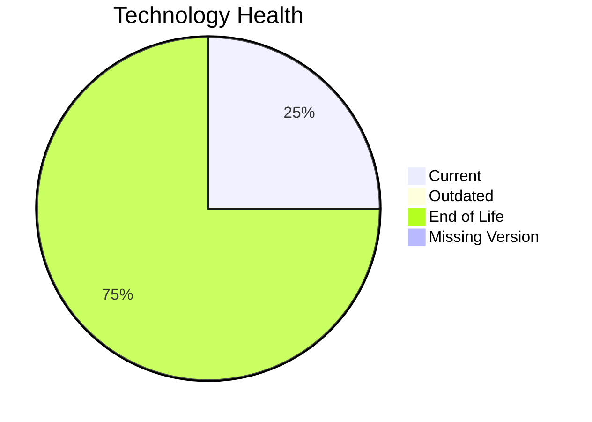

# Application Report: APIGatewayApp-030

**ID:** app030  
**Generated:** 2026-05-13

## Overview
| Attribute | Value |
|---|---|
| Owner | IT |
| Environment | AWS |
| Business Criticality | High |
| Users | 1800 |
| Servers | 2 |

## Technology Stack
| Component | Technology | Status |
|---|---|---|
| Operating System | RHEL 8 | 🟢 CURRENT_VERSION |
| Language | Go 1.19 | 🔴 EOL |
| Application Server | Glassfish 3.0 | 🔴 EOL |
| Database | MySQL 5.7 | 🔴 EOL |

## Complexity Assessment
**Score:** 7/10 — **HIGH**  
**Confidence:** Medium

## Modernization Scenarios
| Applicable Scenario | Priority | Cost | Savings/Year |
|---|---|---:|---:|
| Applications Server replacement | Medium | €13300 | €9600 |
| Upgrade Legacy Databases | High | €13300 | €10000 |
| Update outdated components | High | €N/A | €N/A |

## Financial Summary
| Metric | Value |
|---|---:|
| Total One-Time Cost | €26600 |
| Total Yearly Savings | €19600 |
| Break-Even | 1.4 years |
