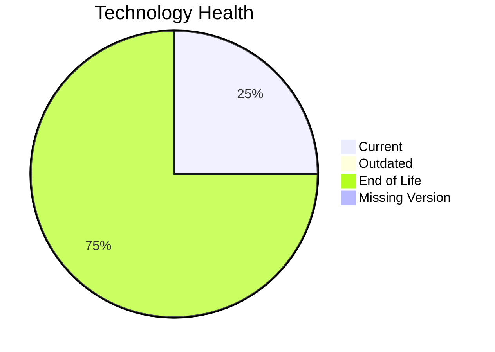

# Application Report: APIGatewayApp-030

**ID:** app030  
**Generated:** 2026-05-17

## Overview

| Attribute | Value |
|-----------|-------|
| Owner | N/A |
| Environment | AWS |
| Business Criticality | High |
| Users | 1800 |
| Servers | 2 |

## Technology Stack

| Component | Technology | Version | Status |
|-----------|-----------|---------|--------|
| Operating System | RHEL | 8 | 🟢 CURRENT_VERSION |
| Database | MySQL | 5.7 | 🔴 EOL |
| Language | Go | 1.19 | 🔴 EOL |
| Framework | N/A | N/A | ⚪ NO_KNOWLEDGE |
| App Server | GlassFish | 3.0 | 🔴 EOL |

## Complexity Assessment

**Score:** 8/10 — **HIGH**  
**Confidence:** 8

| Factor | Score | Notes |
|--------|-------|-------|
| Technology Age | 9/10 | 3 components are EOL. |
| Integration | 8/10 | High integration surface with 30 external interfaces and 50 APIs. |
| Infrastructure | 8/10 | Infrastructure spans 2 servers and 4 environments. |
| Business Criticality | 8/10 | Business criticality is High. |
| Architecture | 4/10 | already containerized, CI/CD exists, traditional multi-tier architecture, legacy application server. |
| Data | 7/10 | 1 database engine(s), 80 GB storage, legacy database support status. |

## Modernization Scenarios

### Applicable Scenarios

#### ✅ Applications Server replacement

- **Priority:** Medium
- **Effort:** Medium
- **Effects:** agility, cost
- **Cost:** €15295 (one-time)
- **Savings:** €9600/year
- **Reasoning:** Glassfish 3.0 is assessed as EOL and should be modernized or replaced.

#### ✅ Upgrade Legacy Databases

- **Priority:** High
- **Effort:** Medium
- **Effects:** security, agility
- **Cost:** €15295 (one-time)
- **Savings:** €10000/year
- **Reasoning:** MySQL 5.7 is assessed as EOL and is a candidate for upgrade.

#### ✅ Update outdated components

- **Priority:** High
- **Effort:** High
- **Effects:** security, agility, cost
- **Cost:** €0 (one-time)
- **Savings:** €0/year
- **Reasoning:** One or more application components are outdated or end-of-life.

### Not Applicable / Other

| Scenario | Status | Reason |
|----------|--------|--------|
| Operating System Update | FULFILLED | RHEL 8 is within supported lifecycle. |
| Switch to standard Linux Operating System | FULFILLED | RHEL 8 already belongs to a standard Linux family. |
| Switch to ARM-based CPU | LACK_OF_DATA | CPU architecture is not documented in the workbook, so ARM suitability cannot be assessed confidently. |
| Application Migration to Cloud Infrastructure (Lift & Shift) | FULFILLED | Deployment target already points to AWS/public cloud only. |
| Application Containerization | FULFILLED | Application is already containerized. |
| Application Refactoring and De-coupling | NOT_APPLICABLE | No clear evidence of customer-controlled monolithic architecture was found. |
| Switch DB Engine to open-source database solution | FULFILLED | MySQL 5.7 already uses an open-source-compatible engine family. |

## Financial Summary

| Metric | Value |
|--------|-------|
| Total One-Time Cost | €30590 |
| Total Yearly Savings | €19600 |
| Break-Even | 1.6 years |
