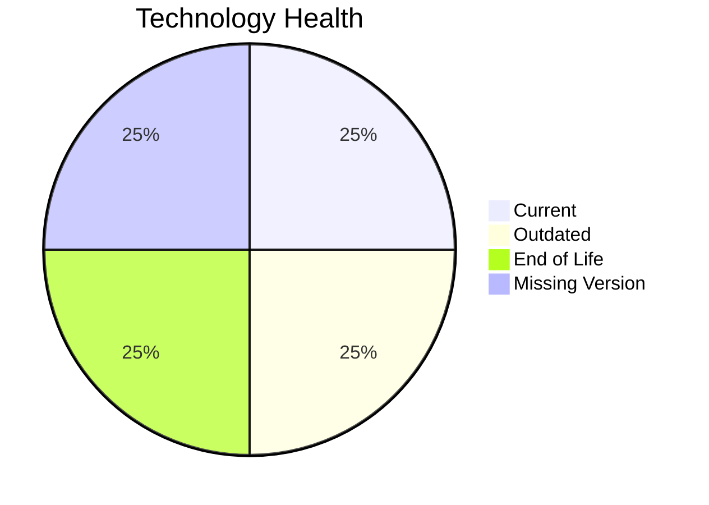

# Application Report: APIGatewayApp-030

**ID:** app030
**Generated:** 2026-04-24

## Overview

| Attribute | Value |
|-----------|-------|
| Owner | IT |
| Business Unit | IT |
| Deployment Type | AWS |
| Business Criticality | High |
| Users | 1800 |
| Servers | 2 |
| Architecture | 3-Tier |
| Solution Type | Open Source |
| CI/CD | Yes |
| Containerized | Yes |

## Technology Stack

| Component | Technology | Version | Status |
|-----------|-----------|---------|--------|
| Operating System | RHEL 8 | RHEL 8 | 🟢 CURRENT_VERSION |
| Language | Go 1.19 | Go 1.19 | 🟡 OUTDATED |
| Database | MySQL 5.7 | MySQL 5.7 | 🔴 EOL |
| App Server | Glassfish 3.0 | Glassfish 3.0 | ⚪ NO_KNOWLEDGE |

## Complexity Assessment

**Score:** 6/10 — **MEDIUM**
**Confidence:** 7

**Reasoning:** Tech age score 7/10 (1 EOL, 1 outdated components). Integration score 9/10 (30 external interfaces). Infrastructure score 5/10 (2 servers, 4 environments). Business criticality score 8/10 (criticality: High). Architecture score 1/10 (architecture: 3-Tier, containerized: Yes, CI/CD: Yes). Data score 3/10 (80GB storage).

### Contributing Factors

| Factor | Value |
|--------|-------|
| Servers | 2 |
| Environments | 4 |
| External Interfaces | 30 |
| EOL Technologies | 1 |
| Outdated Technologies | 1 |
| CI/CD | Yes |
| Containerized | Yes |

## Modernization Scenarios

### Applicable Scenarios

#### ✅ Upgrade Legacy Databases

- **Priority:** High
- **Effort:** Medium
- **Effects:** security, agility
- **Cost:** €11,565 (one-time)
- **Savings:** €10,000/year
- **Reasoning:** Database 'MySQL 5.7' is EOL. Upgrade to a supported version is recommended.

#### ✅ Update outdated components

- **Priority:** High
- **Effort:** High
- **Effects:** security, agility, cost
- **Cost:** N/A (one-time)
- **Savings:** N/A
- **Reasoning:** Programming language 'Go 1.19' is OUTDATED. Component updates are needed.

### Not Applicable / Other

| Scenario | Status | Reason |
|----------|--------|--------|
| Operating System Update | FULFILLED | Operating system 'RHEL 8' is currently supported and up to date.... |
| Switch to standard Linux Operating System | FULFILLED | Application already runs on a standard Linux distribution: 'RHEL 8'.... |
| Switch to ARM-based CPU | LACK_OF_DATA | CPU architecture not explicitly documented; cannot assess ARM suitability.... |
| Applications Server replacement | LACK_OF_DATA | Lifecycle data for application server 'Glassfish 3.0' is not available.... |
| Application Migration to Cloud Infrastructure (Lift & Shift) | FULFILLED | Application is already deployed on cloud: 'AWS'.... |
| Application Containerization | FULFILLED | Application is already containerized.... |
| Application Refactoring and De-coupling | LACK_OF_DATA | Insufficient architecture data to determine refactoring need.... |
| Switch DB Engine to open-source database solution | FULFILLED | Database 'MySQL 5.7' is already an open-source solution.... |

## Financial Summary

| Metric | Value |
|--------|-------|
| Total One-Time Cost | €11,565 |
| Total Yearly Savings | €10,000 |
| Break-Even | 1.2 years |
