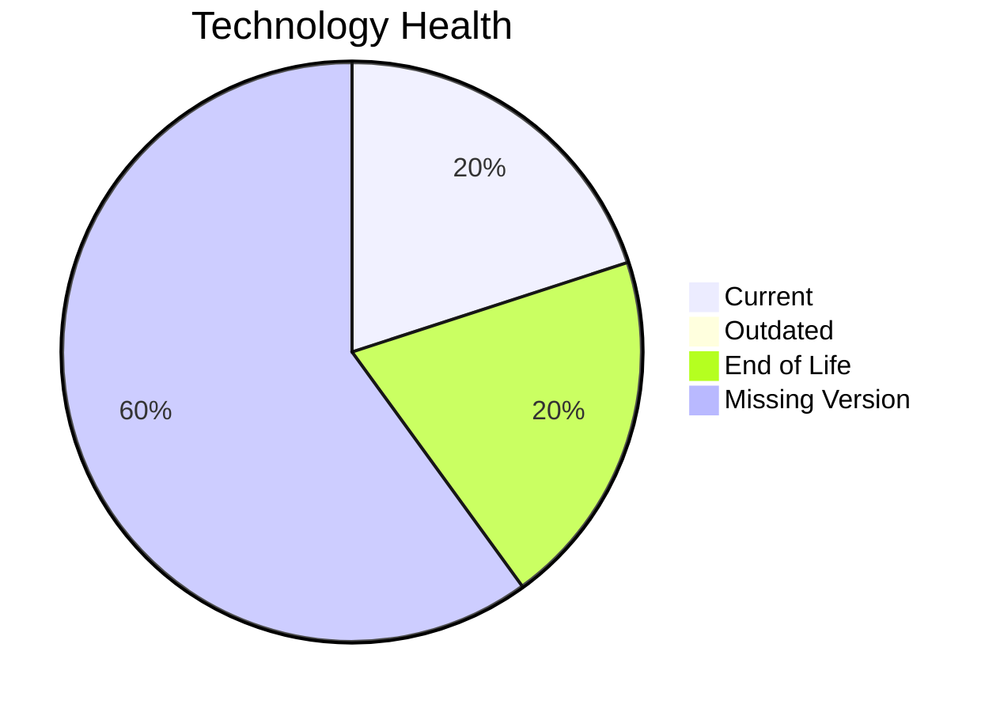

# Application Report: APIGatewayApp-030

**ID:** app030  
**Generated:** 2026-05-14

## Overview

| Attribute | Value |
|-----------|-------|
| Owner | unknown |
| Environment | AWS |
| Business Criticality | High |
| Users | 1800 |
| Servers | sv44, sv45 |

## Technology Stack

| Component | Technology | Version | Status |
|-----------|-----------|---------|--------|
| os | RHEL 8 | 8 | 🟢 CURRENT_VERSION |
| database | MySQL 5.7 | 5.7 | 🔴 EOL |
| language | Go 1.19 | 1.19 | ⚪ NO_KNOWLEDGE |
| framework | Framework | unknown | ⚪ NO_KNOWLEDGE |
| app_server | Glassfish 3.0 | 3.0 | ⚪ NO_KNOWLEDGE |

## Complexity Assessment

**Score:** 6/10 — **MEDIUM**  
**Confidence:** 8

**Reasoning:** Tech age 7/10 (1 EOL, 0 outdated components), integrations 30 interfaces and 0 dependencies, infrastructure 2 servers/4 environments, criticality High, architecture score 3/10, data score 3/10.

## Modernization Scenarios

### Applicable Scenarios

#### ✅ Switch to ARM-based CPU
- **Cost:** €5783 (one-time)
- **Savings:** €1000/year
- **Reasoning:** Cloud-hosted workload can be evaluated for ARM-based instances.
#### ✅ Upgrade Legacy Databases
- **Cost:** €11565 (one-time)
- **Savings:** €10000/year
- **Reasoning:** Database MySQL 5.7 is legacy/outdated.

### Not Applicable / Other

| Scenario | Status | Reason |
|----------|--------|--------|
| Operating System Update | FULFILLED | RHEL 8 appears current. |
| Switch to standard Linux Operating System | FULFILLED | Application already runs on a standard Linux platform. |
| Applications Server replacement | LACK_OF_DATA | Insufficient application server data. |
| Application Migration to Cloud Infrastructure (Lift & Shift) | FULFILLED | Application is already deployed in cloud. |
| Application Containerization | FULFILLED | Application is already containerized. |
| Application Refactoring and De-coupling | PARTIALLY_FULFILLED | Architecture shows partial decoupling already. |
| Switch DB Engine to open-source database solution | FULFILLED | Application already uses open-source database engine. |
| Update outdated components | APPLICABLE | Outdated or EOL components identified in technology assessment. |

## Financial Summary

| Metric | Value |
|--------|-------|
| Total One-Time Cost | €17348 |
| Total Yearly Savings | €11000 |
| Break-Even | 1.6 years |
