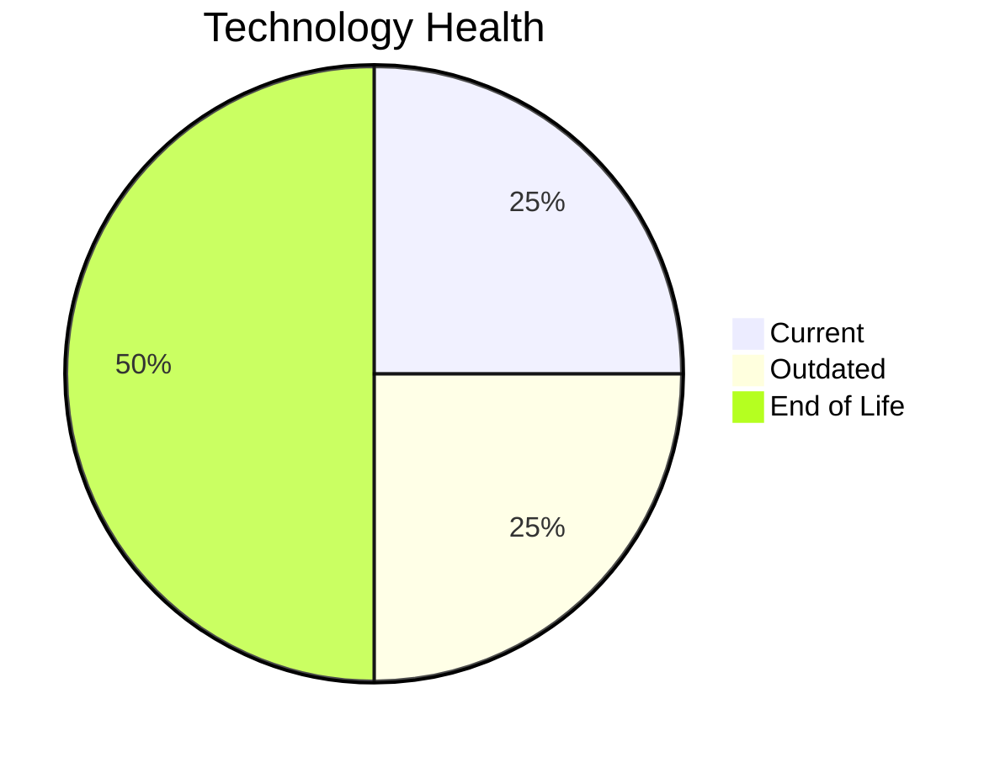

# Application Report: APIGatewayApp-030

**ID:** app030  
**Generated:** 2026-05-05

## Overview

| Attribute | Value |
|-----------|-------|
| Business Unit | IT |
| Deployment Type | AWS |
| Business Criticality | High |
| Users | 1800 |
| Servers | sv44, sv45 |
| Environments | 4 |
| Architecture | 3-Tier |
| Containerized | Yes |
| CI/CD | Yes |
| Solution Type | Open Source |
| Data Classification | Internal |

> Modern API gateway for managing microservices communication and external API access

## Technology Stack

| Component | Technology | Version | Status |
|-----------|-----------|---------|--------|
| Os | RHEL | 8 | 🟢 CURRENT_VERSION |
| Database | MySQL | 5.7 | 🔴 EOL |
| Language | Go | 1.19 | 🟡 OUTDATED |
| Application Server | GlassFish | 3.x | 🔴 EOL |

## Complexity Assessment

**Score:** 7/10 — **HIGH**  
**Confidence:** 7

> Score 7/10 (HIGH). EOL components: 2, Outdated: 1. External interfaces: 30. Servers: 2. Criticality: High. Architecture: 3-Tier. DB storage: 80.0GB.

| Factor | Value |
|--------|-------|
| Servers | 2 |
| Environments | 4 |
| External Interfaces | 30 |
| Business Criticality | High |
| EOL Technologies | 2 |
| Outdated Technologies | 1 |
| CI/CD | Yes |
| Containerized | Yes |

## Modernization Scenarios

### ✅ Applicable Scenarios

#### ✅ Application Server Replacement

- **Priority:** Medium
- **Effort:** Medium
- **One-Time Cost:** €13,300
- **Yearly Savings:** €9,600
- **Reasoning:** Application server GlassFish 3.x is EOL. GlassFish 3.x reached End of Life as Oracle discontinued commercial support. Eclipse GlassFish 3.x is also EOL. Replacement with a modern server is recommended.

#### ✅ Upgrade Legacy Databases

- **Priority:** High
- **Effort:** Medium
- **One-Time Cost:** €13,300
- **Yearly Savings:** €10,000
- **Reasoning:** Database MySQL 5.7 is EOL. MySQL 5.7 reached End of Life on October 31, 2023. No security patches available. Immediate upgrade is required.

#### ✅ Update Outdated Components

- **Priority:** High
- **Effort:** High
- **Reasoning:** Outdated/EOL application components detected: Go 1.19 (OUTDATED), GlassFish 3.x (EOL). These should be updated to current supported versions.

### Other Scenarios

| Scenario | Status | Reason |
|----------|--------|--------|
| Operating System Update | ✔️ FULFILLED | Operating system RHEL 8 is current and supported. |
| Switch to Standard Linux OS | ✔️ FULFILLED | Application already runs on standard Linux (RHEL 8). |
| Switch to ARM-based CPU | ❓ LACK_OF_DATA | CPU architecture is not explicitly documented in the application record. ARM eligibility cannot be confirmed. |
| Application Migration to Cloud (Lift & Shift) | ✔️ FULFILLED | Application is already hosted on cloud (AWS). Lift & Shift is not needed. |
| Application Containerization | ✔️ FULFILLED | Application is already containerized. |
| Application Refactoring and De-coupling | 🔶 PARTIALLY_FULFILLED | Application uses 3-tier architecture with CI/CD and containerization. Some decoupling is in place, but microservices mig... |
| Switch DB Engine to Open-Source | ✔️ FULFILLED | Application already uses an open-source database engine (MySQL 5.7). |

## Financial Summary

| Metric | Value |
|--------|-------|
| Total One-Time Cost | €26,600 |
| Total Yearly Savings | €19,600 |
| Break-Even | 1.4 years |
