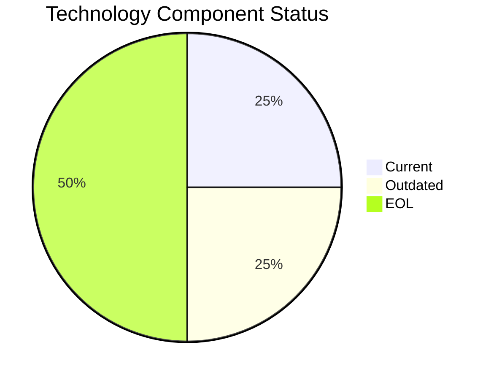

# APIGatewayApp-030 (app030)

> Analysis timestamp: 2025-07-15T00:00:00Z

## Application Overview

| Attribute | Value |
|-----------|-------|
| **Name** | APIGatewayApp-030 |
| **Status** | Production |
| **Criticality** | High |
| **Users** | 1,800 |
| **Solution Type** | Open Source |
| **Architecture** | 3-Tier |
| **Containerized** | Yes |
| **CI/CD** | Yes |
| **Environments** | 4 |
| **Servers** | sv44, sv45 |
| **External Interfaces** | 30 |

## Technology Stack

| Component | Value | Status |
|-----------|-------|--------|
| **Os** | RHEL 8 | ✅ CURRENT_VERSION |
| **Language** | Go 1.19 | ⚠️ OUTDATED |
| **Database** | MySQL 5.7 | ❌ EOL |
| **App Server** | Glassfish 3.0 | ❌ EOL |

## Technology Health

## Complexity Assessment

**Score: 7/10 — HIGH**

2 EOL component(s) significantly raise technical debt; 1 outdated component(s) require attention; 30 external interfaces drive integration complexity; 2 server(s) across 4 environment(s); Business criticality is High.

| Factor | Value |
|--------|-------|
| Servers | 2 |
| Environments | 4 |
| External Interfaces | 30 |
| EOL Technologies | 2 |
| Outdated Technologies | 1 |
| CI/CD Present | Yes |
| Containerized | Yes |

## Modernization Scenarios

| Scenario | Status | Reason |
|----------|--------|--------|
| OS Security Patch | ✅ FULFILLED | Operating system RHEL 8 is current and maintained. |
| Switch to Linux | ✅ FULFILLED | Application already runs on standard Linux (RHEL 8). |
| ARM CPU | 🔧 APPLICABLE | Application is containerized on Linux; ARM CPU migration is feasible. |
| App Server Replace | 🔧 APPLICABLE | Application server Glassfish 3.0 is EOL and should be replaced. |
| Cloud Deploy | 🔧 APPLICABLE | Application can be migrated to cloud infrastructure. |
| Containerization | ✅ FULFILLED | Application is already containerized. |
| Refactor/Decouple | ✅ FULFILLED | 3-Tier architecture already provides modular separation. |
| DB Upgrade | 🔧 APPLICABLE | Database MySQL 5.7 is EOL and should be upgraded. |
| Open Source DB | ✅ FULFILLED | Database MySQL 5.7 is already open source. |
| Update Components | 🔧 APPLICABLE | Application has EOL or outdated components that require updating. |

## Financial Summary

| Metric | Value |
|--------|-------|
| Total Implementation Cost | $39,900.30 |
| Total Annual Savings | $23,000.00 |
| Payback Period | 1.73 years |
| 5-Year Net Benefit | $75,099.70 |

### Applicable Scenario Costs

| Scenario | Impl. Cost | Annual Savings | Payback |
|----------|-----------|----------------|---------|
| ARM CPU | $6,650.05 | $1,000.00 | 6.65 yrs |
| App Server Replace | $13,300.10 | $9,600.00 | 1.39 yrs |
| Cloud Deploy | $6,650.05 | $2,400.00 | 2.77 yrs |
| DB Upgrade | $13,300.10 | $10,000.00 | 1.33 yrs |
