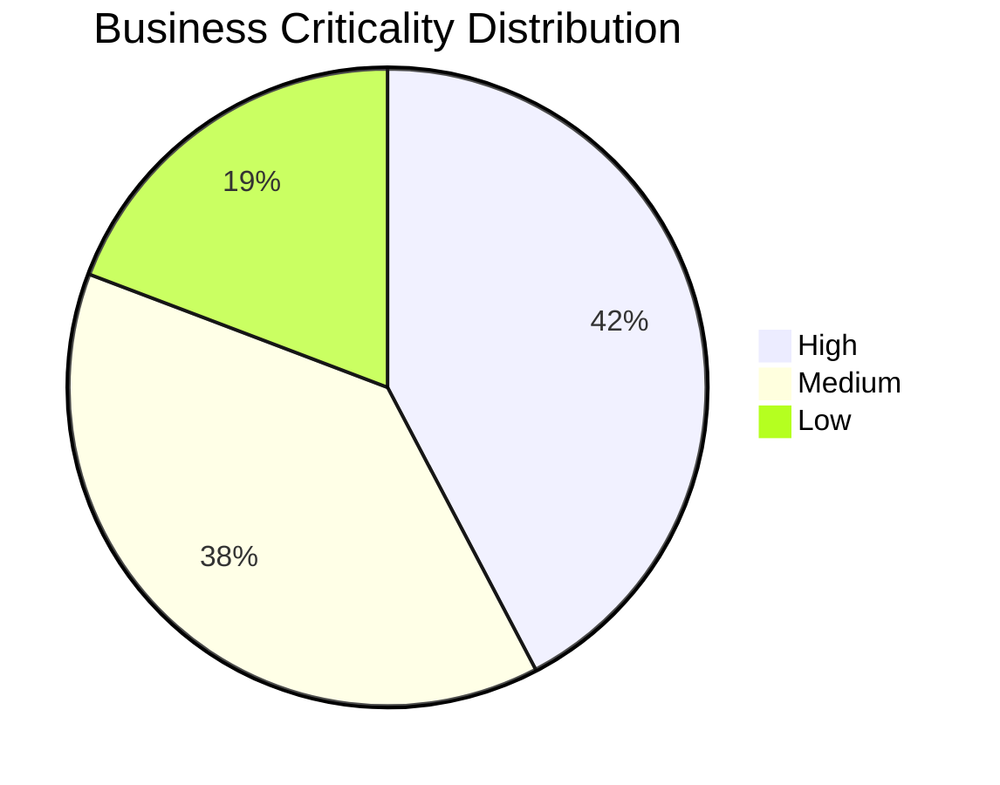
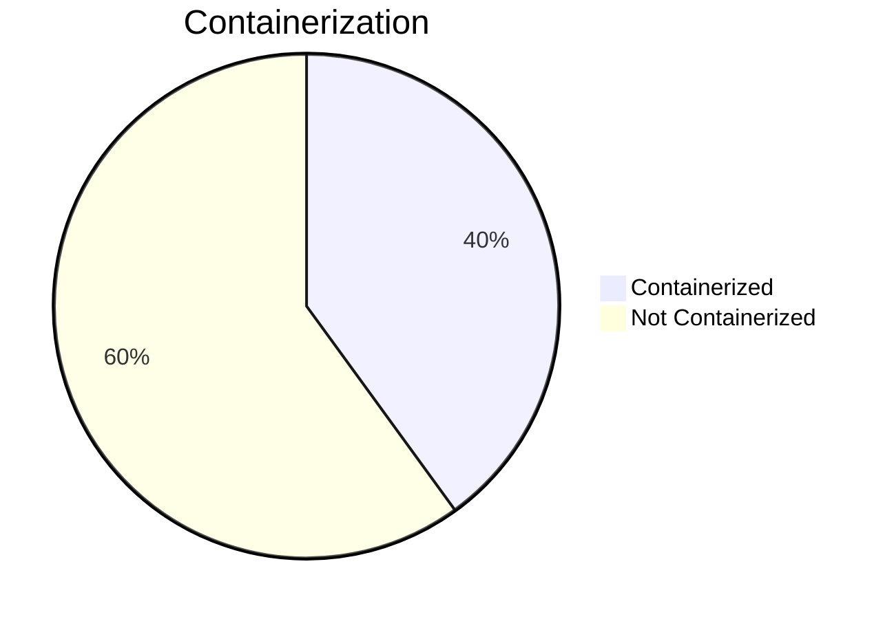

# Portfolio Modernization Report

**Generated:** 2026-05-15T09:47:21.946339+00:00  
**Input source:** discover/input/apps_db_complete.xlsx  
**Applications Analyzed:** 30

## Executive Summary

The portfolio analysis was generated from the Excel source in `discover/input/`.
A total of 30 applications were discovered, with 11 high-criticality,
10 medium-criticality, and 5 low-criticality systems.
Containerization coverage is currently 12/30 applications.

## Portfolio Overview

## Financial Summary

| Metric | Value |
|---|---|
| Total One-Time Investment (estimate) | 2188200 |
| Total Annual Savings (estimate) | 638225 |
| Portfolio Break-Even | 3.4 years |

## Per-Application Reports

| Application | Report |
|---|---|
| ERPApp-001 | [View Report](apps/app001.md) |
| CRMApp-002 | [View Report](apps/app002.md) |
| AnalyticsApp-003 | [View Report](apps/app003.md) |
| HRApp-004 | [View Report](apps/app004.md) |
| EComApp-005 | [View Report](apps/app005.md) |
| SupportApp-006 | [View Report](apps/app006.md) |
| FinanceApp-007 | [View Report](apps/app007.md) |
| InventoryApp-008 | [View Report](apps/app008.md) |
| MarketingApp-009 | [View Report](apps/app009.md) |
| PayrollApp-010 | [View Report](apps/app010.md) |
| RouteOptApp-011 | [View Report](apps/app011.md) |
| IoTSensorApp-012 | [View Report](apps/app012.md) |
| SecurityApp-013 | [View Report](apps/app013.md) |
| DocumentApp-014 | [View Report](apps/app014.md) |
| ReportingApp-015 | [View Report](apps/app015.md) |
| MobileApp-016 | [View Report](apps/app016.md) |
| BackupApp-017 | [View Report](apps/app017.md) |
| VendorApp-018 | [View Report](apps/app018.md) |
| QualityApp-019 | [View Report](apps/app019.md) |
| TrainingApp-020 | [View Report](apps/app020.md) |
| FleetApp-021 | [View Report](apps/app021.md) |
| ComplianceApp-022 | [View Report](apps/app022.md) |
| ChatbotApp-023 | [View Report](apps/app023.md) |
| AuditApp-024 | [View Report](apps/app024.md) |
| PortalApp-025 | [View Report](apps/app025.md) |
| LegacyFinApp-026 | [View Report](apps/app026.md) |
| DataWarehouseApp-027 | [View Report](apps/app027.md) |
| NotificationApp-028 | [View Report](apps/app028.md) |
| ConfigApp-029 | [View Report](apps/app029.md) |
| APIGatewayApp-030 | [View Report](apps/app030.md) |
