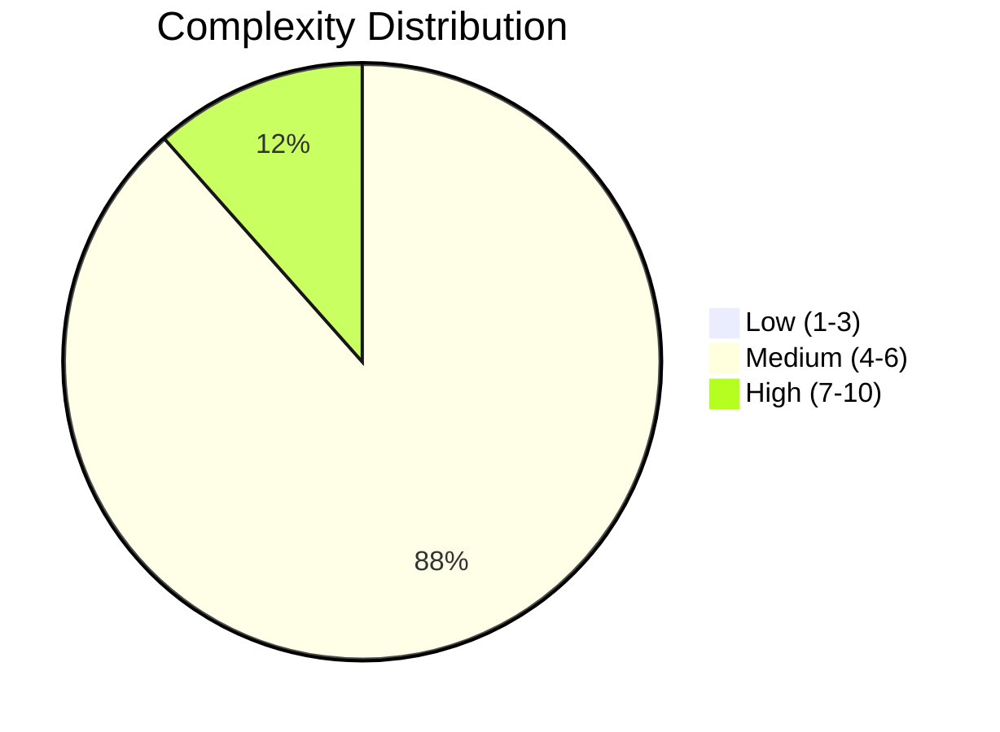
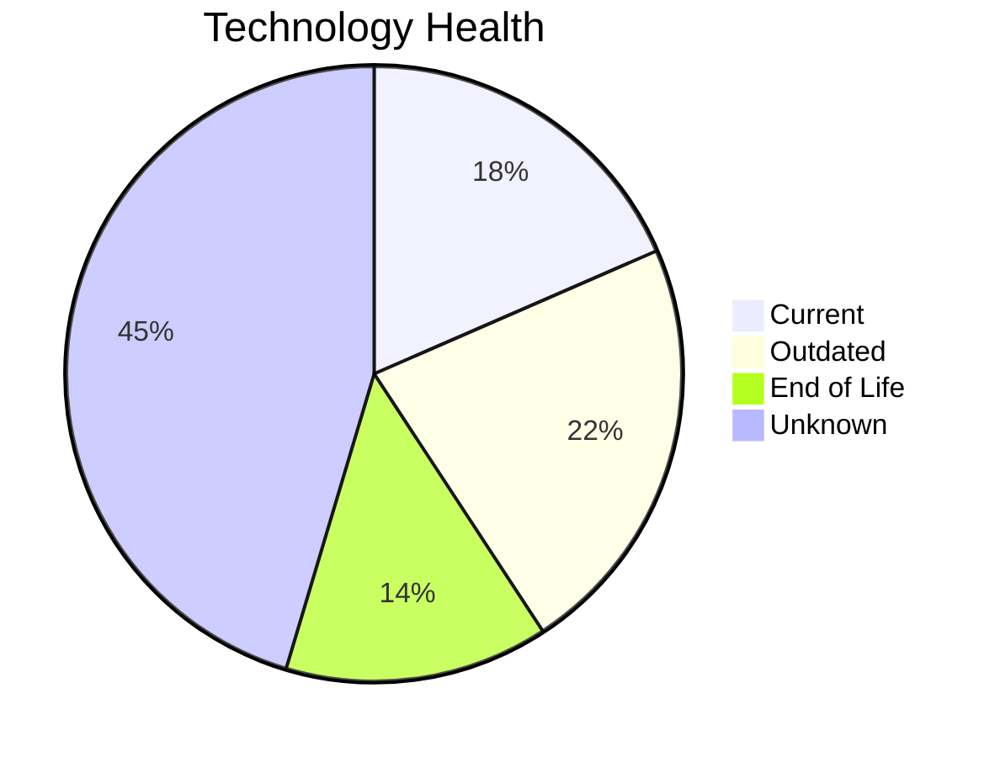
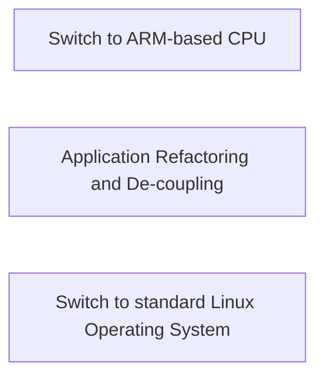
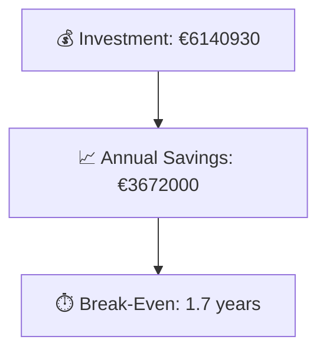

# Portfolio Modernization Report

**Generated:** 2026-05-14  
**Applications Analyzed:** 26

## Executive Summary

The portfolio contains 30 applications, with 26 in scope after excluding retired or SAP systems. Technology assessments show 18 end-of-life component findings and 29 outdated components across in-scope applications. Complexity is concentrated in the medium-to-high range (23 medium, 3 high), indicating structured modernization planning is required. Financial modeling estimates €6140930 one-time investment and €3672000 annual savings, with a portfolio break-even of 1.7 years.

## Portfolio Overview

## Top Modernization Opportunities

| Scenario | Applicable Apps | Priority | Total Cost | Yearly Savings | ROI |
|----------|----------------|----------|------------|---------------|-----|
| Switch to ARM-based CPU | 18 | N/A | €95003 | €18000 | 5.3y |
| Application Refactoring and De-coupling | 16 | N/A | €4237354 | €2130000 | 2.0y |
| Switch to standard Linux Operating System | 16 | N/A | €4944 | €6400 | 0.8y |
| Operating System Update | 15 | N/A | €17119 | €7500 | 2.3y |
| Application Containerization | 14 | N/A | €1480686 | €1240000 | 1.2y |
| Applications Server replacement | 14 | N/A | €150692 | €148800 | 1.0y |
| Upgrade Legacy Databases | 10 | N/A | €111776 | €100000 | 1.1y |
| Application Migration to Cloud Infrastructure (Lift & Shift) | 8 | N/A | €43356 | €21300 | 2.0y |

## Scenario Applicability Matrix

| Application | Switch to ARM-based CPU | Application Refactoring and De-coupling | Switch to standard Linux Operating System | Operating System Update | Application Containerization |
|---|---|---|---|---|---|
| ERPApp-001 | ❌ | ✅ | ✅ | ✅ | 🚫 |
| CRMApp-002 | ✅ | ✅ | ✔️ | ✅ | ✅ |
| AnalyticsApp-003 | ✅ | ◐ | ✔️ | ✅ | ✔️ |
| HRApp-004 | ✅ | ✅ | ✅ | ✅ | ✔️ |
| SupportApp-006 | ✅ | ✅ | ✅ | ❓ | ✅ |
| InventoryApp-008 | ❌ | ✅ | ✅ | ✅ | 🚫 |
| PayrollApp-010 | ✅ | ✅ | ✅ | ✔️ | ✅ |
| RouteOptApp-011 | ✅ | ◐ | ✅ | ✅ | ✔️ |
| IoTSensorApp-012 | ✅ | ✅ | ✅ | ✅ | ✔️ |
| SecurityApp-013 | ❌ | ◐ | ✅ | ❓ | ✅ |
| DocumentApp-014 | ✅ | ✅ | ✅ | ✔️ | ✅ |
| ReportingApp-015 | ✅ | ✅ | ✅ | ✔️ | ✅ |
| MobileApp-016 | ✅ | ◐ | ✔️ | ✅ | ✔️ |
| BackupApp-017 | ❌ | ✅ | ✔️ | ✅ | ✅ |
| VendorApp-018 | ❌ | ◐ | ✔️ | ✅ | ✅ |
| QualityApp-019 | ✅ | ◐ | ✔️ | ✔️ | ✅ |
| TrainingApp-020 | ✅ | ✅ | ✅ | ✅ | ✅ |
| FleetApp-021 | ❌ | ✅ | ✅ | ✅ | ✅ |
| ComplianceApp-022 | ✅ | ◐ | ✔️ | ✅ | ✔️ |
| ChatbotApp-023 | ✅ | ◐ | ✔️ | ✔️ | ✔️ |
| AuditApp-024 | ❌ | ✅ | ✅ | ✔️ | ✅ |
| PortalApp-025 | ✅ | ✅ | ✅ | ✔️ | ✔️ |
| LegacyFinApp-026 | ❌ | ✅ | ✅ | ✅ | ✅ |
| DataWarehouseApp-027 | ✅ | ◐ | ✔️ | ✅ | ✅ |
| NotificationApp-028 | ✅ | ✅ | ✅ | ✔️ | ✔️ |
| APIGatewayApp-030 | ✅ | ◐ | ✔️ | ✔️ | ✔️ |

Legend: ✅ Applicable | ❌ Not Applicable | ✔️ Already Fulfilled | 🚫 Blocked | ❓ Unknown | ◐ Partially fulfilled

## Financial Summary

| Metric | Value |
|--------|-------|
| Total One-Time Investment | €6140930 |
| Total Annual Savings | €3672000 |
| Portfolio Break-Even | 1.7 years |

## Risk Applications

| Application | Complexity | EOL Components | Applicable Scenarios |
|-------------|-----------|---------------|---------------------|
| HRApp-004 | 7/10 (HIGH) | 2 | 7 |
| BackupApp-017 | 7/10 (HIGH) | 2 | 7 |
| DataWarehouseApp-027 | 7/10 (HIGH) | 1 | 7 |
| TrainingApp-020 | 6/10 (MEDIUM) | 2 | 9 |
| CRMApp-002 | 6/10 (MEDIUM) | 2 | 6 |
| VendorApp-018 | 6/10 (MEDIUM) | 2 | 5 |
| FleetApp-021 | 6/10 (MEDIUM) | 1 | 9 |
| MobileApp-016 | 6/10 (MEDIUM) | 1 | 4 |
| ComplianceApp-022 | 6/10 (MEDIUM) | 1 | 3 |
| APIGatewayApp-030 | 6/10 (MEDIUM) | 1 | 3 |

## Per-Application Reports

| Application | Report |
|-------------|--------|
| ERPApp-001 | [View Report](apps/app001.md) |
| CRMApp-002 | [View Report](apps/app002.md) |
| AnalyticsApp-003 | [View Report](apps/app003.md) |
| HRApp-004 | [View Report](apps/app004.md) |
| SupportApp-006 | [View Report](apps/app006.md) |
| InventoryApp-008 | [View Report](apps/app008.md) |
| PayrollApp-010 | [View Report](apps/app010.md) |
| RouteOptApp-011 | [View Report](apps/app011.md) |
| IoTSensorApp-012 | [View Report](apps/app012.md) |
| SecurityApp-013 | [View Report](apps/app013.md) |
| DocumentApp-014 | [View Report](apps/app014.md) |
| ReportingApp-015 | [View Report](apps/app015.md) |
| MobileApp-016 | [View Report](apps/app016.md) |
| BackupApp-017 | [View Report](apps/app017.md) |
| VendorApp-018 | [View Report](apps/app018.md) |
| QualityApp-019 | [View Report](apps/app019.md) |
| TrainingApp-020 | [View Report](apps/app020.md) |
| FleetApp-021 | [View Report](apps/app021.md) |
| ComplianceApp-022 | [View Report](apps/app022.md) |
| ChatbotApp-023 | [View Report](apps/app023.md) |
| AuditApp-024 | [View Report](apps/app024.md) |
| PortalApp-025 | [View Report](apps/app025.md) |
| LegacyFinApp-026 | [View Report](apps/app026.md) |
| DataWarehouseApp-027 | [View Report](apps/app027.md) |
| NotificationApp-028 | [View Report](apps/app028.md) |
| APIGatewayApp-030 | [View Report](apps/app030.md) |
