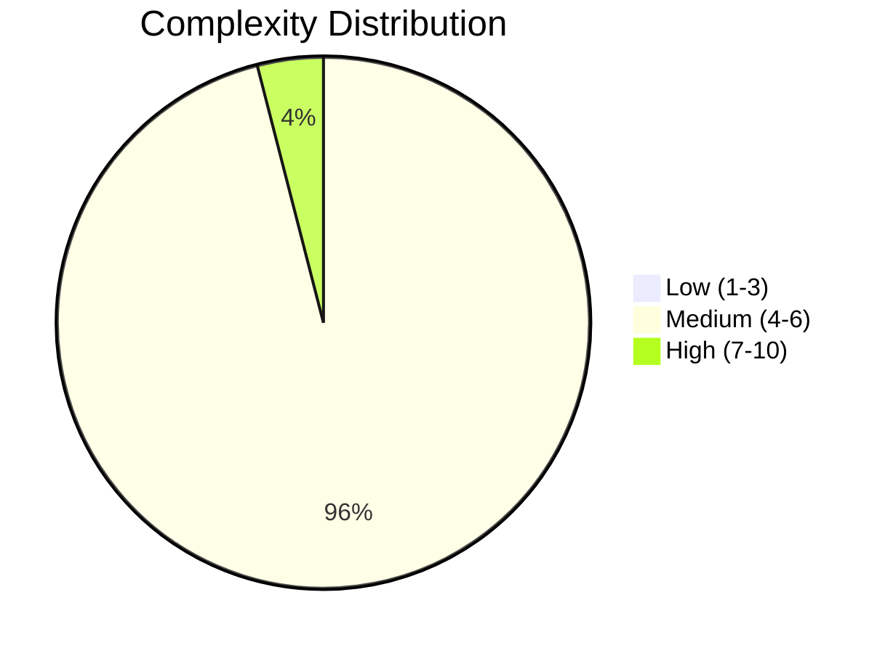
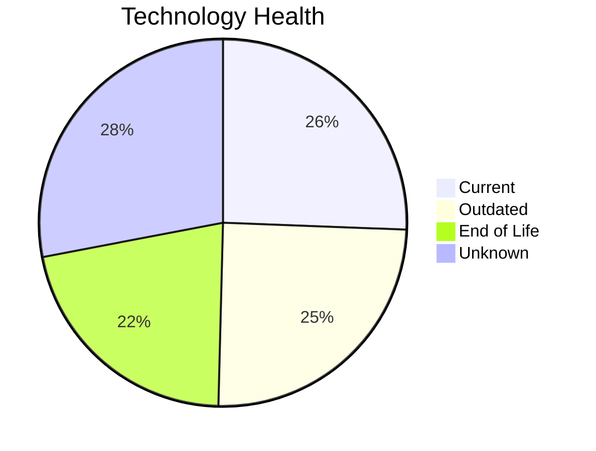
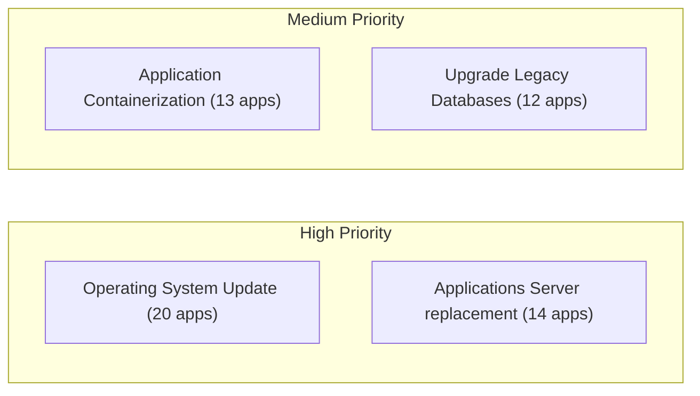
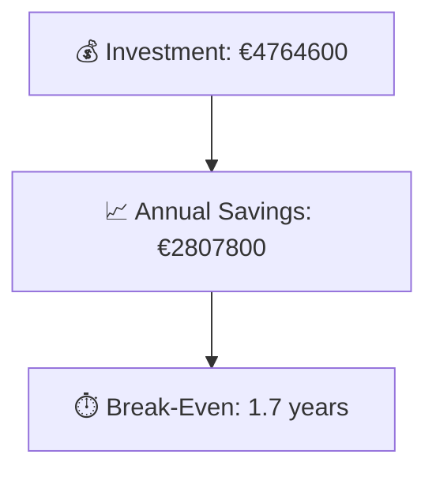

# Portfolio Modernization Report

**Generated:** 2026-05-17  
**Applications Analyzed:** 25

## Executive Summary

The assessment covered 25 in-scope applications from the provided portfolio. Technology risk remains material with 27 EOL and 31 outdated component findings across assessed stacks. The highest-value opportunities cluster around Operating System Update, Applications Server replacement. The estimated one-time investment is €4764600 with annual savings of €2807800, yielding an estimated break-even of 1.7 years where savings are available.

## Portfolio Overview

## Top Modernization Opportunities

| Scenario | Applicable Apps | Priority | Total Cost | Yearly Savings | ROI |
|----------|----------------|----------|------------|---------------|-----|
| Operating System Update | 20 | High | €22427 | €10000 | 2.2y |
| Applications Server replacement | 14 | Medium | €159121 | €150000 | 1.1y |
| Application Containerization | 13 | High | €1447379 | €1160000 | 1.2y |
| Upgrade Legacy Databases | 12 | High | €137272 | €120000 | 1.1y |
| Application Refactoring and De-coupling | 10 | High | €2896986 | €1335000 | 2.2y |
| Switch to ARM-based CPU | 10 | Medium | €54910 | €10000 | 5.5y |
| Application Migration to Cloud Infrastructure (Lift & Shift) | 8 | High | €45509 | €21600 | 2.1y |
| Switch to standard Linux Operating System | 3 | Medium | €996 | €1200 | 0.8y |

## Scenario Applicability Matrix

| Application | Operating System Update | Switch to standard Linux Operating System | Switch to ARM-based CPU | Applications Server replacement | Application Migration to Cloud Infrastructure (Lift & Shift) |
|-------------|:---:|:---:|:---:|:---:|:---:|
| ERPApp-001 | ✅ | ✅ | 🚫 | ❓ | ✅ |
| CRMApp-002 | ✅ | ✔️ | 🚫 | ✅ | ✔️ |
| HRApp-004 | ✅ | ❌ | ✅ | ✅ | 🟨 |
| SupportApp-006 | ✅ | ✔️ | 🚫 | ✅ | ✔️ |
| InventoryApp-008 | ✅ | ✅ | 🚫 | ✅ | ✅ |
| PayrollApp-010 | ✅ | ❌ | 🚫 | 🟨 | ✔️ |
| RouteOptApp-011 | ✅ | ✔️ | ✅ | ✅ | ✔️ |
| IoTSensorApp-012 | ✔️ | ❌ | ✅ | 🟨 | ✔️ |
| SecurityApp-013 | ✅ | ✔️ | ❓ | ✅ | ✅ |
| DocumentApp-014 | ✅ | ❌ | ✅ | 🟨 | ✔️ |
| ReportingApp-015 | ✅ | ❌ | ✅ | 🟨 | ✔️ |
| MobileApp-016 | ✅ | ✔️ | ✅ | ✅ | ✔️ |
| BackupApp-017 | ✅ | ✔️ | 🚫 | ✅ | ✅ |
| VendorApp-018 | ✅ | ✔️ | ❓ | ✅ | ✅ |
| QualityApp-019 | ✔️ | ✔️ | ❓ | ✅ | 🟨 |
| TrainingApp-020 | ✅ | ❌ | 🚫 | ✅ | ✔️ |
| FleetApp-021 | ✔️ | ❌ | ❓ | 🟨 | ✅ |
| ComplianceApp-022 | ✅ | ✔️ | ✅ | 🟨 | 🟨 |
| ChatbotApp-023 | ✔️ | ✔️ | ✅ | ✅ | ✔️ |
| AuditApp-024 | ✅ | ❌ | ❓ | 🟨 | ✅ |
| PortalApp-025 | ✅ | ❌ | ✅ | 🟨 | ✔️ |
| LegacyFinApp-026 | ✅ | ✅ | 🚫 | ❓ | ✅ |
| DataWarehouseApp-027 | ✅ | ✔️ | ❓ | ✅ | 🟨 |
| NotificationApp-028 | ✅ | ❌ | 🚫 | 🟨 | ✔️ |
| APIGatewayApp-030 | ✔️ | ✔️ | ✅ | ✅ | ✔️ |

Legend: ✅ Applicable | ❌ Not Applicable | ✔️ Already Fulfilled | 🚫 Blocked | ❓ Unknown | 🟨 Partially fulfilled

## Financial Summary

| Metric | Value |
|--------|-------|
| Total One-Time Investment | €4764600 |
| Total Annual Savings | €2807800 |
| Portfolio Break-Even | 1.7 years |

## Risk Applications

| Application | Complexity | EOL Components | Applicable Scenarios |
|-------------|-----------|---------------|---------------------|
| DataWarehouseApp-027 | 7/10 (HIGH) | 1 | 6 |
| VendorApp-018 | 6/10 (MEDIUM) | 3 | 6 |
| InventoryApp-008 | 6/10 (MEDIUM) | 2 | 8 |
| HRApp-004 | 6/10 (MEDIUM) | 2 | 6 |
| TrainingApp-020 | 6/10 (MEDIUM) | 2 | 6 |
| APIGatewayApp-030 | 6/10 (MEDIUM) | 2 | 5 |
| CRMApp-002 | 6/10 (MEDIUM) | 2 | 4 |
| SecurityApp-013 | 6/10 (MEDIUM) | 1 | 7 |
| MobileApp-016 | 6/10 (MEDIUM) | 1 | 7 |
| BackupApp-017 | 6/10 (MEDIUM) | 1 | 7 |

## Per-Application Reports

| Application | Report |
|-------------|--------|
| ERPApp-001 | [View Report](apps/app001.md) |
| CRMApp-002 | [View Report](apps/app002.md) |
| HRApp-004 | [View Report](apps/app004.md) |
| SupportApp-006 | [View Report](apps/app006.md) |
| InventoryApp-008 | [View Report](apps/app008.md) |
| PayrollApp-010 | [View Report](apps/app010.md) |
| RouteOptApp-011 | [View Report](apps/app011.md) |
| IoTSensorApp-012 | [View Report](apps/app012.md) |
| SecurityApp-013 | [View Report](apps/app013.md) |
| DocumentApp-014 | [View Report](apps/app014.md) |
| ReportingApp-015 | [View Report](apps/app015.md) |
| MobileApp-016 | [View Report](apps/app016.md) |
| BackupApp-017 | [View Report](apps/app017.md) |
| VendorApp-018 | [View Report](apps/app018.md) |
| QualityApp-019 | [View Report](apps/app019.md) |
| TrainingApp-020 | [View Report](apps/app020.md) |
| FleetApp-021 | [View Report](apps/app021.md) |
| ComplianceApp-022 | [View Report](apps/app022.md) |
| ChatbotApp-023 | [View Report](apps/app023.md) |
| AuditApp-024 | [View Report](apps/app024.md) |
| PortalApp-025 | [View Report](apps/app025.md) |
| LegacyFinApp-026 | [View Report](apps/app026.md) |
| DataWarehouseApp-027 | [View Report](apps/app027.md) |
| NotificationApp-028 | [View Report](apps/app028.md) |
| APIGatewayApp-030 | [View Report](apps/app030.md) |
