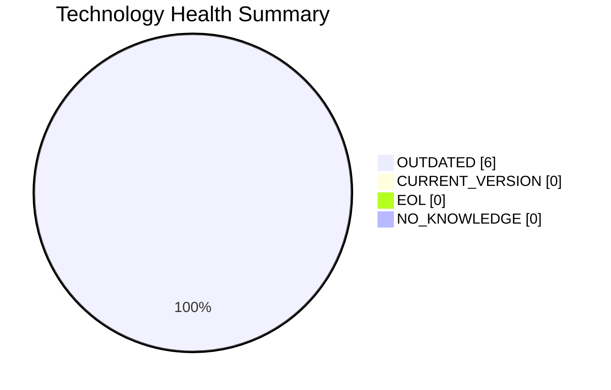

# Portfolio Modernization Report

**Analysis date:** 2025-01-01  
**Portfolio size:** 2 applications  
**Scope:** Full modernization assessment for two production finance ERP applications

## Executive Summary

This portfolio contains two highly similar finance-critical COBOL applications running on AIX 7.2 with Oracle 19c. Both applications are in production, handle confidential financial data, and support core ERP capabilities including accounting, budgeting, and financial planning.

Key findings:
- Both applications are **in scope** for modernization.
- All assessed technology components are **OUTDATED**.
- Both applications have **High complexity** with a normalized score of **8/10**.
- The strongest business case scenarios are Linux replatforming, database modernization, and selective refactoring.
- Portfolio-level business case shows **$1,048,680** estimated total investment and **70.6% ROI over 5 years**.

## Portfolio Application Overview

| App ID | App Name | Business Criticality | Status | OS | Language | Database | Architecture | Users | Complexity |
|---|---|---:|---|---|---|---|---|---:|---:|
| scenarioa-test-transform | COBOL transform | High | Production | AIX 7.2 | COBOL-2014 | Oracle 19c | 1-Tier | 350 | 8/10 |
| scenarioa-test-maintain | COBOL maintain | High | Production | AIX 7.2 | COBOL-2014 | Oracle 19c | 1-Tier | 350 | 8/10 |

## Technology Health Summary

Across the portfolio, 6 major technology components were assessed.

### Summary Observations
- **AIX 7.2** is beyond standard support and remains only in extended support.
- **COBOL-2014** is a legacy language standard with a shrinking talent pool.
- **Oracle 19c** is beyond Premier Support and remains in Extended Support.
- The stack is stable enough to operate today, but it is strategically aging and increasingly costly to sustain.

## Application Assessments

### 1. COBOL transform (`scenarioa-test-transform`)

#### Key Attributes
- Business unit: Finance
- Deployment: On-Premise
- Data classification: Confidential
- Servers: sv01, sv02
- Database size: 1000 GB
- CI/CD present: No
- External interfaces: 5
- Decommission target: 2027

#### Technology Assessment

| Component | Type | Status | EOL / Support Date | Confidence |
|---|---|---|---|---:|
| AIX 7.2 | OS | OUTDATED | 2028-04-30 | 8 |
| COBOL-2014 | Programming language | OUTDATED | N/A | 7 |
| Oracle 19c | Database | OUTDATED | 2027-01-31 | 9 |

#### Complexity Assessment
- **Score:** 8/10 (High)
- **Multiplier:** 1.8
- **Drivers:** legacy Unix platform, COBOL skills scarcity, large Oracle estate, monolithic architecture, no CI/CD, finance criticality.

| Factor | Score | Rationale |
|---|---:|---|
| technology_age | 2.0 | AIX 7.2 and COBOL-2014 create very high modernization complexity. |
| eol_outdated_components | 1.5 | All assessed components are outdated. |
| business_criticality | 1.5 | Finance ERP workload and confidential data increase risk. |
| database_complexity | 1.0 | 1TB Oracle estate with licensing dependency. |
| architecture | 1.0 | 1-tier monolith without CI/CD. |
| external_interfaces | 1.0 | Five interfaces require careful regression testing. |
| server_count | 0.5 | Two production server instances. |
| decommission_timeline | 0.5 | 2027 target adds schedule pressure. |

#### Scenario Applicability

| Scenario | Status | Summary |
|---|---|---|
| os_update_security_patch | APPLICABLE | AIX 7.2 is past standard support and should be updated or migrated. |
| switch_to_standard_linux_os | APPLICABLE | AIX is a proprietary Unix platform and a strong Linux replatform candidate. |
| switch_to_arm_cpu | NOT_APPLICABLE | Current platform is IBM POWER/AIX, not x86/x64. |
| application_server_replacement | NOT_APPLICABLE | No application server layer exists. |
| app_deployment_to_cloud | APPLICABLE | On-premise deployment qualifies, but migration effort is high. |
| app_containerization | BLOCKED | AIX and the monolithic COBOL design block containerization. |
| app_refactor_decoupling | APPLICABLE | Monolithic 1-tier design and zero APIs support decoupling. |
| upgrade_legacy_databases | APPLICABLE | Oracle 19c is outdated and in Extended Support. |
| switch_db_engine_open_source | APPLICABLE | Oracle licensing and custom code make PostgreSQL migration viable. |
| update_outdated_components | APPLICABLE | Entire core stack is outdated. |

#### Business Case

| Scenario | Adjusted Cost | Yearly Savings | 3-Year ROI | 5-Year ROI |
|---|---:|---:|---:|---:|
| OS update | $1,800 | $500 | -16.7% | 38.9% |
| Switch to Linux | $540 | $400 | 122.2% | 270.4% |
| Cloud lift & shift | $9,000 | $3,000 | 0.0% | 66.7% |
| Refactor & decouple | $450,000 | $150,000 | 0.0% | 66.7% |
| Upgrade legacy DB | $18,000 | $10,000 | 66.7% | 177.8% |
| Switch DB to PostgreSQL | $45,000 | $15,000 | 0.0% | 66.7% |

**App total:** adjusted cost **$524,340**, yearly savings **$178,900**, 3-year ROI **2.4%**, 5-year ROI **70.6%**.

#### Recommendation
Prioritize a phased roadmap: stabilize the platform, replatform off AIX, modernize the database posture, and selectively refactor integration boundaries before pursuing containerization.

### 2. COBOL maintain (`scenarioa-test-maintain`)

This application has the same assessed technology posture, complexity profile, scenario applicability, and business case as COBOL transform.

#### Technology Assessment

| Component | Type | Status | EOL / Support Date | Confidence |
|---|---|---|---|---:|
| AIX 7.2 | OS | OUTDATED | 2028-04-30 | 8 |
| COBOL-2014 | Programming language | OUTDATED | N/A | 7 |
| Oracle 19c | Database | OUTDATED | 2027-01-31 | 9 |

#### Complexity Assessment
- **Score:** 8/10 (High)
- **Multiplier:** 1.8

#### Scenario Applicability
Applicable scenarios: os_update_security_patch, switch_to_standard_linux_os, app_deployment_to_cloud, app_refactor_decoupling, upgrade_legacy_databases, switch_db_engine_open_source, update_outdated_components.

#### Business Case
**App total:** adjusted cost **$524,340**, yearly savings **$178,900**, 3-year ROI **2.4%**, 5-year ROI **70.6%**.

## Portfolio-Level Business Case Summary

| Scope | Adjusted Cost | Yearly Savings | 3-Year Savings | 3-Year ROI | 5-Year Savings | 5-Year ROI |
|---|---:|---:|---:|---:|---:|---:|
| Per application | $524,340 | $178,900 | $536,700 | 2.4% | $894,500 | 70.6% |
| Portfolio total (2 apps) | $1,048,680 | $357,800 | $1,073,400 | 2.4% | $1,789,000 | 70.6% |

## Recommended Modernization Sequence
1. Execute short-term OS and database risk reduction.
2. Replatform from AIX to a standard Linux target.
3. Introduce interface decoupling and service boundaries.
4. Decide between cloud-hosted replatforming and deeper refactoring.
5. Reassess containerization only after Linux migration and modularization.
