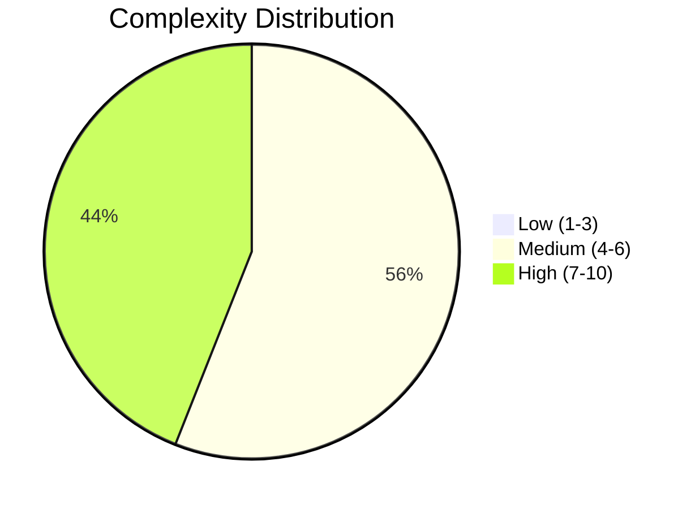
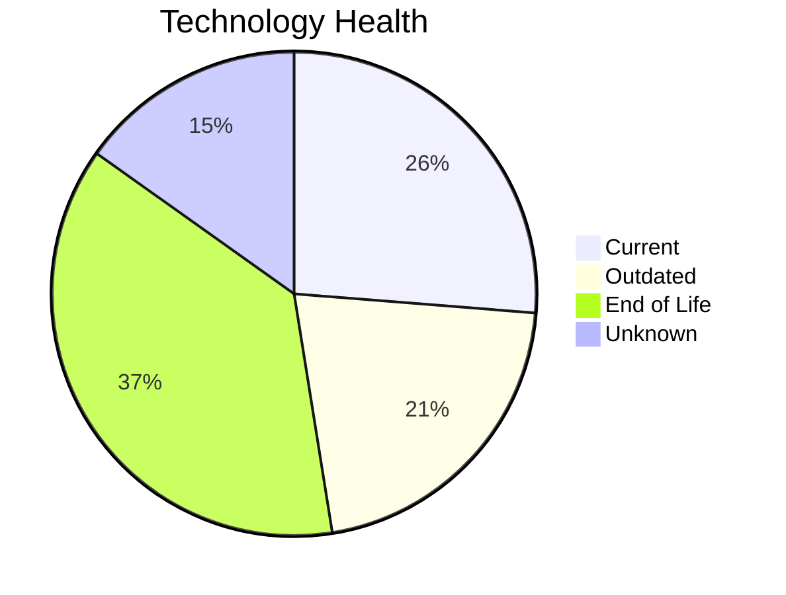
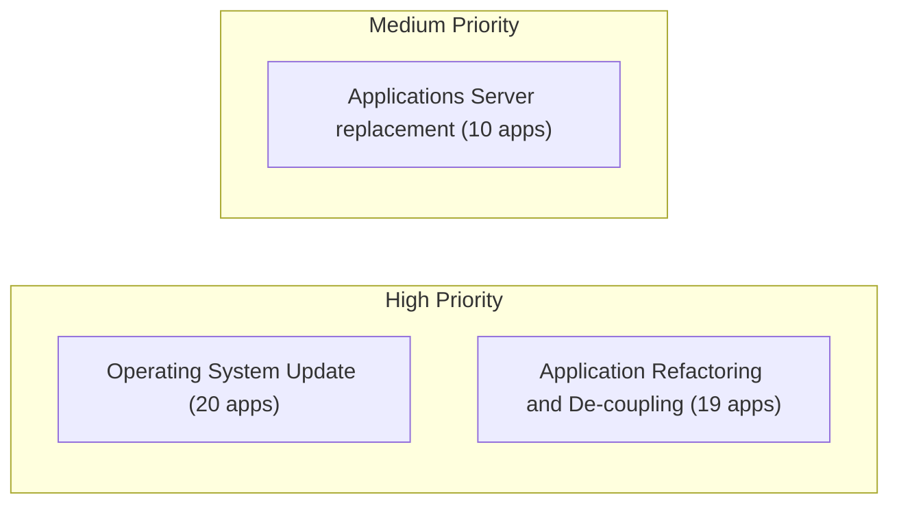
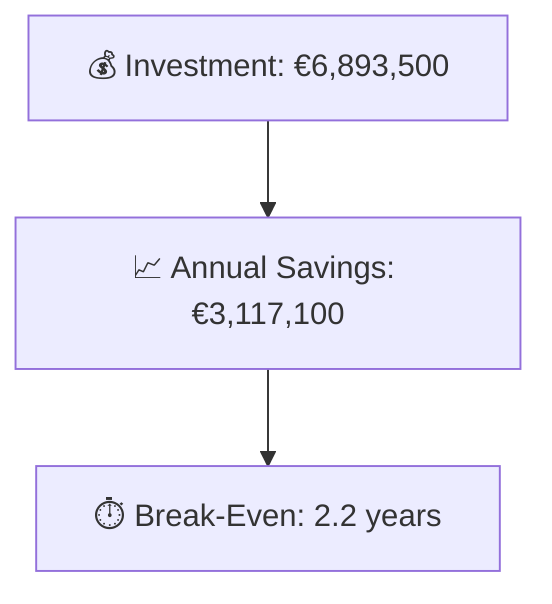

# Portfolio Modernization Report

**Generated:** 2026-05-19
**Applications Analyzed:** 25

## Summary

The portfolio contains 30 applications, of which 25 are in scope after excluding 5 retired systems.
Technology risk is concentrated in 19 applications with at least one EOL component, while 11 applications score high on modernization complexity.
The most common actionable themes are Operating System Update, Application Refactoring and De-coupling, Upgrade Legacy Databases, driven largely by legacy operating systems, databases, and tightly coupled application stacks.
Across all applicable scenarios, the estimated one-time investment is €6,893,500 against €3,117,100 in yearly savings, for a break-even of 2.2 years.

## Modernization Opportunities

| Scenario | Applicable Apps | Priority | Total Cost | Yearly Savings | ROI |
|----------|----------------|----------|------------|---------------|-----|
| Operating System Update | 20 | High | €24,844 | €10,000 | 2.5y |
| Application Refactoring and De-coupling | 19 | High | €5,864,805 | €2,445,000 | 2.4y |
| Upgrade Legacy Databases | 12 | High | €151,412 | €120,000 | 1.3y |
| Applications Server replacement | 10 | Medium | €128,542 | €100,800 | 1.3y |
| Application Migration to Cloud Infrastructure (Lift & Shift) | 8 | High | €52,595 | €20,100 | 2.6y |
| Application Containerization | 5 | High | €670,209 | €420,000 | 1.6y |
| Switch to standard Linux Operating System | 3 | Medium | €1,093 | €1,200 | 0.9y |

## Scenario Overview

| Application | Operating System Update | Switch to standard Linux Operating System | Switch to ARM-based CPU | Applications Server replacement | Application Migration to Cloud Infrastructure (Lift & Shift) | Application Containerization | Application Refactoring and De-coupling | Upgrade Legacy Databases | Switch DB Engine to open-source database solution | Update outdated components |
|-------------|:---:|:---:|:---:|:---:|:---:|:---:|:---:|:---:|:---:|:---:|
| ERPApp-001 | ✅ | ✅ | 🚫 | ❌ | ✅ | 🚫 | ✅ | ✔️ | ✅ | ✅ |
| CRMApp-002 | ✅ | ✔️ | 🚫 | 🚫 | ✔️ | 🚫 | 🚫 | ❓ | ✔️ | 🚫 |
| HRApp-004 | ✅ | ❌ | 🚫 | ✅ | 🟨 | ✔️ | ✅ | ✅ | ✅ | ✅ |
| SupportApp-006 | ✅ | ✔️ | 🚫 | 🚫 | ✔️ | 🚫 | 🚫 | ✅ | ✔️ | 🚫 |
| InventoryApp-008 | ✅ | ✅ | 🚫 | ✅ | ✅ | 🚫 | ✅ | ✅ | ✅ | ✅ |
| PayrollApp-010 | ✅ | ❌ | 🚫 | ✔️ | ✔️ | 🚫 | 🚫 | ✅ | ✔️ | 🚫 |
| RouteOptApp-011 | ✅ | ✔️ | ❓ | ✅ | ✔️ | ✔️ | ✅ | ✔️ | ✔️ | ✅ |
| IoTSensorApp-012 | ✔️ | ❌ | 🚫 | ✔️ | ✔️ | ✔️ | ✅ | ✔️ | ✔️ | ✅ |
| SecurityApp-013 | ✅ | ✔️ | ❓ | ✅ | ✅ | ✅ | ✅ | ✔️ | ✅ | ✅ |
| DocumentApp-014 | ✅ | ❌ | 🚫 | ✔️ | ✔️ | ✅ | ✅ | ✅ | ✔️ | ✅ |
| ReportingApp-015 | ✅ | ❌ | 🚫 | ✔️ | ✔️ | ❓ | ✅ | ❓ | ✔️ | ✅ |
| MobileApp-016 | ✅ | ✔️ | ❓ | ✅ | ✔️ | ✔️ | ✅ | ✅ | ✅ | ✅ |
| BackupApp-017 | ✅ | ✔️ | 🚫 | 🚫 | ✅ | 🚫 | 🚫 | ✅ | 🚫 | 🚫 |
| VendorApp-018 | ✅ | ✔️ | ❓ | ✅ | ✅ | ✅ | ✅ | ✅ | ✔️ | ✅ |
| QualityApp-019 | ✔️ | ✔️ | ❓ | ✅ | 🟨 | ✅ | ✅ | ✅ | ✔️ | ✅ |
| TrainingApp-020 | ✅ | ❌ | 🚫 | 🚫 | ✔️ | 🚫 | 🚫 | ✅ | 🚫 | 🚫 |
| FleetApp-021 | ✔️ | ❌ | 🚫 | ✔️ | ✅ | ❓ | ✅ | ✅ | ✅ | ✅ |
| ComplianceApp-022 | ✅ | ✔️ | ❓ | ✔️ | 🟨 | ✔️ | ✅ | ✔️ | ✔️ | ✅ |
| ChatbotApp-023 | ✔️ | ✔️ | ❓ | ✅ | ✔️ | ✔️ | ✅ | ❓ | ✔️ | ✅ |
| AuditApp-024 | ✅ | ❌ | 🚫 | ✔️ | ✅ | ❓ | ✅ | ❓ | ✅ | ✅ |
| PortalApp-025 | ✅ | ❌ | 🚫 | ✔️ | ✔️ | ✔️ | ✅ | ✔️ | ✔️ | ✅ |
| LegacyFinApp-026 | ✅ | ✅ | 🚫 | ❌ | ✅ | 🚫 | ✅ | ❓ | ✅ | ✅ |
| DataWarehouseApp-027 | ✅ | ✔️ | ❓ | ✅ | 🟨 | ✅ | ✅ | ✔️ | ✅ | ✅ |
| NotificationApp-028 | ✅ | ❌ | 🚫 | ✔️ | ✔️ | ✔️ | 🚫 | ✔️ | 🚫 | 🚫 |
| APIGatewayApp-030 | ✔️ | ✔️ | ❓ | ✅ | ✔️ | ✔️ | ✅ | ✅ | ✔️ | ✅ |

Legend: ✅ Applicable | ❌ Not Applicable | ✔️ Already Fulfilled | 🚫 Blocked | ❓ Unknown | 🟨 Partially Fulfilled

## Roadmap Proposal

| Application | Complexity | EOL Components | Applicable Scenarios |
|-------------|-----------|---------------|---------------------|
| SecurityApp-013 | 8/10 (HIGH) | 2 | 7 |
| DataWarehouseApp-027 | 8/10 (HIGH) | 2 | 6 |
| BackupApp-017 | 8/10 (HIGH) | 2 | 3 |
| VendorApp-018 | 7/10 (HIGH) | 3 | 7 |
| APIGatewayApp-030 | 7/10 (HIGH) | 3 | 4 |
| TrainingApp-020 | 7/10 (HIGH) | 3 | 2 |
| InventoryApp-008 | 7/10 (HIGH) | 2 | 8 |
| HRApp-004 | 7/10 (HIGH) | 2 | 6 |
| CRMApp-002 | 7/10 (HIGH) | 2 | 1 |
| FleetApp-021 | 7/10 (HIGH) | 1 | 5 |

| Metric | Value |
|--------|-------|
| Total One-Time Investment | €6,893,500 |
| Total Annual Savings | €3,117,100 |
| Portfolio Break-Even | 2.2 years |

| Application | Report |
|-------------|--------|
| ERPApp-001 | [View Report](apps/app001.md) |
| CRMApp-002 | [View Report](apps/app002.md) |
| HRApp-004 | [View Report](apps/app004.md) |
| SupportApp-006 | [View Report](apps/app006.md) |
| InventoryApp-008 | [View Report](apps/app008.md) |
| PayrollApp-010 | [View Report](apps/app010.md) |
| RouteOptApp-011 | [View Report](apps/app011.md) |
| IoTSensorApp-012 | [View Report](apps/app012.md) |
| SecurityApp-013 | [View Report](apps/app013.md) |
| DocumentApp-014 | [View Report](apps/app014.md) |
| ReportingApp-015 | [View Report](apps/app015.md) |
| MobileApp-016 | [View Report](apps/app016.md) |
| BackupApp-017 | [View Report](apps/app017.md) |
| VendorApp-018 | [View Report](apps/app018.md) |
| QualityApp-019 | [View Report](apps/app019.md) |
| TrainingApp-020 | [View Report](apps/app020.md) |
| FleetApp-021 | [View Report](apps/app021.md) |
| ComplianceApp-022 | [View Report](apps/app022.md) |
| ChatbotApp-023 | [View Report](apps/app023.md) |
| AuditApp-024 | [View Report](apps/app024.md) |
| PortalApp-025 | [View Report](apps/app025.md) |
| LegacyFinApp-026 | [View Report](apps/app026.md) |
| DataWarehouseApp-027 | [View Report](apps/app027.md) |
| NotificationApp-028 | [View Report](apps/app028.md) |
| APIGatewayApp-030 | [View Report](apps/app030.md) |
