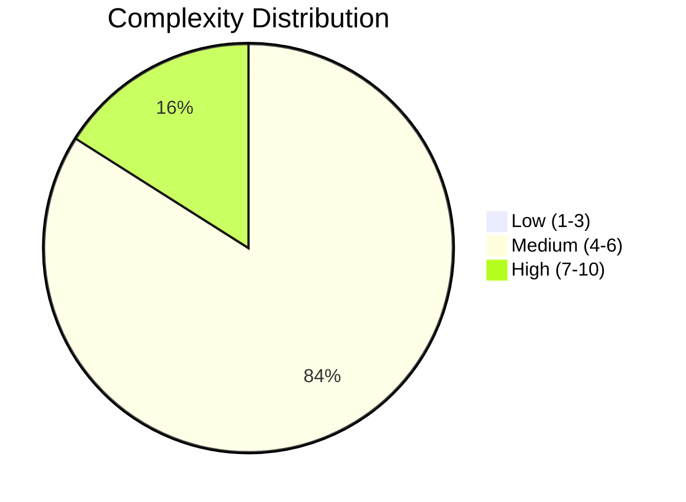
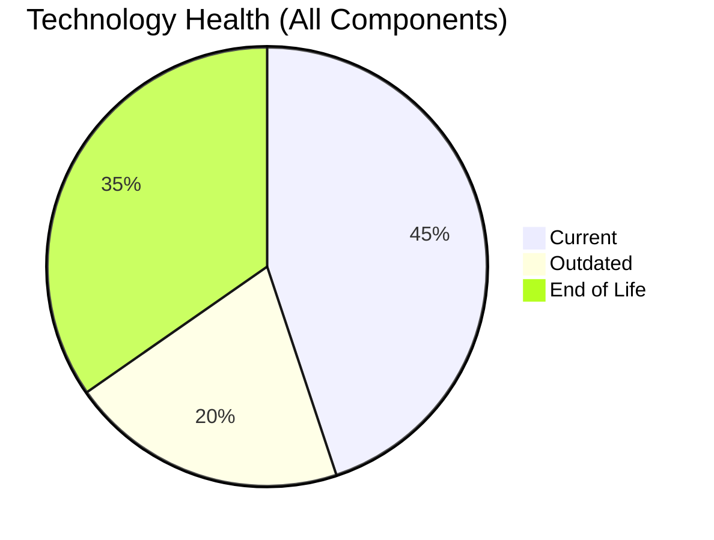
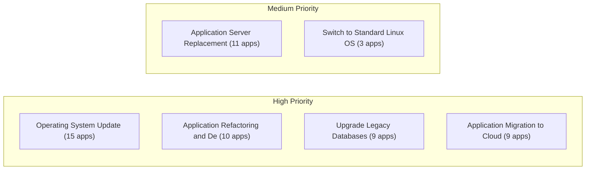
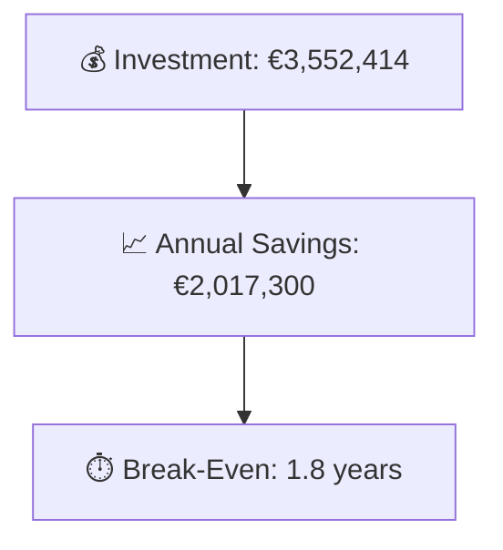

# Portfolio Modernization Report

**Generated:** 2026-05-05  
**Applications Analyzed:** 25 in-scope (4 retired/out-of-scope)

## Executive Summary

This portfolio assessment covers 25 in-scope applications across multiple business units. Technology health analysis reveals a significant modernization debt: 34 components are End-of-Life (EOL) and 20 are outdated across the portfolio. The complexity breakdown shows 4 high-complexity, 21 medium-complexity, and 0 low-complexity applications. A total of 62 actionable modernization scenarios were identified across 24 applications, with an estimated one-time investment of €3,552,414 generating annual savings of €2,017,300, yielding a portfolio break-even point of approximately 1.8 years.

## Portfolio Overview

## Top Modernization Opportunities

| Scenario | Applicable Apps | Priority | Total Cost | Yearly Savings | ROI |
|----------|----------------|----------|------------|---------------|-----|
| Operating System Update | 15 | High | €16,988 | €7,500 | 2.3y |
| Applications Server replacement | 11 | Medium | €125,076 | €115,200 | 1.1y |
| Application Refactoring and De-coupling | 10 | High | €2,669,971 | €1,350,000 | 2.0y |
| Upgrade Legacy Databases | 9 | High | €103,454 | €90,000 | 1.1y |
| Application Migration to Cloud Infrastructure (Lift & Shift) | 9 | High | €53,138 | €23,400 | 2.3y |
| Application Containerization | 5 | High | €582,791 | €430,000 | 1.4y |
| Switch to standard Linux Operating System | 3 | Medium | €996 | €1,200 | 0.8y |

## Scenario Applicability Matrix

| Application | OS Update | →Linux | →ARM | AppSrv Repl | →Cloud | Container | Refactor | DB Upgrade | →OpenDB | Upd. Comp |
|-------------|:---: | :---: | :---: | :---: | :---: | :---: | :---: | :---: | :---: | :---:|
| ERPApp-001 | ✅ | ✅ | ❌ | ❌ | 🔶 | ❌ | ✅ | ✔️ | ✅ | ✅ |
| CRMApp-002 | ✅ | ✔️ | ❌ | ❌ | ✔️ | ❌ | ❌ | ✔️ | ❌ | ❌ |
| HRApp-004 | ✅ | ❌ | ❌ | ✅ | ✅ | ✔️ | ✅ | ✔️ | ✅ | ✅ |
| SupportApp-006 | ✅ | ✔️ | ❌ | ❌ | ✔️ | ❌ | ❌ | ✅ | ❌ | ❌ |
| InventoryApp-008 | ✅ | ✅ | ❌ | ✅ | 🔶 | ❌ | ✅ | ✔️ | ✅ | ✅ |
| PayrollApp-010 | ✔️ | ❌ | ❌ | ❌ | ✔️ | ❌ | ❌ | ✔️ | ❌ | ❌ |
| RouteOptApp-011 | ✅ | ✔️ | ❓ | ✅ | ✔️ | ✔️ | 🔶 | ✔️ | ✔️ | ✅ |
| IoTSensorApp-012 | ✔️ | ❌ | ❌ | ✔️ | ✔️ | ✔️ | ✅ | ✔️ | ✔️ | ✅ |
| SecurityApp-013 | ✅ | ✔️ | ❓ | ✅ | ✅ | ✅ | ❓ | ✔️ | ✅ | ✅ |
| DocumentApp-014 | ✔️ | ❌ | ❌ | ✔️ | ✔️ | ✅ | ✅ | ✔️ | ✔️ | ✅ |
| ReportingApp-015 | ✔️ | ❌ | ❌ | ✔️ | ✔️ | ❌ | ✅ | ✔️ | ✔️ | ✅ |
| MobileApp-016 | ✅ | ✔️ | ❓ | ✅ | ✔️ | ✔️ | 🔶 | ✔️ | ✅ | ✅ |
| BackupApp-017 | ✅ | ✔️ | ❌ | ❌ | ✅ | ❌ | ❌ | ✅ | ❌ | ❌ |
| VendorApp-018 | ✅ | ✔️ | ❓ | ✅ | ✅ | ✅ | ❓ | ✅ | ✔️ | ✅ |
| QualityApp-019 | ✔️ | ✔️ | ❓ | ✅ | ✅ | ✅ | ❓ | ✔️ | ✔️ | ✅ |
| TrainingApp-020 | ✅ | ❌ | ❌ | ❌ | ✔️ | ❌ | ❌ | ✅ | ❌ | ❌ |
| FleetApp-021 | ✔️ | ❌ | ❌ | ✔️ | ✅ | ❌ | ✅ | ✅ | ✅ | ✔️ |
| ComplianceApp-022 | ✅ | ✔️ | ❓ | ✔️ | ✅ | ✔️ | 🔶 | ✔️ | ✔️ | ✔️ |
| ChatbotApp-023 | ✔️ | ✔️ | ❓ | ✅ | ✔️ | ✔️ | 🔶 | ✔️ | ✔️ | ✅ |
| AuditApp-024 | ✔️ | ❌ | ❌ | ✔️ | ✅ | ❌ | ✅ | ✅ | ✅ | ✅ |
| PortalApp-025 | ✔️ | ❌ | ❌ | ✔️ | ✔️ | ✔️ | ✅ | ✔️ | ✔️ | ✅ |
| LegacyFinApp-026 | ✅ | ✅ | ❌ | ❌ | 🔶 | ❌ | ✅ | ✅ | ✅ | ✅ |
| DataWarehouseApp-027 | ✅ | ✔️ | ❓ | ✅ | ✅ | ✅ | ❓ | ✔️ | ✅ | ✅ |
| NotificationApp-028 | ✔️ | ❌ | ❌ | ❌ | ✔️ | ✔️ | ❌ | ✔️ | ❌ | ❌ |
| APIGatewayApp-030 | ✔️ | ✔️ | ❓ | ✅ | ✔️ | ✔️ | 🔶 | ✅ | ✔️ | ✅ |

**Legend:** ✅ Applicable | ❌ Not Applicable | ✔️ Fulfilled | 🔶 Partially Fulfilled | 🚫 Blocked | ❓ Unknown/Lack of Data

## Financial Summary

| Metric | Value |
|--------|-------|
| Total One-Time Investment | €3,552,414 |
| Total Annual Savings | €2,017,300 |
| Portfolio Break-Even | 1.8 years |
| Applications Assessed | 26 |
| Applications with Opportunities | 24 |
| Total Applicable Scenarios | 62 |

## Risk Applications

Applications with the highest modernization complexity or most EOL components:

| Application | Complexity | EOL Components | Applicable Scenarios |
|-------------|-----------|---------------|---------------------|
| BackupApp-017 | 7/10 (HIGH) | 3 | 3 |
| VendorApp-018 | 7/10 (HIGH) | 3 | 6 |
| APIGatewayApp-030 | 7/10 (HIGH) | 2 | 3 |
| DataWarehouseApp-027 | 7/10 (HIGH) | 1 | 6 |
| TrainingApp-020 | 6/10 (MEDIUM) | 3 | 2 |
| CRMApp-002 | 6/10 (MEDIUM) | 2 | 1 |
| HRApp-004 | 6/10 (MEDIUM) | 2 | 6 |
| InventoryApp-008 | 6/10 (MEDIUM) | 2 | 6 |
| SecurityApp-013 | 6/10 (MEDIUM) | 2 | 6 |
| MobileApp-016 | 6/10 (MEDIUM) | 2 | 4 |

## Per-Application Reports

| Application | ID | Report |
|-------------|-----|--------|
| ERPApp-001 | app001 | [View Report](apps/app001.md) |
| CRMApp-002 | app002 | [View Report](apps/app002.md) |
| HRApp-004 | app004 | [View Report](apps/app004.md) |
| SupportApp-006 | app006 | [View Report](apps/app006.md) |
| InventoryApp-008 | app008 | [View Report](apps/app008.md) |
| PayrollApp-010 | app010 | [View Report](apps/app010.md) |
| RouteOptApp-011 | app011 | [View Report](apps/app011.md) |
| IoTSensorApp-012 | app012 | [View Report](apps/app012.md) |
| SecurityApp-013 | app013 | [View Report](apps/app013.md) |
| DocumentApp-014 | app014 | [View Report](apps/app014.md) |
| ReportingApp-015 | app015 | [View Report](apps/app015.md) |
| MobileApp-016 | app016 | [View Report](apps/app016.md) |
| BackupApp-017 | app017 | [View Report](apps/app017.md) |
| VendorApp-018 | app018 | [View Report](apps/app018.md) |
| QualityApp-019 | app019 | [View Report](apps/app019.md) |
| TrainingApp-020 | app020 | [View Report](apps/app020.md) |
| FleetApp-021 | app021 | [View Report](apps/app021.md) |
| ComplianceApp-022 | app022 | [View Report](apps/app022.md) |
| ChatbotApp-023 | app023 | [View Report](apps/app023.md) |
| AuditApp-024 | app024 | [View Report](apps/app024.md) |
| PortalApp-025 | app025 | [View Report](apps/app025.md) |
| LegacyFinApp-026 | app026 | [View Report](apps/app026.md) |
| DataWarehouseApp-027 | app027 | [View Report](apps/app027.md) |
| NotificationApp-028 | app028 | [View Report](apps/app028.md) |
| APIGatewayApp-030 | app030 | [View Report](apps/app030.md) |
