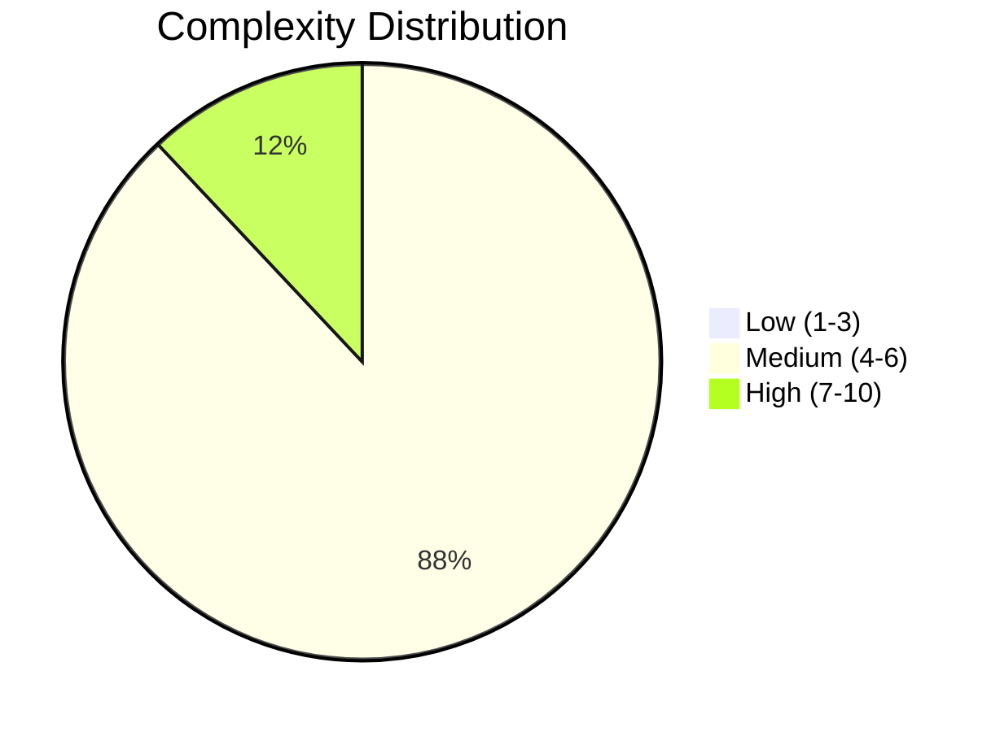
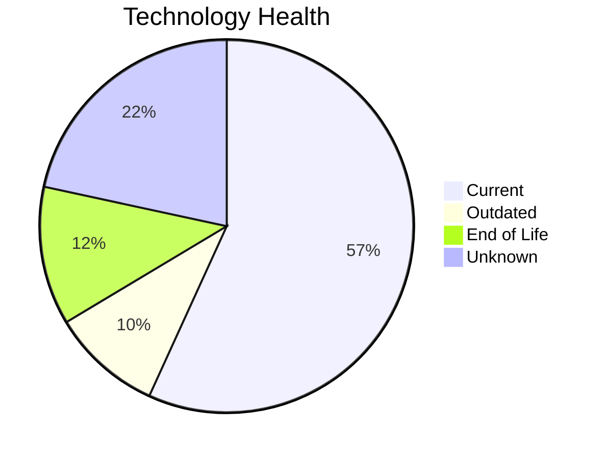

# Portfolio Modernization Report

**Generated:** 2026-05-14
**Applications Analyzed:** 25

## Executive Summary

Analyzed 30 applications from discover/input/apps_db_complete.xlsx; 25 are in scope for modernization planning.
The portfolio shows 3 high-complexity applications and 15 end-of-life technology components requiring near-term action.
Estimated one-time modernization investment is €7,662,787 with yearly savings of €4,457,740, yielding an ROI of 1.7 years.

## Portfolio Overview

## Top Modernization Opportunities

| Scenario | Applicable Apps | Priority | Total Cost | Yearly Savings | ROI |
|----------|----------------|----------|------------|---------------|-----|
| App Refactor Decoupling | 18 | Medium | €5145936 | €2385000 | 2.2y |
| Switch To Arm Cpu | 16 | Medium | €84523 | €14400 | 5.9y |
| App Containerization | 16 | Medium | €1725110 | €1420000 | 1.2y |
| Os Update Security Patch | 12 | Medium | €14252 | €6000 | 2.4y |
| App Deployment To Cloud | 12 | Medium | €68322 | €31500 | 2.2y |
| Switch To Managed Db | 12 | Medium | €68322 | €120000 | 0.6y |
| Serverless Db Migration | 12 | Medium | €67243 | €180000 | 0.4y |
| Switch Db Engine Postgresql | 12 | Medium | €348654 | €180000 | 1.9y |

## Scenario Applicability Matrix

| Application | App Refactor Decoupling | Switch To Arm Cpu | App Containerization | Os Update Security Patch | App Deployment To Cloud | Switch To Managed Db |
|-------------|:---:|:---:|:---:|:---:|:---:|:---:|
| ERPApp-001 | ✅ | ❌ | ✅ | ✅ | ✅ | ✅ |
| CRMApp-002 | ✅ | ✅ | ✅ | ✅ | ❌ | ❌ |
| HRApp-004 | ✅ | ❌ | ✔️ | ✅ | ✅ | ✅ |
| SupportApp-006 | ❌ | ✅ | ✅ | ❌ | ❌ | ❌ |
| InventoryApp-008 | ✅ | ❌ | ✅ | ❌ | ✅ | ✅ |
| PayrollApp-010 | ❌ | ✅ | ✅ | ✔️ | ❌ | ❌ |
| RouteOptApp-011 | ❌ | ✅ | ✔️ | ✅ | ❌ | ❌ |
| IoTSensorApp-012 | ✅ | ✅ | ✔️ | ✔️ | ❌ | ❌ |
| SecurityApp-013 | ✅ | ❌ | ✅ | ✔️ | ✅ | ✅ |
| DocumentApp-014 | ✅ | ✅ | ✅ | ✔️ | ❌ | ❌ |
| ReportingApp-015 | ❌ | ✅ | ✅ | ✔️ | ❌ | ❌ |
| MobileApp-016 | ✅ | ✅ | ✔️ | ✅ | ❌ | ❌ |
| BackupApp-017 | ✅ | ❌ | ✅ | ✅ | ✅ | ✅ |
| VendorApp-018 | ✅ | ❌ | ✅ | ✅ | ✅ | ✅ |
| QualityApp-019 | ❌ | ✅ | ✅ | ❌ | ✅ | ✅ |
| TrainingApp-020 | ✅ | ✅ | ✅ | ✅ | ❌ | ❌ |
| FleetApp-021 | ❌ | ❌ | ✅ | ✅ | ✅ | ✅ |
| ComplianceApp-022 | ✅ | ✅ | ✔️ | ✅ | ✅ | ✅ |
| ChatbotApp-023 | ✅ | ✅ | ✔️ | ❌ | ❌ | ❌ |
| AuditApp-024 | ❌ | ❌ | ✅ | ✔️ | ✅ | ✅ |
| PortalApp-025 | ✅ | ✅ | ✔️ | ✔️ | ❌ | ❌ |
| LegacyFinApp-026 | ✅ | ❌ | ✅ | ✅ | ✅ | ✅ |
| DataWarehouseApp-027 | ✅ | ✅ | ✅ | ✅ | ✅ | ✅ |
| NotificationApp-028 | ✅ | ✅ | ✔️ | ❌ | ❌ | ❌ |
| APIGatewayApp-030 | ✅ | ✅ | ✔️ | ❌ | ❌ | ❌ |

Legend: ✅ Applicable | ❌ Not Applicable | ✔️ Already Fulfilled | 🚫 Blocked | ❓ Unknown

## Financial Summary

| Metric | Value |
|--------|-------|
| Total One-Time Investment | €7662787 |
| Total Annual Savings | €4457740 |
| Portfolio Break-Even | 1.7 years |

## Risk Applications

| Application | Complexity | EOL Components | Applicable Scenarios |
|-------------|-----------|---------------|---------------------|
| HRApp-004 | 7/10 (HIGH) | 2 | 7 |
| ERPApp-001 | 7/10 (HIGH) | 1 | 8 |
| BackupApp-017 | 7/10 (HIGH) | 1 | 6 |
| CRMApp-002 | 6/10 (MEDIUM) | 2 | 8 |
| TrainingApp-020 | 6/10 (MEDIUM) | 2 | 7 |
| MobileApp-016 | 6/10 (MEDIUM) | 1 | 5 |
| VendorApp-018 | 6/10 (MEDIUM) | 1 | 5 |
| FleetApp-021 | 6/10 (MEDIUM) | 1 | 5 |
| ComplianceApp-022 | 6/10 (MEDIUM) | 1 | 6 |
| LegacyFinApp-026 | 6/10 (MEDIUM) | 1 | 7 |

## Per-Application Reports

| Application | Report |
|-------------|--------|
| ERPApp-001 | [View Report](apps/app001.md) |
| CRMApp-002 | [View Report](apps/app002.md) |
| HRApp-004 | [View Report](apps/app004.md) |
| SupportApp-006 | [View Report](apps/app006.md) |
| InventoryApp-008 | [View Report](apps/app008.md) |
| PayrollApp-010 | [View Report](apps/app010.md) |
| RouteOptApp-011 | [View Report](apps/app011.md) |
| IoTSensorApp-012 | [View Report](apps/app012.md) |
| SecurityApp-013 | [View Report](apps/app013.md) |
| DocumentApp-014 | [View Report](apps/app014.md) |
| ReportingApp-015 | [View Report](apps/app015.md) |
| MobileApp-016 | [View Report](apps/app016.md) |
| BackupApp-017 | [View Report](apps/app017.md) |
| VendorApp-018 | [View Report](apps/app018.md) |
| QualityApp-019 | [View Report](apps/app019.md) |
| TrainingApp-020 | [View Report](apps/app020.md) |
| FleetApp-021 | [View Report](apps/app021.md) |
| ComplianceApp-022 | [View Report](apps/app022.md) |
| ChatbotApp-023 | [View Report](apps/app023.md) |
| AuditApp-024 | [View Report](apps/app024.md) |
| PortalApp-025 | [View Report](apps/app025.md) |
| LegacyFinApp-026 | [View Report](apps/app026.md) |
| DataWarehouseApp-027 | [View Report](apps/app027.md) |
| NotificationApp-028 | [View Report](apps/app028.md) |
| APIGatewayApp-030 | [View Report](apps/app030.md) |
