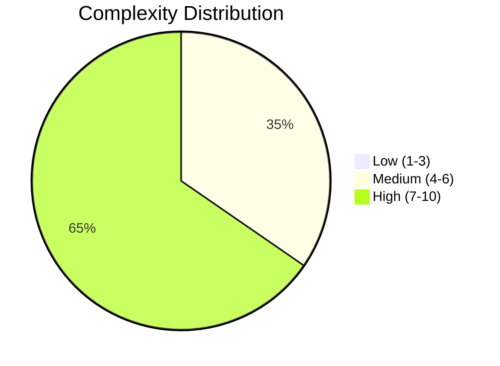
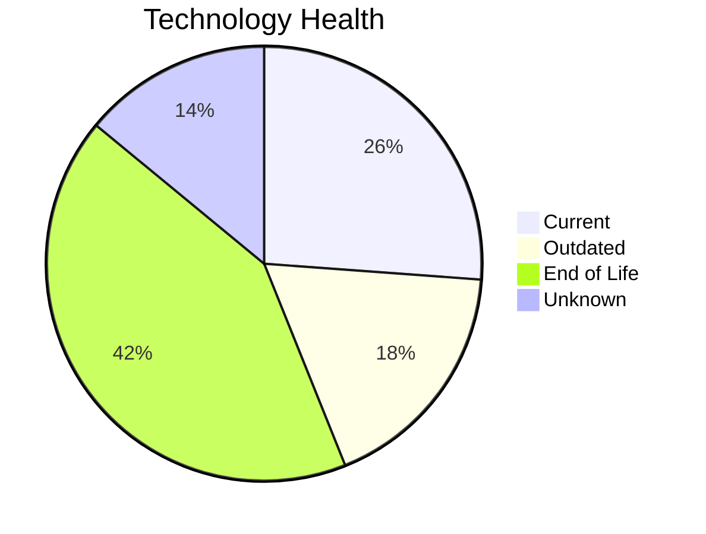
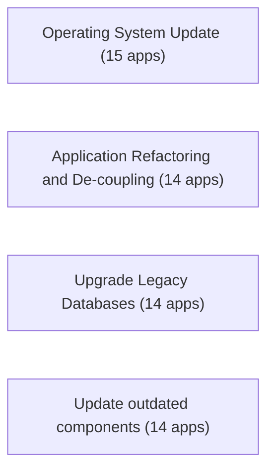
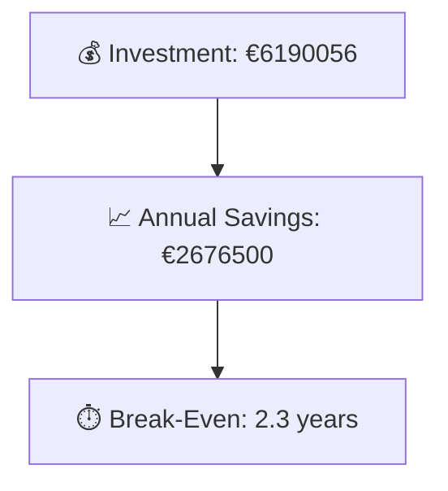

# Portfolio Modernization Report

Generated portfolio modernization summary based on discover/input/apps_db_complete.xlsx.

**Generated:** 2026-05-07  
**Applications Analyzed:** 26  
**Total Portfolio:** 30 (4 out-of-scope, 26 in-scope)

## Executive Summary

The portfolio contains 30 applications in total, with 26 assessed in scope and 4 marked out of scope based on the Excel input. 21 in-scope applications contain at least one EOL component, and 16 contain outdated-but-supported technology. The most common directly applicable modernization scenarios are Operating System Update, Application Refactoring and De-coupling, Upgrade Legacy Databases. The modeled portfolio investment is €6190056 with estimated annual savings of €2676500, giving a break-even point of 2.3 years.

## Portfolio Overview

## Top Modernization Opportunities

| Scenario | Applicable Apps | Priority | Total Cost | Yearly Savings | ROI |
|----------|----------------|----------|------------|---------------|-----|
| Operating System Update | 15 | High | €20458 | €7500 | 2.7y |
| Application Refactoring and De-coupling | 14 | High | €4681056 | €1740000 | 2.7y |
| Upgrade Legacy Databases | 14 | High | €188975 | €140000 | 1.3y |
| Applications Server replacement | 11 | Medium | €154800 | €108000 | 1.4y |
| Application Containerization | 8 | High | €1089162 | €660000 | 1.7y |
| Application Migration to Cloud Infrastructure (Lift & Shift) | 8 | High | €54460 | €19800 | 2.8y |
| Switch to standard Linux Operating System | 3 | Medium | €1145 | €1200 | 1.0y |

## Scenario Applicability Matrix

| Application | Operating System Update | Application Refactoring and De-coupling | Upgrade Legacy Databases | Update outdated components | Applications Server replacement | Switch DB Engine to open-source database solution |
|-------------|:---:|:---:|:---:|:---:|:---:|:---:|
| ERPApp-001 | ✅ | ✅ | ✅ | ❓ | ❌ | ✅ |
| CRMApp-002 | ✅ | 🚫 | ❓ | 🚫 | 🚫 | ✔️ |
| AnalyticsApp-003 | ✅ | ❌ | ✅ | ✅ | ✅ | ✔️ |
| HRApp-004 | ✅ | ✅ | ✅ | ✅ | ✅ | ✅ |
| SupportApp-006 | ✅ | 🚫 | 🚫 | 🚫 | 🚫 | ✔️ |
| InventoryApp-008 | ✅ | ✅ | ✅ | ✅ | ✅ | ✅ |
| PayrollApp-010 | ✔️ | 🚫 | 🚫 | 🚫 | ✔️ | ✔️ |
| RouteOptApp-011 | ✅ | ◐ | ✅ | ✅ | ✅ | ✔️ |
| IoTSensorApp-012 | ✔️ | ✅ | ✅ | ✅ | ✔️ | ✔️ |
| SecurityApp-013 | ✅ | ✅ | ✔️ | ✅ | ✅ | ✅ |
| DocumentApp-014 | ✔️ | ✅ | ✅ | ✅ | ✔️ | ✔️ |
| ReportingApp-015 | ✔️ | ✅ | ❓ | ✅ | ✔️ | ✔️ |
| MobileApp-016 | ✅ | ◐ | ✅ | ✅ | ✅ | ✅ |
| BackupApp-017 | ✅ | 🚫 | 🚫 | 🚫 | 🚫 | 🚫 |
| VendorApp-018 | ✅ | ✅ | ✅ | ✅ | ✅ | ✔️ |
| QualityApp-019 | ✔️ | ✅ | ✅ | ✅ | ✅ | ✔️ |
| TrainingApp-020 | ✅ | 🚫 | 🚫 | 🚫 | 🚫 | 🚫 |
| FleetApp-021 | ✔️ | ✅ | ✅ | ✔️ | ✔️ | ✅ |
| ComplianceApp-022 | ✅ | ◐ | ✅ | ✔️ | ✔️ | ✔️ |
| ChatbotApp-023 | ✔️ | ◐ | ❓ | ✅ | ✅ | ✔️ |
| AuditApp-024 | ✔️ | ✅ | ✅ | ❓ | ✔️ | ✅ |
| PortalApp-025 | ✔️ | ✅ | ✔️ | ❓ | ✔️ | ✔️ |
| LegacyFinApp-026 | ✅ | ✅ | ❓ | ❓ | ❌ | ✅ |
| DataWarehouseApp-027 | ✅ | ✅ | ✔️ | ✅ | ✅ | ✅ |
| NotificationApp-028 | ✔️ | 🚫 | 🚫 | 🚫 | ✔️ | 🚫 |
| APIGatewayApp-030 | ✔️ | ◐ | ✅ | ✅ | ✅ | ✔️ |

Legend: ✅ Applicable | ❌ Not Applicable | ✔️ Already Fulfilled | 🚫 Blocked | ❓ Unknown | ◐ Partially fulfilled

## Financial Summary

| Metric | Value |
|--------|-------|
| Total One-Time Investment | €6190056 |
| Total Annual Savings | €2676500 |
| Portfolio Break-Even | 2.3 years |

## Risk Applications

Applications with the highest modernization complexity or most EOL components:

| Application | Complexity | EOL Components | Applicable Scenarios |
|-------------|-----------|---------------|---------------------|
| TrainingApp-020 | 7/10 (HIGH) | 5 | 1 |
| VendorApp-018 | 8/10 (HIGH) | 4 | 7 |
| AnalyticsApp-003 | 6/10 (MEDIUM) | 4 | 4 |
| APIGatewayApp-030 | 8/10 (HIGH) | 3 | 3 |
| SecurityApp-013 | 8/10 (HIGH) | 2 | 7 |
| HRApp-004 | 8/10 (HIGH) | 2 | 6 |
| DataWarehouseApp-027 | 8/10 (HIGH) | 2 | 6 |
| MobileApp-016 | 8/10 (HIGH) | 2 | 5 |

## Per-Application Reports

| Application | Report |
|-------------|--------|
| ERPApp-001 | [View Report](apps/app001.md) |
| CRMApp-002 | [View Report](apps/app002.md) |
| AnalyticsApp-003 | [View Report](apps/app003.md) |
| HRApp-004 | [View Report](apps/app004.md) |
| SupportApp-006 | [View Report](apps/app006.md) |
| InventoryApp-008 | [View Report](apps/app008.md) |
| PayrollApp-010 | [View Report](apps/app010.md) |
| RouteOptApp-011 | [View Report](apps/app011.md) |
| IoTSensorApp-012 | [View Report](apps/app012.md) |
| SecurityApp-013 | [View Report](apps/app013.md) |
| DocumentApp-014 | [View Report](apps/app014.md) |
| ReportingApp-015 | [View Report](apps/app015.md) |
| MobileApp-016 | [View Report](apps/app016.md) |
| BackupApp-017 | [View Report](apps/app017.md) |
| VendorApp-018 | [View Report](apps/app018.md) |
| QualityApp-019 | [View Report](apps/app019.md) |
| TrainingApp-020 | [View Report](apps/app020.md) |
| FleetApp-021 | [View Report](apps/app021.md) |
| ComplianceApp-022 | [View Report](apps/app022.md) |
| ChatbotApp-023 | [View Report](apps/app023.md) |
| AuditApp-024 | [View Report](apps/app024.md) |
| PortalApp-025 | [View Report](apps/app025.md) |
| LegacyFinApp-026 | [View Report](apps/app026.md) |
| DataWarehouseApp-027 | [View Report](apps/app027.md) |
| NotificationApp-028 | [View Report](apps/app028.md) |
| APIGatewayApp-030 | [View Report](apps/app030.md) |
