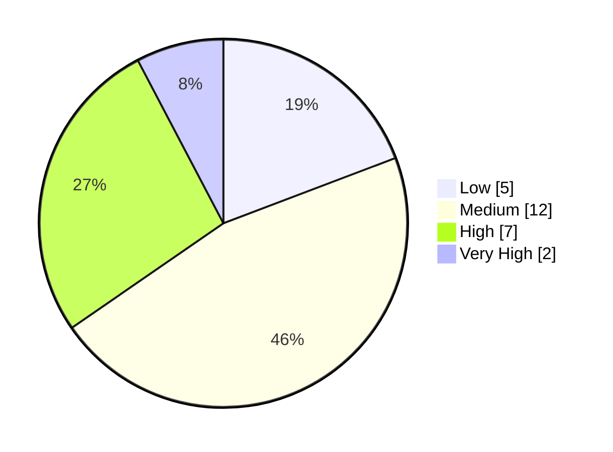
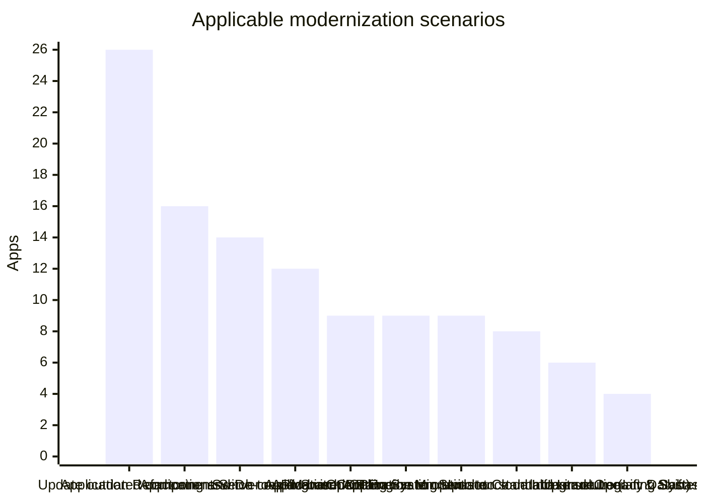

# Portfolio Modernization Report
The portfolio contains 30 applications, of which 26 are in scope for modernization analysis.

## Executive Summary
- Total applications: **30**
- In-scope applications: **26**
- Total investment: **EUR 7,149,360.00**
- Total annual savings: **EUR 3,685,900.00**
- Portfolio 3-year ROI: **54.67%**

## Complexity Distribution

## Scenario Overview

## Per-App Summary
| App ID | Application | Technology Risk | Complexity | Applicable Scenarios | Investment | Annual Savings |
| --- | --- | --- | --- | --- | --- | --- |
| app001 | ERPApp-001 | MEDIUM | High | 5 | EUR 392,420.00 | EUR 168,400.00 |
| app002 | CRMApp-002 | CRITICAL | Medium | 3 | EUR 13,200.00 | EUR 12,500.00 |
| app003 | AnalyticsApp-003 | CRITICAL | Low | 4 | EUR 6,400.00 | EUR 13,500.00 |
| app004 | HRApp-004 | CRITICAL | High | 5 | EUR 393,400.00 | EUR 166,500.00 |
| app006 | SupportApp-006 | HIGH | Low | 3 | EUR 6,180.00 | EUR 12,400.00 |
| app008 | InventoryApp-008 | MEDIUM | Medium | 6 | EUR 348,360.00 | EUR 180,400.00 |
| app010 | PayrollApp-010 | MEDIUM | Low | 2 | EUR 60,000.00 | EUR 100,000.00 |
| app011 | RouteOptApp-011 | MEDIUM | Medium | 5 | EUR 212,240.00 | EUR 163,400.00 |
| app012 | IoTSensorApp-012 | MEDIUM | Medium | 3 | EUR 306,000.00 | EUR 151,000.00 |
| app013 | SecurityApp-013 | CRITICAL | Very High | 6 | EUR 580,600.00 | EUR 180,400.00 |
| app014 | DocumentApp-014 | CRITICAL | Medium | 2 | EUR 120,000.00 | EUR 100,000.00 |
| app015 | ReportingApp-015 | MEDIUM | Low | 4 | EUR 213,000.00 | EUR 251,000.00 |
| app016 | MobileApp-016 | CRITICAL | Medium | 6 | EUR 349,200.00 | EUR 178,500.00 |
| app017 | BackupApp-017 | CRITICAL | High | 6 | EUR 201,600.00 | EUR 125,500.00 |
| app018 | VendorApp-018 | CRITICAL | High | 6 | EUR 585,600.00 | EUR 265,500.00 |
| app019 | QualityApp-019 | CRITICAL | High | 5 | EUR 584,000.00 | EUR 263,000.00 |
| app020 | TrainingApp-020 | CRITICAL | Medium | 4 | EUR 111,000.00 | EUR 110,500.00 |
| app021 | FleetApp-021 | MEDIUM | Medium | 5 | EUR 456,000.00 | EUR 268,000.00 |
| app022 | ComplianceApp-022 | CRITICAL | High | 5 | EUR 478,800.00 | EUR 163,500.00 |
| app023 | ChatbotApp-023 | HIGH | Low | 3 | EUR 9,000.00 | EUR 13,000.00 |
| app024 | AuditApp-024 | CRITICAL | Medium | 6 | EUR 468,000.00 | EUR 278,000.00 |
| app025 | PortalApp-025 | MEDIUM | Medium | 3 | EUR 306,000.00 | EUR 151,000.00 |
| app026 | LegacyFinApp-026 | MEDIUM | Medium | 5 | EUR 336,360.00 | EUR 168,400.00 |
| app027 | DataWarehouseApp-027 | CRITICAL | Very High | 5 | EUR 572,000.00 | EUR 177,500.00 |
| app028 | NotificationApp-028 | MEDIUM | Medium | 2 | EUR 5,000.00 | EUR 1,000.00 |
| app030 | APIGatewayApp-030 | CRITICAL | High | 4 | EUR 35,000.00 | EUR 23,000.00 |

## Top 5 Recommendations
- Prioritize **AnalyticsApp-003** for **Applications Server replacement**; projected annual savings EUR 12,000.00 and 3-year ROI 800.00%.
- Prioritize **AnalyticsApp-003** for **Operating System Update**; projected annual savings EUR 500.00 and 3-year ROI 275.00%.
- Prioritize **TrainingApp-020** for **Application Containerization**; projected annual savings EUR 100,000.00 and 3-year ROI 200.00%.
- Prioritize **MobileApp-016** for **Applications Server replacement**; projected annual savings EUR 12,000.00 and 3-year ROI 200.00%.
- Prioritize **CRMApp-002** for **Applications Server replacement**; projected annual savings EUR 12,000.00 and 3-year ROI 200.00%.
