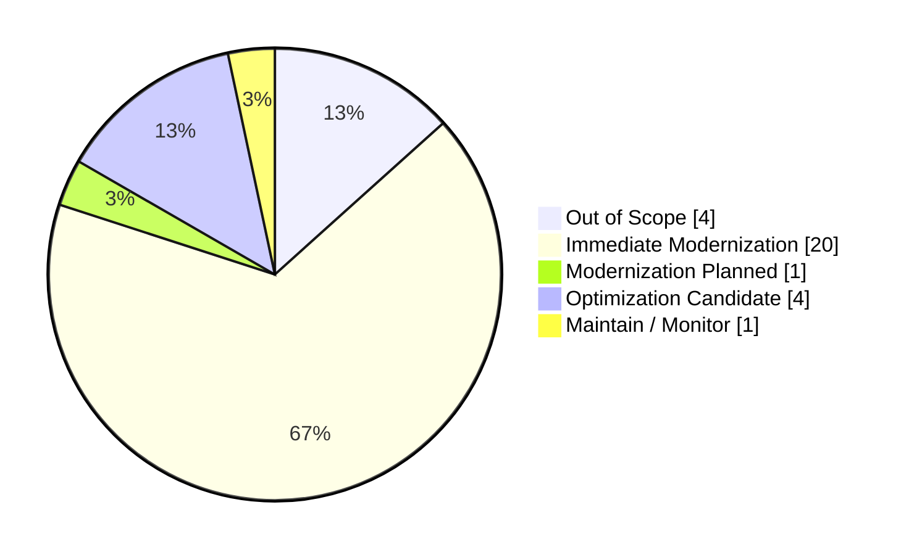
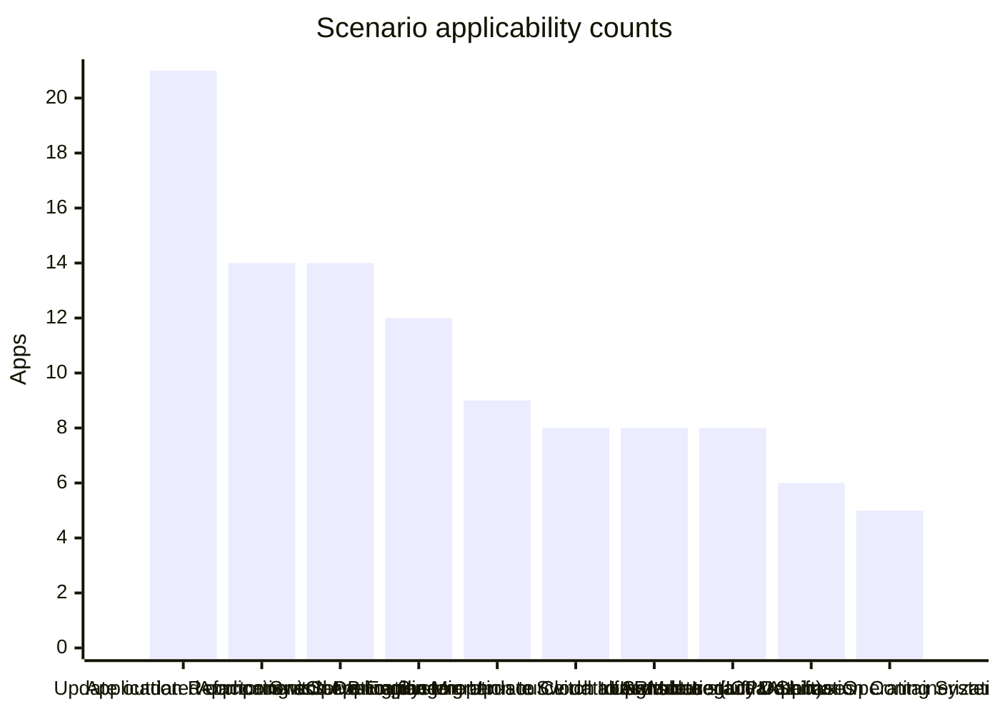

# Portfolio Modernization Report

## Executive summary
- Total applications: **30**
- In-scope applications: **26**
- Total investment: **EUR 6,620,740.00**
- Total annual savings: **EUR 3,023,400.00**
- Portfolio 3-year ROI: **37.00%**

## Application distribution by modernization status

## Scenario applicability counts

## Per-application summary table
| App ID | Application | Modernization Status | Complexity Score | Complexity Label | Applicable Scenarios | Investment | Annual Savings |
| --- | --- | --- | --- | --- | --- | --- | --- |
| app001 | ERPApp-001 | Optimization Candidate | 7 | High | 4 | EUR 392,420.00 | EUR 168,400.00 |
| app002 | CRMApp-002 | Immediate Modernization | 7 | High | 3 | EUR 15,400.00 | EUR 12,500.00 |
| app003 | AnalyticsApp-003 | Immediate Modernization | 3 | Low | 5 | EUR 15,600.00 | EUR 23,500.00 |
| app004 | HRApp-004 | Immediate Modernization | 7 | High | 4 | EUR 386,400.00 | EUR 165,500.00 |
| app006 | SupportApp-006 | Immediate Modernization | 4 | Medium | 5 | EUR 17,040.00 | EUR 22,900.00 |
| app008 | InventoryApp-008 | Immediate Modernization | 7 | High | 6 | EUR 406,420.00 | EUR 180,400.00 |
| app010 | PayrollApp-010 | Immediate Modernization | 4 | Medium | 1 | EUR 0.00 | EUR 0.00 |
| app011 | RouteOptApp-011 | Immediate Modernization | 5 | Medium | 6 | EUR 266,300.00 | EUR 163,900.00 |
| app012 | IoTSensorApp-012 | Optimization Candidate | 6 | Medium | 2 | EUR 306,000.00 | EUR 151,000.00 |
| app013 | SecurityApp-013 | Immediate Modernization | 10 | Very high | 8 | EUR 782,600.00 | EUR 280,900.00 |
| app014 | DocumentApp-014 | Immediate Modernization | 6 | Medium | 1 | EUR 0.00 | EUR 0.00 |
| app015 | ReportingApp-015 | Modernization Planned | 3 | Low | 2 | EUR 3,000.00 | EUR 1,000.00 |
| app016 | MobileApp-016 | Immediate Modernization | 6 | Medium | 6 | EUR 349,200.00 | EUR 178,500.00 |
| app017 | BackupApp-017 | Immediate Modernization | 8 | High | 6 | EUR 201,600.00 | EUR 125,500.00 |
| app018 | VendorApp-018 | Immediate Modernization | 8 | High | 7 | EUR 601,600.00 | EUR 275,500.00 |
| app019 | QualityApp-019 | Immediate Modernization | 8 | High | 3 | EUR 416,000.00 | EUR 162,000.00 |
| app020 | TrainingApp-020 | Immediate Modernization | 5 | Medium | 3 | EUR 11,000.00 | EUR 10,500.00 |
| app021 | FleetApp-021 | Immediate Modernization | 7 | High | 6 | EUR 546,000.00 | EUR 278,000.00 |
| app022 | ComplianceApp-022 | Immediate Modernization | 9 | High | 4 | EUR 469,800.00 | EUR 162,500.00 |
| app023 | ChatbotApp-023 | Immediate Modernization | 4 | Medium | 3 | EUR 12,000.00 | EUR 13,000.00 |
| app024 | AuditApp-024 | Immediate Modernization | 6 | Medium | 5 | EUR 168,000.00 | EUR 128,000.00 |
| app025 | PortalApp-025 | Optimization Candidate | 6 | Medium | 2 | EUR 306,000.00 | EUR 151,000.00 |
| app026 | LegacyFinApp-026 | Optimization Candidate | 6 | Medium | 4 | EUR 336,360.00 | EUR 168,400.00 |
| app027 | DataWarehouseApp-027 | Immediate Modernization | 10 | Very high | 5 | EUR 572,000.00 | EUR 177,500.00 |
| app028 | NotificationApp-028 | Maintain / Monitor | 5 | Medium | 0 | EUR 0.00 | EUR 0.00 |
| app030 | APIGatewayApp-030 | Immediate Modernization | 8 | High | 4 | EUR 40,000.00 | EUR 23,000.00 |

## Top 5 recommendations
- Prioritize **AnalyticsApp-003** for **Applications Server replacement**; annual savings EUR 12,000.00 and 3-year ROI 500.00%.
- Prioritize **AnalyticsApp-003** for **Upgrade Legacy Databases**; annual savings EUR 10,000.00 and 3-year ROI 400.00%.
- Prioritize **SupportApp-006** for **Switch to standard Linux Operating System**; annual savings EUR 400.00 and 3-year ROI 400.00%.
- Prioritize **SupportApp-006** for **Applications Server replacement**; annual savings EUR 12,000.00 and 3-year ROI 350.00%.
- Prioritize **ChatbotApp-023** for **Applications Server replacement**; annual savings EUR 12,000.00 and 3-year ROI 350.00%.
