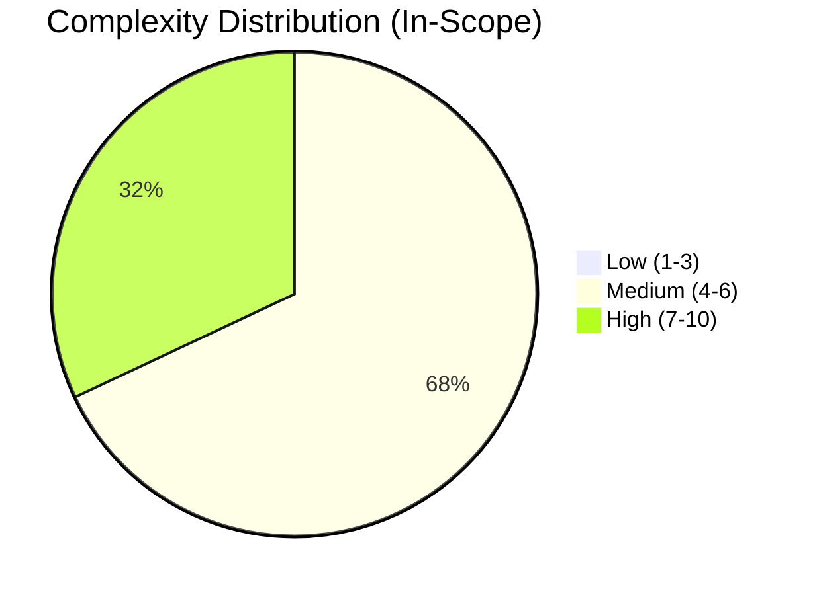
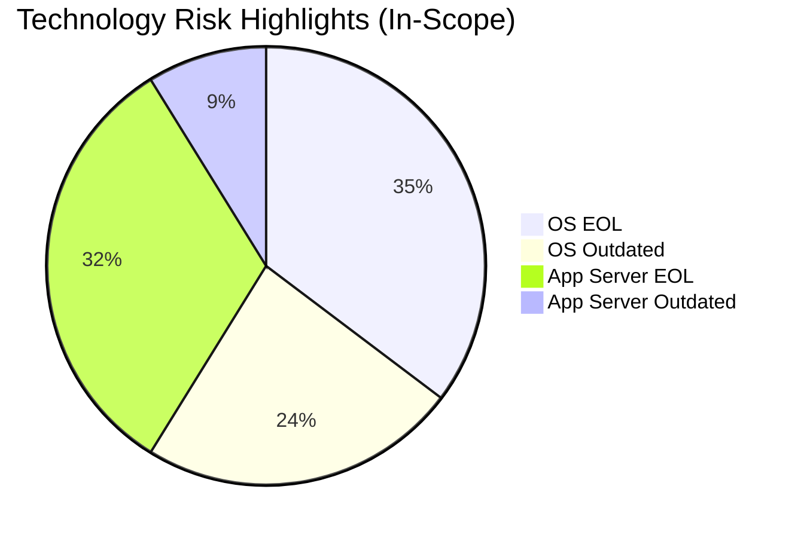

# Portfolio Modernization Report

**Source Excel:** `discover/input/apps_db_complete.xlsx`  
**Generated:** 2026-05-13

## Executive Summary

The portfolio contains 30 applications, with 25 in scope for modernization and 5 out of scope. Complexity is concentrated in medium to high levels, with no low-complexity applications identified. The most common technology risks are EOL or outdated operating systems and application servers. The top modernization opportunities are OS updates, component upgrades, and application refactoring. Estimated modeled payback for the analyzed scenarios is about 2.0 years.

## Portfolio Overview

- **Total applications:** 30
- **In scope:** 25
- **Out of scope:** 5 (4 retired, 1 SAP-indicated)

## Key Technology Risks

- **Operating systems:** 12 EOL, 8 outdated, 5 current
- **Application servers:** 11 EOL, 3 outdated, 9 current
- **Programming languages/runtimes:** 6 EOL, 10 outdated, 5 current, 4 unknown-version
- **Databases:** 4 EOL, 3 outdated, 14 current, 4 unknown-version

Frequent risky technologies include RHEL 7, Windows Server 2019, Java 11, AIX 7.2/AIX 6, COBOL-2014, PostgreSQL 13, and WebSphere 7.0/IIS 8.0.

## Top Modernization Opportunities

| Scenario | Applicable Apps |
|---|---:|
| Operating System Update | 20 |
| Update Outdated Components | 19 |
| Application Refactor / Decoupling | 17 |
| Application Server Replacement | 10 |
| Switch DB Engine to Open Source | 9 |
| Cloud Lift & Shift | 8 |
| Application Containerization | 8 |
| Upgrade Legacy Databases | 7 |

## Financial Outlook (Modeled)

- **Estimated one-time modernization cost:** 6,358,013
- **Estimated yearly savings:** 3,113,900
- **Estimated payback (ROI):** ~2.0 years

Notes:
- 101 scenario-application pairs were assessed as applicable.
- Financial configuration was missing for `switch_db_engine_open_source` and `update_outdated_components`, so totals are likely conservative.
