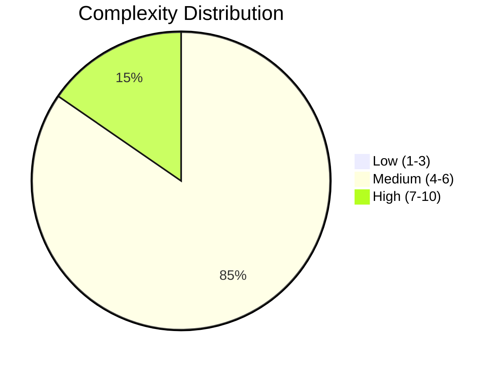
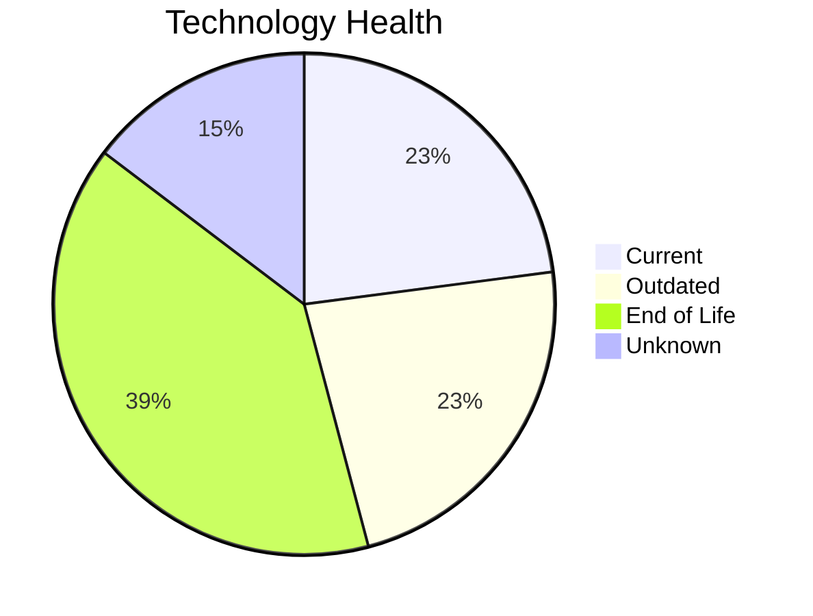
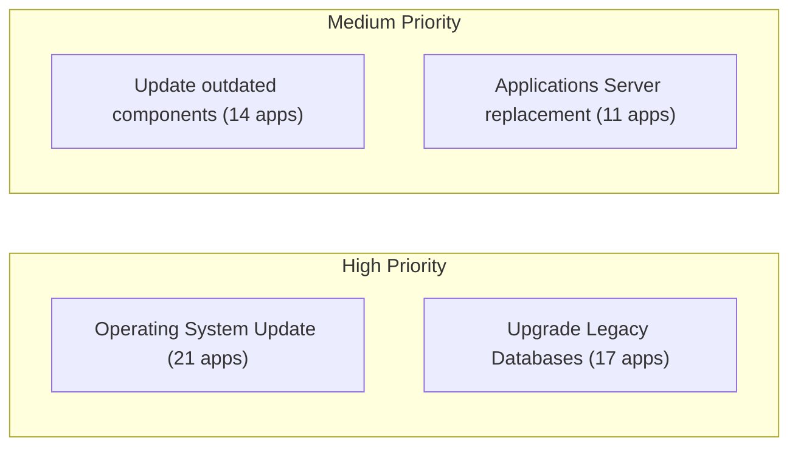
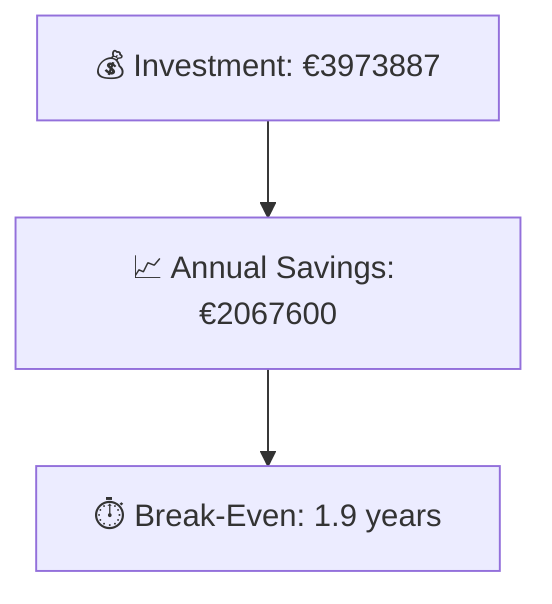

# Portfolio Modernization Report

**Generated:** 2026-05-18T00:00:00Z
**Applications Analyzed:** 26

## Executive Summary

The workbook apps_db_complete.xlsx contains 30 applications, of which 26 remain in scope after excluding 4 retired applications and no SAP applications.
The portfolio contains 4 high-complexity applications and 43 end-of-life technology findings across in-scope systems, with operating system, database, and middleware obsolescence as the main risks.
The strongest modernization opportunities are Operating System Update, Upgrade Legacy Databases, and Update outdated components, driven mainly by on-premise deployments, proprietary databases, and aging application servers.
The quantified business case totals €3,973,887 one-time investment against €2,067,600 annual savings, for a portfolio break-even of 1.9 years where finance data exists.

## Portfolio Overview

## Top Modernization Opportunities

| Scenario | Applicable Apps | Priority | Total Cost | Yearly Savings | ROI |
|----------|----------------|----------|------------|---------------|-----|
| Operating System Update | 21 | High | €24363 | €10500 | 2.3y |
| Upgrade Legacy Databases | 17 | High | €195778 | €170000 | 1.2y |
| Applications Server replacement | 11 | Medium | €127896 | €115200 | 1.1y |
| Application Refactoring and De-coupling | 10 | High | €2978068 | €1320000 | 2.3y |
| Application Migration to Cloud Infrastructure (Lift & Shift) | 8 | High | €48865 | €20700 | 2.4y |
| Application Containerization | 5 | High | €597876 | €430000 | 1.4y |
| Switch to standard Linux Operating System | 3 | Medium | €1041 | €1200 | 0.9y |

## Scenario Applicability Matrix

| Application | Operating System Update | Switch to standard Linux Operating System | Switch to ARM-based CPU | Applications Server replacement | Application Migration to Cloud Infrastructure (Lift & Shift) | Application Containerization | Application Refactoring and De-coupling | Upgrade Legacy Databases | Switch DB Engine to open-source database solution | Update outdated components |
|-------------|:---:|:---:|:---:|:---:|:---:|:---:|:---:|:---:|:---:|:---:|
| ERPApp-001 | ✅ | ✅ | 🚫 | ✔️ | ✅ | 🚫 | ✅ | ✔️ | ✅ | ❓ |
| CRMApp-002 | ✅ | ◐ | 🚫 | 🚫 | ✔️ | 🚫 | 🚫 | ❓ | 🚫 | 🚫 |
| AnalyticsApp-003 | ✅ | ◐ | ❓ | ✅ | ✔️ | ✔️ | ❌ | ✅ | ✔️ | ✅ |
| HRApp-004 | ✅ | ❌ | 🚫 | ✅ | ◐ | ✔️ | ✅ | ✅ | ✅ | ✅ |
| SupportApp-006 | ✅ | ◐ | 🚫 | 🚫 | ✔️ | 🚫 | 🚫 | ✅ | 🚫 | 🚫 |
| InventoryApp-008 | ✅ | ✅ | 🚫 | ✅ | ✅ | 🚫 | ✅ | ✅ | ✅ | ✅ |
| PayrollApp-010 | ✅ | ❌ | 🚫 | 🚫 | ✔️ | 🚫 | 🚫 | ✅ | 🚫 | 🚫 |
| RouteOptApp-011 | ✅ | ◐ | ❓ | ✅ | ✔️ | ✔️ | ◐ | ✅ | ✔️ | ✅ |
| IoTSensorApp-012 | ✔️ | ❌ | 🚫 | ✔️ | ✔️ | ✔️ | ✅ | ✅ | ✔️ | ✅ |
| SecurityApp-013 | ✅ | ◐ | ❓ | ✅ | ✅ | ✅ | ✅ | ✔️ | ✅ | ✅ |
| DocumentApp-014 | ✅ | ❌ | 🚫 | ✔️ | ✔️ | ✅ | ✅ | ✅ | ✔️ | ✅ |
| ReportingApp-015 | ✅ | ❌ | 🚫 | ✔️ | ✔️ | 🚫 | ❌ | ❓ | ✔️ | ✅ |
| MobileApp-016 | ✅ | ◐ | ❓ | ✅ | ✔️ | ✔️ | ◐ | ✅ | ✅ | ✅ |
| BackupApp-017 | ✅ | ◐ | 🚫 | 🚫 | ✅ | 🚫 | 🚫 | ✅ | 🚫 | 🚫 |
| VendorApp-018 | ✅ | ◐ | ❓ | ✅ | ✅ | ✅ | ✅ | ✅ | ✔️ | ✅ |
| QualityApp-019 | ✔️ | ✔️ | ❓ | ✅ | ◐ | ✅ | ❌ | ✅ | ✔️ | ✅ |
| TrainingApp-020 | ✅ | ❌ | 🚫 | 🚫 | ✔️ | 🚫 | 🚫 | ✅ | 🚫 | 🚫 |
| FleetApp-021 | ✔️ | ❌ | 🚫 | ✔️ | ✅ | 🚫 | ❌ | ✅ | ✅ | ❓ |
| ComplianceApp-022 | ✅ | ◐ | ❓ | ✔️ | ◐ | ✔️ | ◐ | ✅ | ✔️ | ✔️ |
| ChatbotApp-023 | ✔️ | ✔️ | ❓ | ✅ | ✔️ | ✔️ | ◐ | ❓ | ✔️ | ✅ |
| AuditApp-024 | ✅ | ❌ | 🚫 | ✔️ | ✅ | 🚫 | ❌ | ✅ | ✅ | ❓ |
| PortalApp-025 | ✅ | ❌ | 🚫 | ✔️ | ✔️ | ✔️ | ✅ | ✔️ | ✔️ | ❓ |
| LegacyFinApp-026 | ✅ | ✅ | 🚫 | ✔️ | ✅ | 🚫 | ✅ | ❓ | ✅ | ❓ |
| DataWarehouseApp-027 | ✅ | ◐ | ❓ | ✅ | ◐ | ✅ | ✅ | ✔️ | ✅ | ✅ |
| NotificationApp-028 | ✅ | ❌ | 🚫 | 🚫 | ✔️ | ✔️ | 🚫 | ✔️ | 🚫 | 🚫 |
| APIGatewayApp-030 | ✔️ | ✔️ | ❓ | ✅ | ✔️ | ✔️ | ◐ | ✅ | ✔️ | ✅ |

Legend: ✅ Applicable | ❌ Not Applicable | ✔️ Already Fulfilled | 🚫 Blocked | ❓ Unknown | ◐ Partially fulfilled

## Financial Summary

| Metric | Value |
|--------|-------|
| Total One-Time Investment | €3973887 |
| Total Annual Savings | €2067600 |
| Portfolio Break-Even | 1.9 years |

## Risk Applications

| Application | Complexity | EOL Components | Applicable Scenarios |
|-------------|-----------|---------------|---------------------|
| VendorApp-018 | 7/10 (HIGH) | 4 | 7 |
| APIGatewayApp-030 | 7/10 (HIGH) | 3 | 3 |
| SecurityApp-013 | 7/10 (HIGH) | 2 | 7 |
| BackupApp-017 | 7/10 (HIGH) | 2 | 3 |
| TrainingApp-020 | 6/10 (MEDIUM) | 4 | 2 |
| CRMApp-002 | 6/10 (MEDIUM) | 2 | 1 |
| HRApp-004 | 6/10 (MEDIUM) | 2 | 6 |
| SupportApp-006 | 6/10 (MEDIUM) | 2 | 2 |
| InventoryApp-008 | 6/10 (MEDIUM) | 2 | 8 |
| DocumentApp-014 | 6/10 (MEDIUM) | 2 | 5 |

## Per-Application Reports

| Application | Report |
|-------------|--------|
| ERPApp-001 | [View Report](apps/app001.md) |
| CRMApp-002 | [View Report](apps/app002.md) |
| AnalyticsApp-003 | [View Report](apps/app003.md) |
| HRApp-004 | [View Report](apps/app004.md) |
| SupportApp-006 | [View Report](apps/app006.md) |
| InventoryApp-008 | [View Report](apps/app008.md) |
| PayrollApp-010 | [View Report](apps/app010.md) |
| RouteOptApp-011 | [View Report](apps/app011.md) |
| IoTSensorApp-012 | [View Report](apps/app012.md) |
| SecurityApp-013 | [View Report](apps/app013.md) |
| DocumentApp-014 | [View Report](apps/app014.md) |
| ReportingApp-015 | [View Report](apps/app015.md) |
| MobileApp-016 | [View Report](apps/app016.md) |
| BackupApp-017 | [View Report](apps/app017.md) |
| VendorApp-018 | [View Report](apps/app018.md) |
| QualityApp-019 | [View Report](apps/app019.md) |
| TrainingApp-020 | [View Report](apps/app020.md) |
| FleetApp-021 | [View Report](apps/app021.md) |
| ComplianceApp-022 | [View Report](apps/app022.md) |
| ChatbotApp-023 | [View Report](apps/app023.md) |
| AuditApp-024 | [View Report](apps/app024.md) |
| PortalApp-025 | [View Report](apps/app025.md) |
| LegacyFinApp-026 | [View Report](apps/app026.md) |
| DataWarehouseApp-027 | [View Report](apps/app027.md) |
| NotificationApp-028 | [View Report](apps/app028.md) |
| APIGatewayApp-030 | [View Report](apps/app030.md) |

## Notable Data Gaps

The following applicable scenarios had no finance config and were excluded from ROI calculations:

- Switch DB Engine to open-source database solution (switch_db_engine_open_source) for app016, app013, app008, app024, app004, app001, app026, app021, app027
- Update outdated components (update_outdated_components) for app016, app013, app023, app008, app003, app015, app004, app011, app012, app030, app014, app018, app019, app027
