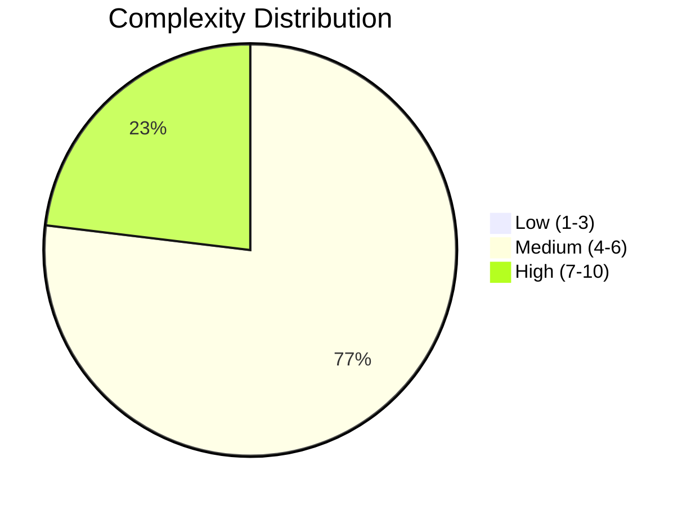
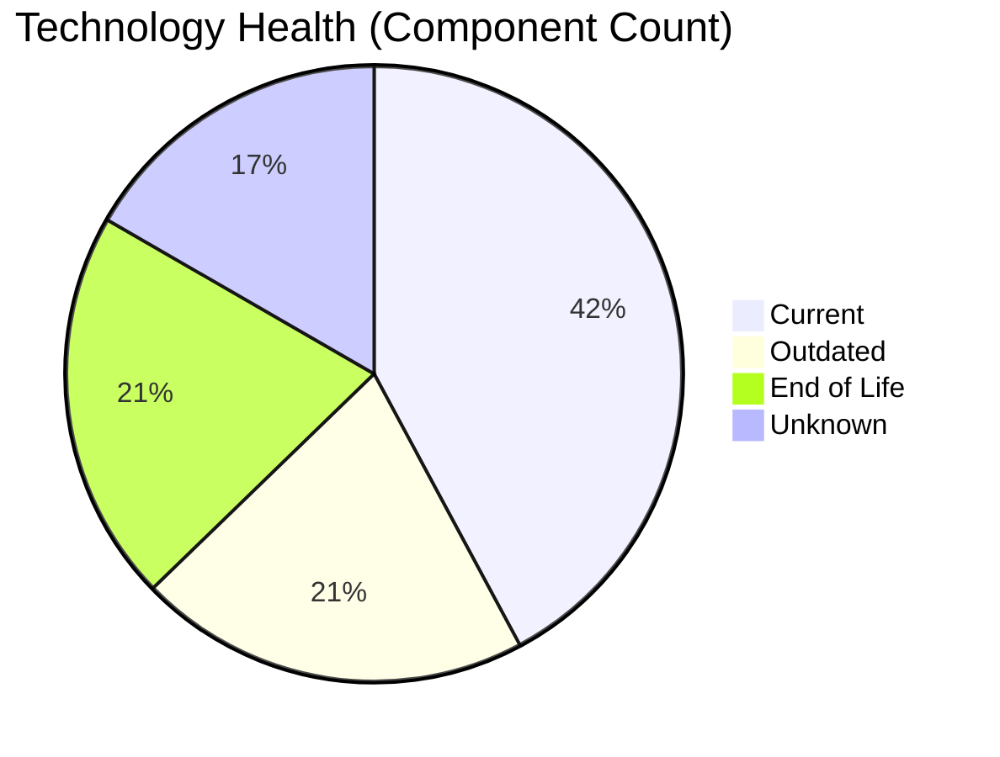
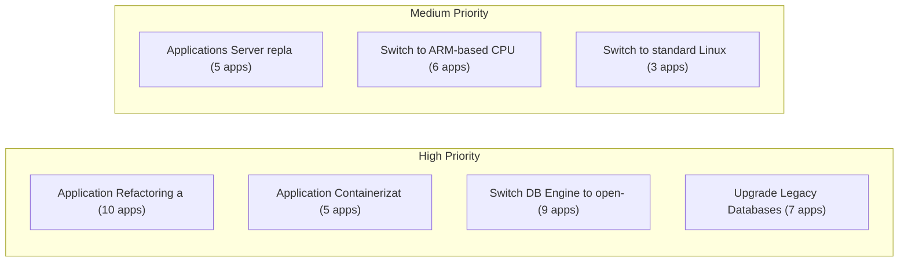

# Portfolio Modernization Report

**Generated:** 2026-05-14
**Applications Analyzed:** 26 (in-scope)

## Executive Summary

This portfolio modernization assessment covers **26 in-scope applications** (4 applications were excluded as retired). The analysis identified **72 applicable modernization scenarios** across all in-scope applications — every application has at least one actionable modernization opportunity. The most prevalent risks are **EOL and outdated operating systems** (affecting 18 apps with EOL components) and **legacy or EOL databases**. The portfolio's top financial opportunity is application containerization and refactoring, with an estimated total investment of **€3,846,539** yielding **€2,048,700** in annual savings and a portfolio break-even of **1.9 years**. Priority attention should be given to the 6 HIGH complexity applications, particularly those running on EOL operating systems (RHEL 7, CentOS 7, Windows Server 2012, Debian 6/7) which represent immediate security risks.

## Portfolio Overview

## Top Modernization Opportunities

| Scenario | Applicable Apps | Priority | Total Cost | Yearly Savings | ROI |
|----------|----------------|----------|------------|---------------|-----|
| Application Refactoring and De-coupling | 10 | High | €2,746,134 | €1,335,000 | 2.1y |
| Application Containerization | 5 | High | €587,021 | €420,000 | 1.4y |
| Switch DB Engine to open-source database solution | 9 | High | €269,457 | €135,000 | 2.0y |
| Upgrade Legacy Databases | 7 | High | €82,917 | €70,000 | 1.2y |
| Applications Server replacement | 5 | Medium | €58,475 | €51,600 | 1.1y |
| Application Migration to Cloud Infrastructure (Lift & Shift) | 8 | High | €48,977 | €20,400 | 2.4y |
| Switch to ARM-based CPU | 6 | Medium | €31,335 | €6,000 | 5.2y |
| Operating System Update | 19 | High | €21,227 | €9,500 | 2.2y |
| Switch to standard Linux Operating System | 3 | Medium | €996 | €1,200 | 0.8y |

## Scenario Applicability Matrix

| Application | Operating System Upd | Application Refactor | Switch DB Engine to  | Application Migratio | Upgrade Legacy Datab | Switch to ARM-based  | Application Containe | Applications Server  |
|-------------|:---:|:---:|:---:|:---:|:---:|:---:|:---:|:---:|
| ERPApp-001 | ✔️ | ✅ | ✅ | ✅ | ✅ | 🚫 | 🚫 | ❌ |
| CRMApp-002 | ✅ | 🚫 | ✔️ | ✔️ | ✔️ | 🚫 | 🚫 | 🚫 |
| AnalyticsApp-003 | ✅ | ❌ | ✔️ | ✔️ | ✔️ | ✅ | ✔️ | ✅ |
| HRApp-004 | ✅ | ✅ | ✅ | ⚠️ | ✔️ | 🚫 | ✔️ | ❓ |
| SupportApp-006 | ✅ | 🚫 | ✔️ | ✔️ | ✔️ | 🚫 | 🚫 | ❓ |
| InventoryApp-008 | ✅ | ✅ | ✅ | ✅ | ✔️ | 🚫 | 🚫 | ✅ |
| PayrollApp-010 | ✅ | 🚫 | ✔️ | ✔️ | ✔️ | 🚫 | 🚫 | ✔️ |
| RouteOptApp-011 | ✅ | ❌ | ✔️ | ✔️ | ✔️ | ✅ | ✔️ | ❓ |
| IoTSensorApp-012 | ✔️ | ✅ | ✔️ | ✔️ | ✔️ | 🚫 | ✔️ | ✔️ |
| SecurityApp-013 | ✅ | ⚠️ | ✅ | ✅ | ✔️ | ⚠️ | ✅ | ✅ |
| DocumentApp-014 | ✅ | ✅ | ✔️ | ✔️ | ✔️ | 🚫 | ✅ | ✔️ |
| ReportingApp-015 | ✅ | ✅ | ✔️ | ✔️ | ❓ | 🚫 | ⚠️ | ✔️ |
| MobileApp-016 | ✅ | ❌ | ✅ | ✔️ | ✔️ | ✅ | ✔️ | ❓ |
| BackupApp-017 | ✅ | 🚫 | 🚫 | ✅ | ✅ | 🚫 | 🚫 | ❓ |
| VendorApp-018 | ✅ | ⚠️ | ✔️ | ✅ | ✔️ | ⚠️ | ✅ | ❓ |
| QualityApp-019 | ✔️ | ⚠️ | ✔️ | ⚠️ | ✔️ | ⚠️ | ✅ | ❓ |
| TrainingApp-020 | ✅ | 🚫 | 🚫 | ✔️ | ✅ | 🚫 | 🚫 | ❓ |
| FleetApp-021 | ✔️ | ✅ | ✅ | ✅ | ✅ | 🚫 | ⚠️ | ✔️ |
| ComplianceApp-022 | ✅ | ❌ | ✔️ | ⚠️ | ✔️ | ✅ | ✔️ | ❓ |
| ChatbotApp-023 | ✔️ | ❌ | ✔️ | ✔️ | ❓ | ✅ | ✔️ | ❓ |
| AuditApp-024 | ✅ | ✅ | ✅ | ✅ | ✅ | 🚫 | ⚠️ | ✔️ |
| PortalApp-025 | ✅ | ✅ | ✔️ | ✔️ | ✔️ | 🚫 | ✔️ | ✔️ |
| LegacyFinApp-026 | ✔️ | ✅ | ✅ | ✅ | ❓ | 🚫 | 🚫 | ❌ |
| DataWarehouseApp-027 | ✅ | ⚠️ | ✅ | ⚠️ | ✔️ | ⚠️ | ✅ | ✅ |
| NotificationApp-028 | ✅ | 🚫 | 🚫 | ✔️ | ✅ | 🚫 | ✔️ | ✔️ |
| APIGatewayApp-030 | ✔️ | ❌ | ✔️ | ✔️ | ✅ | ✅ | ✔️ | ✅ |

**Legend:** ✅ Applicable | ❌ Not Applicable | ✔️ Already Fulfilled | 🚫 Blocked | ⚠️ Partially Fulfilled | ❓ Unknown

## Financial Summary

| Metric | Value |
|--------|-------|
| Total One-Time Investment | €3,846,539 |
| Total Annual Savings | €2,048,700 |
| Portfolio Break-Even | 1.9 years |

## Risk Applications

Applications with the highest modernization complexity or most EOL components:

| Application | Complexity | EOL Components | Applicable Scenarios |
|-------------|-----------|---------------|---------------------|
| BackupApp-017 | 7/10 (HIGH) | 2 | 3 |
| SecurityApp-013 | 7/10 (HIGH) | 1 | 6 |
| VendorApp-018 | 7/10 (HIGH) | 1 | 4 |
| FleetApp-021 | 7/10 (HIGH) | 1 | 4 |
| ComplianceApp-022 | 7/10 (HIGH) | 1 | 2 |
| DataWarehouseApp-027 | 7/10 (HIGH) | 1 | 5 |
| APIGatewayApp-030 | 6/10 (MEDIUM) | 2 | 4 |
| AnalyticsApp-003 | 4/10 (MEDIUM) | 2 | 4 |

## Per-Application Reports

| Application | Report |
|-------------|--------|
| ERPApp-001 | [View Report](apps/app001.md) |
| CRMApp-002 | [View Report](apps/app002.md) |
| AnalyticsApp-003 | [View Report](apps/app003.md) |
| HRApp-004 | [View Report](apps/app004.md) |
| SupportApp-006 | [View Report](apps/app006.md) |
| InventoryApp-008 | [View Report](apps/app008.md) |
| PayrollApp-010 | [View Report](apps/app010.md) |
| RouteOptApp-011 | [View Report](apps/app011.md) |
| IoTSensorApp-012 | [View Report](apps/app012.md) |
| SecurityApp-013 | [View Report](apps/app013.md) |
| DocumentApp-014 | [View Report](apps/app014.md) |
| ReportingApp-015 | [View Report](apps/app015.md) |
| MobileApp-016 | [View Report](apps/app016.md) |
| BackupApp-017 | [View Report](apps/app017.md) |
| VendorApp-018 | [View Report](apps/app018.md) |
| QualityApp-019 | [View Report](apps/app019.md) |
| TrainingApp-020 | [View Report](apps/app020.md) |
| FleetApp-021 | [View Report](apps/app021.md) |
| ComplianceApp-022 | [View Report](apps/app022.md) |
| ChatbotApp-023 | [View Report](apps/app023.md) |
| AuditApp-024 | [View Report](apps/app024.md) |
| PortalApp-025 | [View Report](apps/app025.md) |
| LegacyFinApp-026 | [View Report](apps/app026.md) |
| DataWarehouseApp-027 | [View Report](apps/app027.md) |
| NotificationApp-028 | [View Report](apps/app028.md) |
| APIGatewayApp-030 | [View Report](apps/app030.md) |
