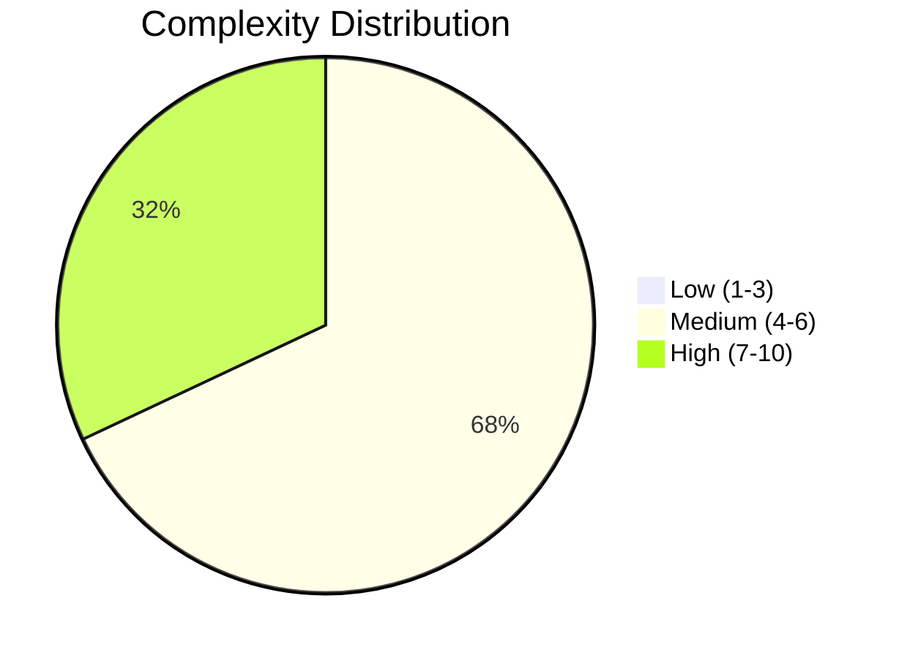
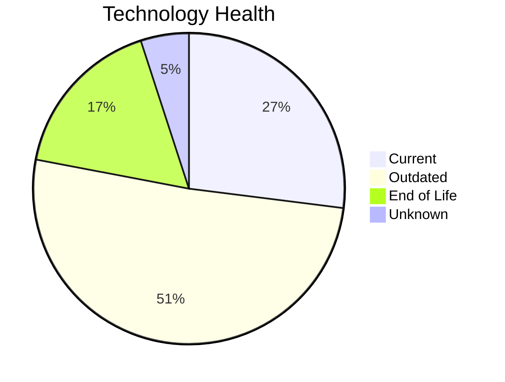

# Portfolio Modernization Report

**Generated:** 2026-05-19  
**Applications Analyzed:** 25 (from 30 total; 5 out-of-scope)

## Executive Summary
25 in-scope applications were assessed. Complexity distribution is 0 low / 17 medium / 8 high. Technology lifecycle review found 17 EOL and 51 outdated components (OS, DB, language, app server). Financial modeling indicates €2,275,931 one-time cost and €1,320,500 yearly savings, with ~1.7 year break-even.

## Portfolio Overview

## Top Modernization Opportunities

| Scenario | Applicable Apps | Total Cost | Yearly Savings | ROI |
|---|---:|---:|---:|---:|
| App Refactor/Decoupling | 3 | €954137 | €375000 | 2.5y |
| Application Containerization | 8 | €944835 | €700000 | 1.3y |
| Upgrade Legacy Databases | 14 | €166290 | €140000 | 1.2y |
| Application Server Replacement | 6 | €78325 | €60000 | 1.3y |
| App Deployment to Cloud | 12 | €75708 | €30300 | 2.5y |
| Switch to ARM CPU | 6 | €35677 | €6000 | 5.9y |

## Financial Summary

| Metric | Value |
|---|---:|
| Total One-Time Investment | €2275931 |
| Total Annual Savings | €1320500 |
| Portfolio Break-Even | 1.7 years |

## Risk Applications (Top 5)

| Application | Complexity | EOL Components |
|---|---:|---:|
| BackupApp-017 | 8/10 | 2 |
| CRMApp-002 | 7/10 | 2 |
| HRApp-004 | 7/10 | 2 |
| InventoryApp-008 | 7/10 | 2 |
| VendorApp-018 | 7/10 | 1 |
