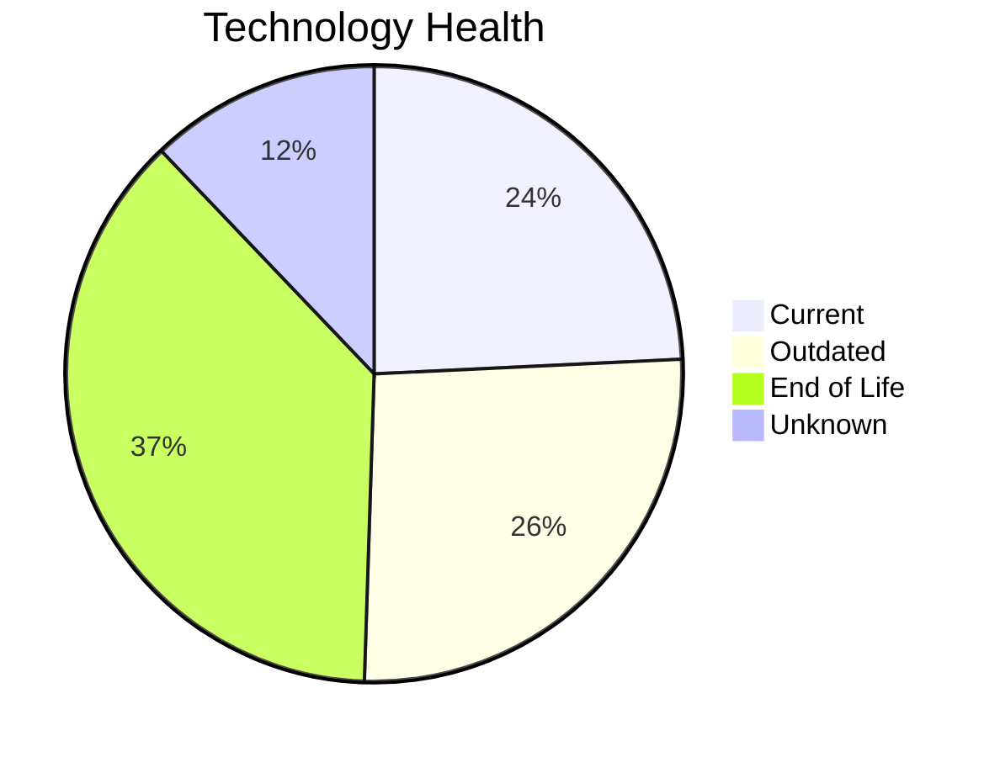
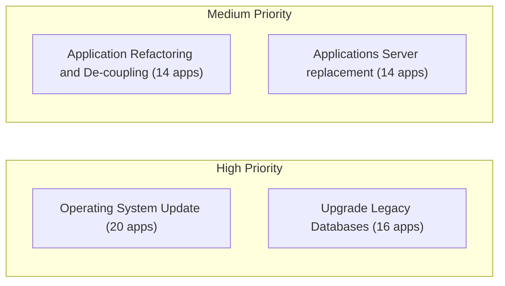
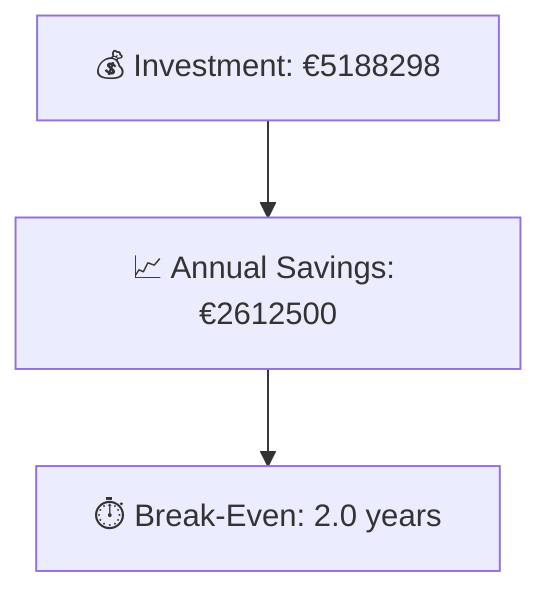

# Portfolio Modernization Report

**Generated:** 2026-05-07
**Applications Analyzed:** 25

## Executive Summary

25 in-scope applications were analyzed from the portfolio workbook. 20 applications contain at least one EOL technology component, which is the main modernization risk. The strongest modernization themes are Operating System Update, Upgrade Legacy Databases, Application Refactoring and De-coupling. The aggregated one-time investment is €5,188,298 with annual savings of €2,612,500. Portfolio break-even is 2.0 years.

## Portfolio Overview

## Top Modernization Opportunities

| Scenario | Applicable Apps | Priority | Total Cost | Yearly Savings | ROI |
|----------|----------------|----------|------------|---------------|-----|
| Operating System Update | 20 | High | €23579 | €10000 | 2.4y |
| Upgrade Legacy Databases | 16 | High | €189224 | €160000 | 1.2y |
| Application Refactoring and De-coupling | 14 | High | €4140256 | €1845000 | 2.2y |
| Applications Server replacement | 14 | Medium | €171072 | €145200 | 1.2y |
| Application Migration to Cloud Infrastructure (Lift & Shift) | 8 | High | €49863 | €20700 | 2.4y |
| Application Containerization | 5 | High | €612961 | €430000 | 1.4y |
| Switch to standard Linux Operating System | 4 | Medium | €1343 | €1600 | 0.8y |

## Scenario Applicability Matrix

| Application | Operating System Update | Switch to standard Linux Operating System | Switch to ARM-based CPU | Applications Server replacement | Application Migration to Cloud Infrastructure (Lift & Shift) | Application Containerization | Application Refactoring and De-coupling | Upgrade Legacy Databases | Switch DB Engine to open-source database solution | Update outdated components |
|-------------|:---:|:---:|:---:|:---:|:---:|:---:|:---:|:---:|:---:|:---:|
| ERPApp-001 | ✅ | ✅ | ❓ | ❌ | ✅ | ❌ | ✅ | ✔️ | ✅ | ❓ |
| CRMApp-002 | ✅ | ➖ | ❓ | ✅ | ✔️ | 🚫 | 🚫 | ❓ | ✔️ | 🚫 |
| HRApp-004 | ✅ | ❌ | ❓ | ✅ | ➖ | ✔️ | ✅ | ✅ | ✅ | ✅ |
| SupportApp-006 | ✅ | ➖ | ❓ | ✅ | ✔️ | 🚫 | 🚫 | ✅ | ✔️ | 🚫 |
| InventoryApp-008 | ✅ | ✅ | ❓ | ✅ | ✅ | ❌ | ✅ | ✅ | ✅ | ✅ |
| PayrollApp-010 | ✅ | ❌ | ❓ | ✔️ | ✔️ | 🚫 | 🚫 | ✅ | ✔️ | 🚫 |
| RouteOptApp-011 | ✅ | ✅ | ❓ | ✅ | ✔️ | ✔️ | ➖ | ✅ | ✔️ | ✅ |
| IoTSensorApp-012 | ✔️ | ❌ | ❓ | ✔️ | ✔️ | ✔️ | ✅ | ✅ | ✔️ | ✅ |
| SecurityApp-013 | ✅ | ➖ | ❓ | ✅ | ✅ | ✅ | ✅ | ✔️ | ✅ | ✅ |
| DocumentApp-014 | ✅ | ❌ | ❓ | ✔️ | ✔️ | ✅ | ✅ | ✅ | ✔️ | ✅ |
| ReportingApp-015 | ✅ | ❌ | ❓ | ✔️ | ✔️ | ❌ | ✅ | ❓ | ✔️ | ✅ |
| MobileApp-016 | ✅ | ➖ | ❓ | ✅ | ✔️ | ✔️ | ➖ | ✅ | ✅ | ✅ |
| BackupApp-017 | ✅ | ➖ | ❓ | ✅ | ✅ | 🚫 | 🚫 | ✅ | 🚫 | 🚫 |
| VendorApp-018 | ✅ | ➖ | ❓ | ✅ | ✅ | ✅ | ✅ | ✅ | ✔️ | ✅ |
| QualityApp-019 | ✔️ | ✔️ | ❓ | ✅ | ➖ | ✅ | ✅ | ✅ | ✔️ | ✅ |
| TrainingApp-020 | ✅ | ❌ | ❓ | ✅ | ✔️ | 🚫 | 🚫 | ✅ | 🚫 | 🚫 |
| FleetApp-021 | ✔️ | ❌ | ❓ | ✔️ | ✅ | ❌ | ✅ | ✅ | ✅ | ✅ |
| ComplianceApp-022 | ✅ | ➖ | ❓ | ✔️ | ➖ | ✔️ | ➖ | ✅ | ✔️ | ✔️ |
| ChatbotApp-023 | ✔️ | ✔️ | ❓ | ✅ | ✔️ | ✔️ | ➖ | ❓ | ✔️ | ✅ |
| AuditApp-024 | ✅ | ❌ | ❓ | ✔️ | ✅ | ❌ | ✅ | ✅ | ✅ | ❓ |
| PortalApp-025 | ✅ | ❌ | ❓ | ✔️ | ✔️ | ✔️ | ✅ | ✔️ | ✔️ | ❓ |
| LegacyFinApp-026 | ✅ | ✅ | ❓ | ❌ | ✅ | ❌ | ✅ | ❓ | ✅ | ✔️ |
| DataWarehouseApp-027 | ✅ | ➖ | ❓ | ✅ | ➖ | ✅ | ✅ | ✔️ | ✅ | ✅ |
| NotificationApp-028 | ✅ | ❌ | ❓ | ✔️ | ✔️ | ✔️ | 🚫 | ✔️ | 🚫 | 🚫 |
| APIGatewayApp-030 | ✔️ | ✔️ | ❓ | ✅ | ✔️ | ✔️ | ➖ | ✅ | ✔️ | ✅ |

Legend: ✅ Applicable | ❌ Not Applicable | ✔️ Already Fulfilled | 🚫 Blocked | ❓ Unknown | ➖ Partially Fulfilled

## Financial Summary

| Metric | Value |
|--------|-------|
| Total One-Time Investment | €5188298 |
| Total Annual Savings | €2612500 |
| Portfolio Break-Even | 2.0 years |

## Risk Applications

| Application | Complexity | EOL Components | Applicable Scenarios |
|-------------|-----------|---------------|---------------------|
| BackupApp-017 | 8/10 (HIGH) | 2 | 4 |
| APIGatewayApp-030 | 7/10 (HIGH) | 3 | 3 |
| CRMApp-002 | 7/10 (HIGH) | 2 | 2 |
| DataWarehouseApp-027 | 7/10 (HIGH) | 2 | 6 |
| SecurityApp-013 | 7/10 (HIGH) | 2 | 7 |

## Per-Application Reports

| Application | Report |
|-------------|--------|
| ERPApp-001 | [View Report](apps/app001.md) |
| CRMApp-002 | [View Report](apps/app002.md) |
| HRApp-004 | [View Report](apps/app004.md) |
| SupportApp-006 | [View Report](apps/app006.md) |
| InventoryApp-008 | [View Report](apps/app008.md) |
| PayrollApp-010 | [View Report](apps/app010.md) |
| RouteOptApp-011 | [View Report](apps/app011.md) |
| IoTSensorApp-012 | [View Report](apps/app012.md) |
| SecurityApp-013 | [View Report](apps/app013.md) |
| DocumentApp-014 | [View Report](apps/app014.md) |
| ReportingApp-015 | [View Report](apps/app015.md) |
| MobileApp-016 | [View Report](apps/app016.md) |
| BackupApp-017 | [View Report](apps/app017.md) |
| VendorApp-018 | [View Report](apps/app018.md) |
| QualityApp-019 | [View Report](apps/app019.md) |
| TrainingApp-020 | [View Report](apps/app020.md) |
| FleetApp-021 | [View Report](apps/app021.md) |
| ComplianceApp-022 | [View Report](apps/app022.md) |
| ChatbotApp-023 | [View Report](apps/app023.md) |
| AuditApp-024 | [View Report](apps/app024.md) |
| PortalApp-025 | [View Report](apps/app025.md) |
| LegacyFinApp-026 | [View Report](apps/app026.md) |
| DataWarehouseApp-027 | [View Report](apps/app027.md) |
| NotificationApp-028 | [View Report](apps/app028.md) |
| APIGatewayApp-030 | [View Report](apps/app030.md) |
