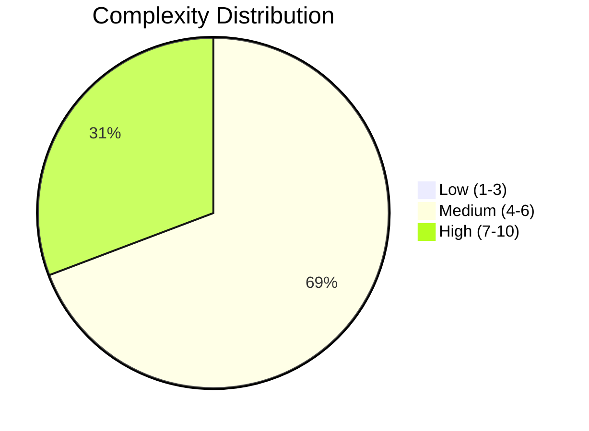
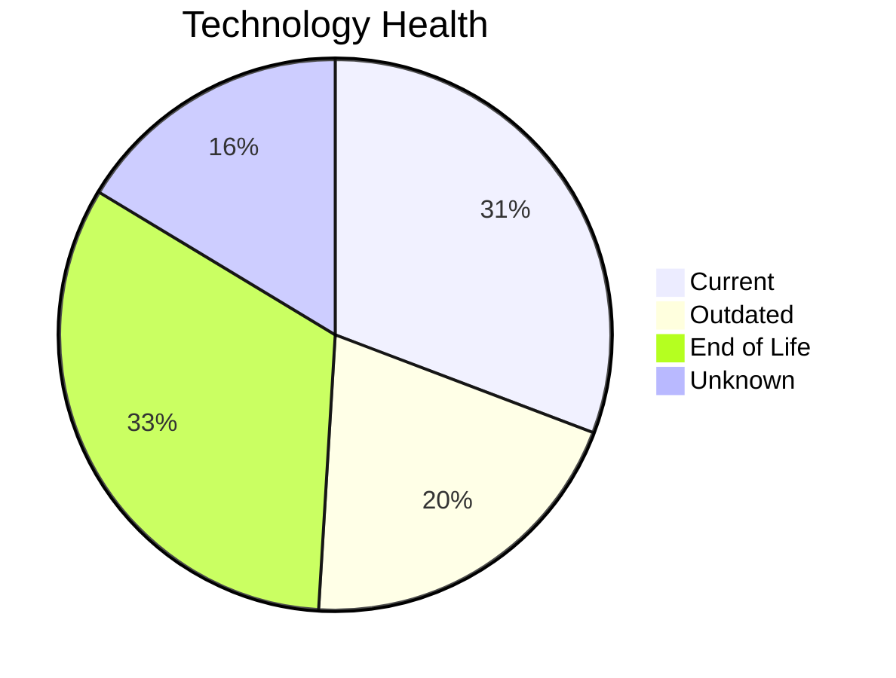
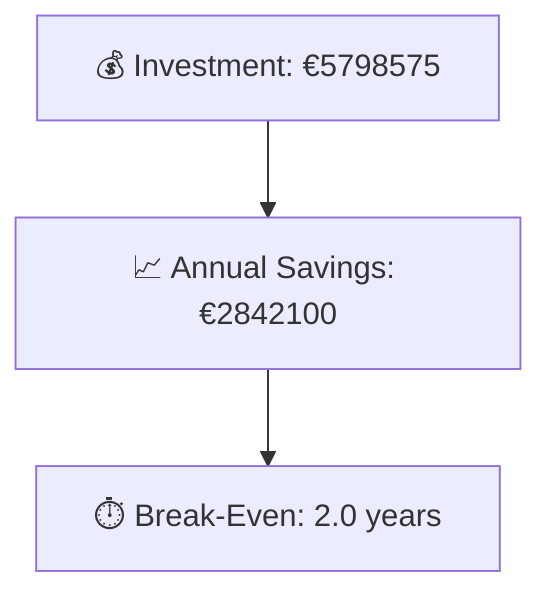

# Portfolio Modernization Report

**Generated:** 2026-05-13  
**Applications Analyzed:** 30

## Executive Summary
30 applications were analyzed; 26 are in scope after exclusions (4 retired, 0 SAP). 8 in-scope applications are high complexity, and 20 contain at least one EOL component. The most frequent opportunities are OS updates, component refresh, app refactoring, and on-prem lift-and-shift to cloud. Estimated portfolio investment is €5798575 with annual savings of €2842100, yielding ~2.0 years break-even under configured assumptions.

## Portfolio Overview

## Top Modernization Opportunities
| Scenario | Applicable Apps | Priority | Total Cost | Yearly Savings | ROI |
|----------|----------------:|----------|-----------:|---------------:|----:|
| Operating System Update | 21 | High | €25153 | €10500 | 2.4 |
| Update outdated components | 20 | High | €0 | €0 | N/A |
| Application Refactoring and De-coupling | 15 | High | €4528290 | €1950000 | 2.3 |
| Applications Server replacement | 9 | Medium | €113474 | €90000 | 1.3 |
| Switch DB Engine to open-source database solution | 9 | High | €0 | €0 | N/A |
| Application Containerization | 8 | High | €982133 | €690000 | 1.4 |
| Upgrade Legacy Databases | 8 | High | €96704 | €80000 | 1.2 |
| Application Migration to Cloud Infrastructure (Lift & Shift) | 8 | High | €51728 | €20400 | 2.5 |
| Switch to standard Linux Operating System | 3 | Medium | €1093 | €1200 | 0.9 |

## Scenario Applicability Matrix
| Application | Operating System Update | Switch to standard Linux Operating System | Switch to ARM-based CPU | Applications Server replacement | Application Migration to Cloud Infrastructure (Lift & Shift) | Application Containerization | Application Refactoring and De-coupling | Upgrade Legacy Databases | Switch DB Engine to open-source database solution | Update outdated components |
|-------------|:---:|:---:|:---:|:---:|:---:|:---:|:---:|:---:|:---:|:---:|
| ERPApp-001 | ✅ | ✅ | ❓ | ❓ | ✅ | 🚫 | ✅ | ✔️ | ✅ | ✅ |
| CRMApp-002 | ✅ | ✔️ | 🚫 | 🚫 | ✔️ | 🚫 | 🚫 | ❓ | ✔️ | 🚫 |
| AnalyticsApp-003 | ✅ | ✔️ | ❓ | ✅ | ✔️ | ✔️ | ✅ | ✅ | ✔️ | ✅ |
| HRApp-004 | ✅ | ❌ | ❓ | ✅ | ◐ | ✔️ | ✅ | ✔️ | ✅ | ✅ |
| SupportApp-006 | ✅ | ✔️ | 🚫 | 🚫 | ✔️ | 🚫 | 🚫 | ✅ | ✔️ | 🚫 |
| InventoryApp-008 | ✅ | ✅ | ❓ | ✅ | ✅ | 🚫 | ✅ | ✔️ | ✅ | ✅ |
| PayrollApp-010 | ✅ | ❌ | 🚫 | ✔️ | ✔️ | 🚫 | 🚫 | ✔️ | ✔️ | 🚫 |
| RouteOptApp-011 | ✅ | ✔️ | ❓ | ✅ | ✔️ | ✔️ | ◐ | ✔️ | ✔️ | ✅ |
| IoTSensorApp-012 | ✔️ | ❌ | ❓ | ✔️ | ✔️ | ✔️ | ✅ | ✔️ | ✔️ | ✅ |
| SecurityApp-013 | ✅ | ✔️ | ❓ | ✅ | ✅ | ✅ | ✅ | ✔️ | ✅ | ✅ |
| DocumentApp-014 | ✅ | ❌ | ❓ | ✔️ | ✔️ | ✅ | ✅ | ✔️ | ✔️ | ✅ |
| ReportingApp-015 | ✅ | ❌ | ❓ | ✔️ | ✔️ | ✅ | ✅ | ❓ | ✔️ | ✅ |
| MobileApp-016 | ✅ | ✔️ | ❓ | ❓ | ✔️ | ✔️ | ◐ | ✔️ | ✅ | ✅ |
| BackupApp-017 | ✅ | ✔️ | 🚫 | 🚫 | ✅ | 🚫 | 🚫 | ✅ | 🚫 | 🚫 |
| VendorApp-018 | ✅ | ✔️ | ❓ | ✅ | ✅ | ✅ | ✅ | ✅ | ✔️ | ✅ |
| QualityApp-019 | ✔️ | ✔️ | ❓ | ✅ | ◐ | ✅ | ✅ | ✔️ | ✔️ | ✅ |
| TrainingApp-020 | ✅ | ❌ | 🚫 | 🚫 | ✔️ | 🚫 | 🚫 | ✅ | 🚫 | 🚫 |
| FleetApp-021 | ✔️ | ❌ | ❓ | ✔️ | ✅ | ✅ | ✅ | ✅ | ✅ | ✅ |
| ComplianceApp-022 | ✅ | ✔️ | ❓ | ✔️ | ◐ | ✔️ | ◐ | ✔️ | ✔️ | ✅ |
| ChatbotApp-023 | ✔️ | ✔️ | ❓ | ❓ | ✔️ | ✔️ | ◐ | ❓ | ✔️ | ✅ |
| AuditApp-024 | ✅ | ❌ | ❓ | ✔️ | ✅ | ✅ | ✅ | ✅ | ✅ | ✅ |
| PortalApp-025 | ✅ | ❌ | ❓ | ✔️ | ✔️ | ✔️ | ✅ | ✔️ | ✔️ | ✅ |
| LegacyFinApp-026 | ✅ | ✅ | ❓ | ❓ | ✅ | 🚫 | ✅ | ❓ | ✅ | ✅ |
| DataWarehouseApp-027 | ✅ | ✔️ | ❓ | ✅ | ◐ | ✅ | ✅ | ✔️ | ✅ | ✅ |
| NotificationApp-028 | ✅ | ❌ | 🚫 | ✔️ | ✔️ | ✔️ | 🚫 | ✔️ | 🚫 | 🚫 |
| APIGatewayApp-030 | ✔️ | ✔️ | ❓ | ✅ | ✔️ | ✔️ | ◐ | ✅ | ✔️ | ✅ |

Legend: ✅ Applicable | ❌ Not Applicable | ✔️ Already Fulfilled | 🚫 Blocked | ❓ Unknown | ◐ Partially Fulfilled

## Financial Summary
| Metric | Value |
|--------|-------|
| Total One-Time Investment | €5798575 |
| Total Annual Savings | €2842100 |
| Portfolio Break-Even | 2.0 years |

## Per-Application Reports
| Application | Report |
|-------------|--------|
| ERPApp-001 | [View Report](apps/app001.md) |
| CRMApp-002 | [View Report](apps/app002.md) |
| AnalyticsApp-003 | [View Report](apps/app003.md) |
| HRApp-004 | [View Report](apps/app004.md) |
| EComApp-005 | [View Report](apps/app005.md) |
| SupportApp-006 | [View Report](apps/app006.md) |
| FinanceApp-007 | [View Report](apps/app007.md) |
| InventoryApp-008 | [View Report](apps/app008.md) |
| MarketingApp-009 | [View Report](apps/app009.md) |
| PayrollApp-010 | [View Report](apps/app010.md) |
| RouteOptApp-011 | [View Report](apps/app011.md) |
| IoTSensorApp-012 | [View Report](apps/app012.md) |
| SecurityApp-013 | [View Report](apps/app013.md) |
| DocumentApp-014 | [View Report](apps/app014.md) |
| ReportingApp-015 | [View Report](apps/app015.md) |
| MobileApp-016 | [View Report](apps/app016.md) |
| BackupApp-017 | [View Report](apps/app017.md) |
| VendorApp-018 | [View Report](apps/app018.md) |
| QualityApp-019 | [View Report](apps/app019.md) |
| TrainingApp-020 | [View Report](apps/app020.md) |
| FleetApp-021 | [View Report](apps/app021.md) |
| ComplianceApp-022 | [View Report](apps/app022.md) |
| ChatbotApp-023 | [View Report](apps/app023.md) |
| AuditApp-024 | [View Report](apps/app024.md) |
| PortalApp-025 | [View Report](apps/app025.md) |
| LegacyFinApp-026 | [View Report](apps/app026.md) |
| DataWarehouseApp-027 | [View Report](apps/app027.md) |
| NotificationApp-028 | [View Report](apps/app028.md) |
| ConfigApp-029 | [View Report](apps/app029.md) |
| APIGatewayApp-030 | [View Report](apps/app030.md) |
