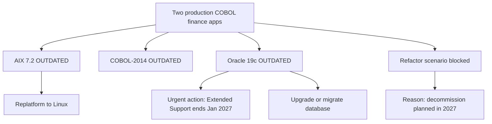

# Portfolio Modernization Report

**Analysis date:** 2026-07-02  
**Portfolio size:** 2 applications  
**Scope:** Full modernization assessment for two production finance ERP applications

## Executive Summary

The portfolio consists of two nearly identical production COBOL finance applications running on AIX 7.2 and Oracle 19c. Both are in scope, both have high complexity, and both face immediate technology risk from Oracle 19c Extended Support ending in January 2027. The key change in this refresh is that `app_refactor_decoupling` is now **BLOCKED** for both applications because the planned 2027 decommission date makes a large refactoring program economically unjustified.

Key findings:
- Both applications are **in scope** for modernization.
- All six assessed technology components are **OUTDATED**.
- Both applications have **High complexity** with a normalized score of **8/10**.
- **Oracle 19c requires urgent action** because Extended Support ends in **January 2027**.
- The strongest business case scenarios are Linux replatforming, database modernization, and targeted cloud migration.
- Portfolio-level business case is now **$148,680** investment with **94.4% ROI over 5 years**.

## Portfolio Application Overview

| App ID | App Name | Business Criticality | Status | OS | Language | Database | Architecture | Users | Complexity |
|---|---|---:|---|---|---|---|---|---:|---:|
| scenarioa-test-transform | COBOL transform | High | Production | AIX 7.2 | COBOL-2014 | Oracle 19c | 1-Tier | 350 | 8/10 |
| scenarioa-test-maintain | COBOL maintain | High | Production | AIX 7.2 | COBOL-2014 | Oracle 19c | 1-Tier | 350 | 8/10 |

## Technology Health Summary

Across the portfolio, 6 major technology components were assessed and all 6 are outdated.

### Summary Observations
- **AIX 7.2** is beyond standard support and remains only in Extended Support.
- **COBOL-2014** is a legacy language standard with a shrinking talent pool.
- **Oracle 19c** is beyond Premier Support and reaches the end of Extended Support in **January 2027**.
- The portfolio should emphasize tactical risk reduction and economically justified replatforming, not deep structural refactoring.

## Application Assessments

### 1. COBOL transform (`scenarioa-test-transform`)

#### Technology Assessment

| Component | Type | Status | Support Date | Confidence |
|---|---|---|---|---:|
| AIX 7.2 | OS | **OUTDATED** | Extended Support to 2028-04-30 | 8 |
| COBOL-2014 | Programming language | **OUTDATED** | Superseded by COBOL 2023 | 7 |
| Oracle 19c | Database | **OUTDATED** | Extended Support to 2027-01-31 | 9 |

#### Complexity Assessment
- **Score:** 8/10 (High)
- **Multiplier:** 1.8
- **Drivers:** legacy Unix platform, COBOL skills scarcity, large Oracle estate, monolithic architecture, no CI/CD, finance criticality, and compressed decommission timeline.

#### Scenario Applicability

| Scenario | Status | Summary |
|---|---|---|
| os_update_security_patch | APPLICABLE | Reduce immediate AIX support and security risk. |
| switch_to_standard_linux_os | APPLICABLE | Strong replatform candidate away from proprietary Unix. |
| switch_to_arm_cpu | NOT_APPLICABLE | POWER/AIX stack does not fit ARM scenario criteria. |
| application_server_replacement | NOT_APPLICABLE | No application server layer exists. |
| app_deployment_to_cloud | APPLICABLE | Lift-and-shift is possible after careful platform planning. |
| app_containerization | BLOCKED | Linux migration and decomposition are prerequisites. |
| app_refactor_decoupling | BLOCKED | 2027 decommission plan invalidates a major refactoring investment. |
| upgrade_legacy_databases | APPLICABLE | Oracle 19c support window is nearly exhausted. |
| switch_db_engine_open_source | APPLICABLE | PostgreSQL migration remains commercially attractive. |
| update_outdated_components | APPLICABLE | Full-stack currency improvement is warranted. |

#### Business Case

| Scenario | Adjusted Cost | Yearly Savings | 3-Year ROI | 5-Year ROI |
|---|---:|---:|---:|---:|
| OS update | $1,800 | $500 | -16.7% | 38.9% |
| Switch to Linux | $540 | $400 | 122.2% | 270.4% |
| Cloud lift & shift | $9,000 | $3,000 | 0.0% | 66.7% |
| Upgrade legacy DB | $18,000 | $10,000 | 66.7% | 177.8% |
| Switch DB to PostgreSQL | $45,000 | $15,000 | 0.0% | 66.7% |

**App total:** adjusted cost **$74,340**, yearly savings **$28,900**, 3-year ROI **16.6%**, 5-year ROI **94.4%**.

### 2. COBOL maintain (`scenarioa-test-maintain`)

#### Technology Assessment

| Component | Type | Status | Support Date | Confidence |
|---|---|---|---|---:|
| AIX 7.2 | OS | **OUTDATED** | Extended Support to 2028-04-30 | 8 |
| COBOL-2014 | Programming language | **OUTDATED** | Superseded by COBOL 2023 | 7 |
| Oracle 19c | Database | **OUTDATED** | Extended Support to 2027-01-31 | 9 |

#### Complexity Assessment
- **Score:** 8/10 (High)
- **Multiplier:** 1.8
- **Drivers:** same legacy platform, Oracle dependency, monolithic design, no CI/CD, and the same 2027 decommission constraint.

#### Scenario Applicability

| Scenario | Status | Summary |
|---|---|---|
| os_update_security_patch | APPLICABLE | Reduce immediate AIX support and security risk. |
| switch_to_standard_linux_os | APPLICABLE | Strong replatform candidate away from proprietary Unix. |
| switch_to_arm_cpu | NOT_APPLICABLE | POWER/AIX stack does not fit ARM scenario criteria. |
| application_server_replacement | NOT_APPLICABLE | No application server layer exists. |
| app_deployment_to_cloud | APPLICABLE | Lift-and-shift is possible after careful platform planning. |
| app_containerization | BLOCKED | Linux migration and decomposition are prerequisites. |
| app_refactor_decoupling | BLOCKED | 2027 decommission plan invalidates a major refactoring investment. |
| upgrade_legacy_databases | APPLICABLE | Oracle 19c support window is nearly exhausted. |
| switch_db_engine_open_source | APPLICABLE | PostgreSQL migration remains commercially attractive. |
| update_outdated_components | APPLICABLE | Full-stack currency improvement is warranted. |

#### Business Case

| Scenario | Adjusted Cost | Yearly Savings | 3-Year ROI | 5-Year ROI |
|---|---:|---:|---:|---:|
| OS update | $1,800 | $500 | -16.7% | 38.9% |
| Switch to Linux | $540 | $400 | 122.2% | 270.4% |
| Cloud lift & shift | $9,000 | $3,000 | 0.0% | 66.7% |
| Upgrade legacy DB | $18,000 | $10,000 | 66.7% | 177.8% |
| Switch DB to PostgreSQL | $45,000 | $15,000 | 0.0% | 66.7% |

**App total:** adjusted cost **$74,340**, yearly savings **$28,900**, 3-year ROI **16.6%**, 5-year ROI **94.4%**.

## Portfolio-Level Business Case Summary

| Scope | Adjusted Cost | Yearly Savings | 3-Year Savings | 3-Year ROI | 5-Year Savings | 5-Year ROI |
|---|---:|---:|---:|---:|---:|---:|
| Per application | $74,340 | $28,900 | $86,700 | 16.6% | $144,500 | 94.4% |
| Portfolio total (2 apps) | $148,680 | $57,800 | $173,400 | 16.6% | $289,000 | 94.4% |

## Recommended Modernization Sequence
1. Execute short-term OS and Oracle risk reduction planning immediately.
2. Make the Oracle 19c upgrade or migration decision before January 2027.
3. Replatform from AIX to a standard Linux target where operationally justified.
4. Evaluate cloud landing zones for the remaining application lifetime.
5. Do **not** fund a major refactor/de-coupling program because the 2027 decommission plan blocks the payback case.
