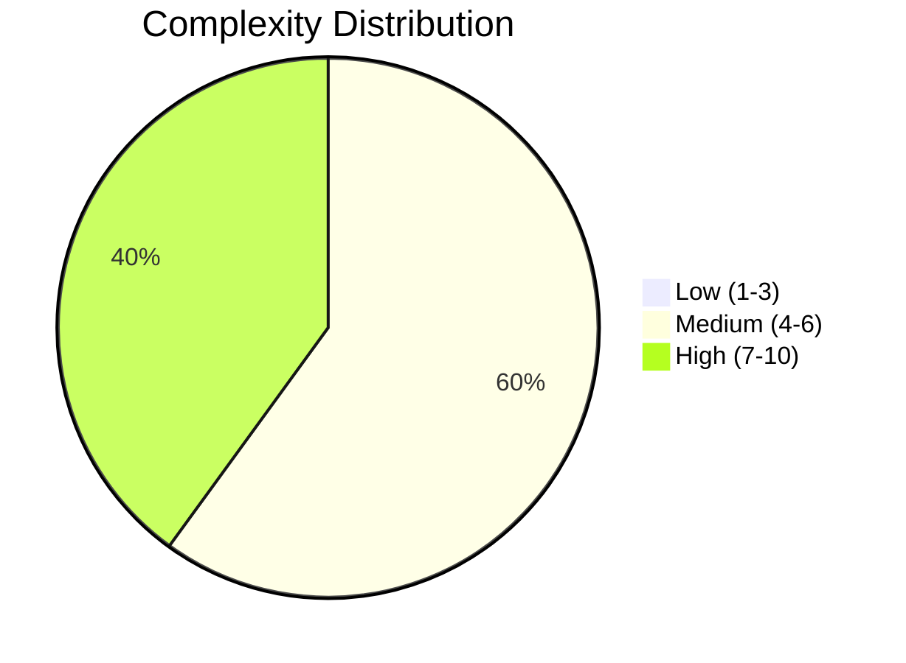
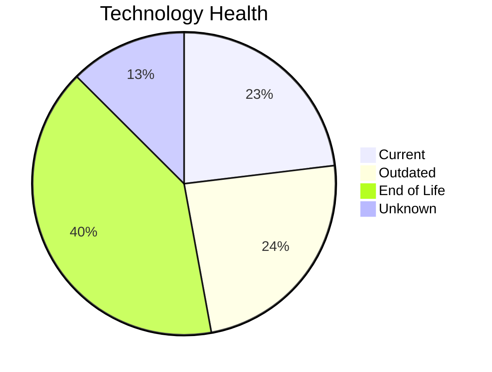
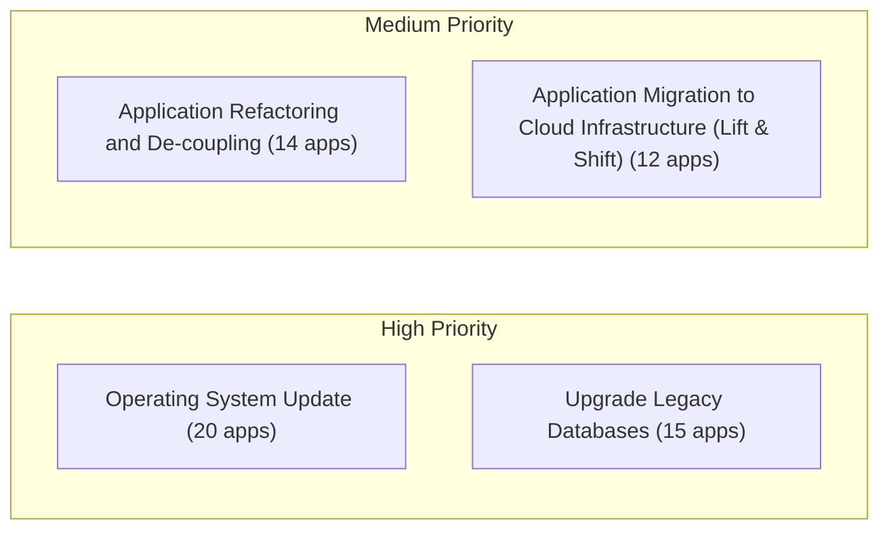
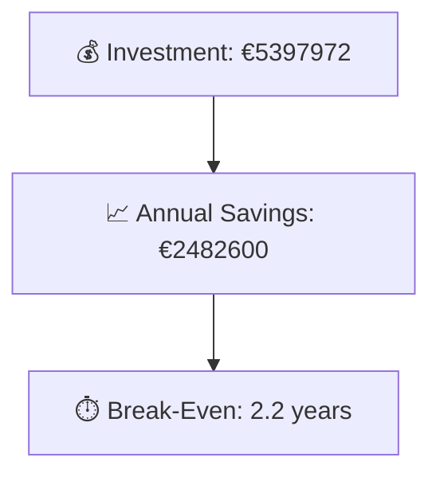

# Portfolio Modernization Report

**Generated:** 2026-05-11
**Applications Analyzed:** 25

## Executive Summary

The portfolio contains 30 applications, of which 25 are in scope for modernization and 5 are out of scope (retired/SAP).
Complexity is predominantly medium (15 applications), with 10 high-complexity applications requiring phased execution and stronger risk controls.
Technology risk is driven by 42 end-of-life and 25 outdated components, creating strong triggers for remediation scenarios.
Top opportunities are concentrated in Operating System Update, Upgrade Legacy Databases, and Application Refactoring and De-coupling.
Estimated portfolio break-even is 2.2 years based on one-time costs of €5397972 and yearly savings of €2482600.

## Portfolio Scope

- Total Portfolio: 30
- In Scope: 25 (5 out-of-scope applications)

## Portfolio Overview

## Top Modernization Opportunities

| Scenario | Applicable Apps | Priority | Total Cost | Yearly Savings | ROI |
|----------|----------------|----------|------------|---------------|-----|
| Operating System Update | 20 | High | €24293 | €10000 | 2.4y |
| Upgrade Legacy Databases | 15 | High | €184372 | €150000 | 1.2y |
| Application Refactoring and De-coupling | 14 | High | €4357101 | €1770000 | 2.5y |
| Application Migration to Cloud Infrastructure (Lift & Shift) | 12 | High | €74841 | €30600 | 2.4y |
| Applications Server replacement | 10 | Medium | €126060 | €100800 | 1.3y |
| Application Containerization | 5 | High | €630309 | €420000 | 1.5y |
| Switch to standard Linux Operating System | 3 | Medium | €996 | €1200 | 0.8y |

## Scenario Applicability Matrix

| Application | Operating System Update | Upgrade Legacy Databases | Application Refactoring and De-coupling | Application Migration to Cloud Infrastructure (Lift & Shift) | Applications Server replacement |
|-------------|:---:|:---:|:---:|:---:|:---:|
| ERPApp-001 | ✅ | ✅ | ✅ | ✅ | ❌ |
| CRMApp-002 | ✅ | ❓ | 🚫 | ✔️ | 🚫 |
| HRApp-004 | ✅ | ✅ | ✅ | ✅ | ✅ |
| SupportApp-006 | ✅ | ✅ | 🚫 | ✔️ | 🚫 |
| InventoryApp-008 | ✅ | ✅ | ✅ | ✅ | ✅ |
| PayrollApp-010 | ✅ | ✔️ | 🚫 | ✔️ | 🚫 |
| RouteOptApp-011 | ✅ | ✅ | ◐ | ✔️ | ✅ |
| IoTSensorApp-012 | ✔️ | ✅ | ✅ | ✔️ | ✔️ |
| SecurityApp-013 | ✅ | ✔️ | ✅ | ✅ | ✅ |
| DocumentApp-014 | ✅ | ✔️ | ✅ | ✔️ | ✔️ |
| ReportingApp-015 | ✅ | ❓ | ◐ | ✔️ | ✔️ |
| MobileApp-016 | ✅ | ✅ | ✅ | ✔️ | ✅ |
| BackupApp-017 | ✅ | ✅ | 🚫 | ✅ | 🚫 |
| VendorApp-018 | ✅ | ✅ | ✅ | ✅ | ✅ |
| QualityApp-019 | ✔️ | ✔️ | ◐ | ✅ | ✅ |
| TrainingApp-020 | ✅ | ✅ | 🚫 | ✔️ | 🚫 |
| FleetApp-021 | ✔️ | ✅ | ◐ | ✅ | ✔️ |
| ComplianceApp-022 | ✅ | ✅ | ✅ | ✅ | ✔️ |
| ChatbotApp-023 | ✔️ | ❓ | ✅ | ✔️ | ✅ |
| AuditApp-024 | ✅ | ✅ | ◐ | ✅ | ✔️ |
| PortalApp-025 | ✅ | ✔️ | ✅ | ✔️ | ✔️ |
| LegacyFinApp-026 | ✅ | ❓ | ✅ | ✅ | ❌ |
| DataWarehouseApp-027 | ✅ | ✔️ | ✅ | ✅ | ✅ |
| NotificationApp-028 | ✅ | ✅ | 🚫 | ✔️ | 🚫 |
| APIGatewayApp-030 | ✔️ | ✅ | ✅ | ✔️ | ✅ |

Legend: ✅ Applicable | ❌ Not Applicable | ✔️ Already Fulfilled | 🚫 Blocked | ❓ Unknown | ◐ Partially Fulfilled

## Financial Summary

| Metric | Value |
|--------|-------|
| Total One-Time Investment | €5397972 |
| Total Annual Savings | €2482600 |
| Portfolio Break-Even | 2.2 years |

## Risk Applications

Applications with the highest modernization complexity or most EOL components:

| Application | Complexity | EOL Components | Applicable Scenarios |
|-------------|-----------|---------------|---------------------|
| BackupApp-017 | 8/10 (HIGH) | 2 | 3 |
| HRApp-004 | 7/10 (HIGH) | 4 | 7 |
| VendorApp-018 | 7/10 (HIGH) | 4 | 7 |
| APIGatewayApp-030 | 7/10 (HIGH) | 3 | 4 |
| SecurityApp-013 | 7/10 (HIGH) | 2 | 7 |
| MobileApp-016 | 7/10 (HIGH) | 2 | 6 |
| PortalApp-025 | 7/10 (HIGH) | 2 | 3 |
| CRMApp-002 | 7/10 (HIGH) | 2 | 1 |
| DataWarehouseApp-027 | 7/10 (HIGH) | 1 | 7 |
| ComplianceApp-022 | 7/10 (HIGH) | 1 | 4 |

## Per-Application Reports

| Application | Report |
|-------------|--------|
| ERPApp-001 | [View Report](apps/app001.md) |
| CRMApp-002 | [View Report](apps/app002.md) |
| HRApp-004 | [View Report](apps/app004.md) |
| SupportApp-006 | [View Report](apps/app006.md) |
| InventoryApp-008 | [View Report](apps/app008.md) |
| PayrollApp-010 | [View Report](apps/app010.md) |
| RouteOptApp-011 | [View Report](apps/app011.md) |
| IoTSensorApp-012 | [View Report](apps/app012.md) |
| SecurityApp-013 | [View Report](apps/app013.md) |
| DocumentApp-014 | [View Report](apps/app014.md) |
| ReportingApp-015 | [View Report](apps/app015.md) |
| MobileApp-016 | [View Report](apps/app016.md) |
| BackupApp-017 | [View Report](apps/app017.md) |
| VendorApp-018 | [View Report](apps/app018.md) |
| QualityApp-019 | [View Report](apps/app019.md) |
| TrainingApp-020 | [View Report](apps/app020.md) |
| FleetApp-021 | [View Report](apps/app021.md) |
| ComplianceApp-022 | [View Report](apps/app022.md) |
| ChatbotApp-023 | [View Report](apps/app023.md) |
| AuditApp-024 | [View Report](apps/app024.md) |
| PortalApp-025 | [View Report](apps/app025.md) |
| LegacyFinApp-026 | [View Report](apps/app026.md) |
| DataWarehouseApp-027 | [View Report](apps/app027.md) |
| NotificationApp-028 | [View Report](apps/app028.md) |
| APIGatewayApp-030 | [View Report](apps/app030.md) |