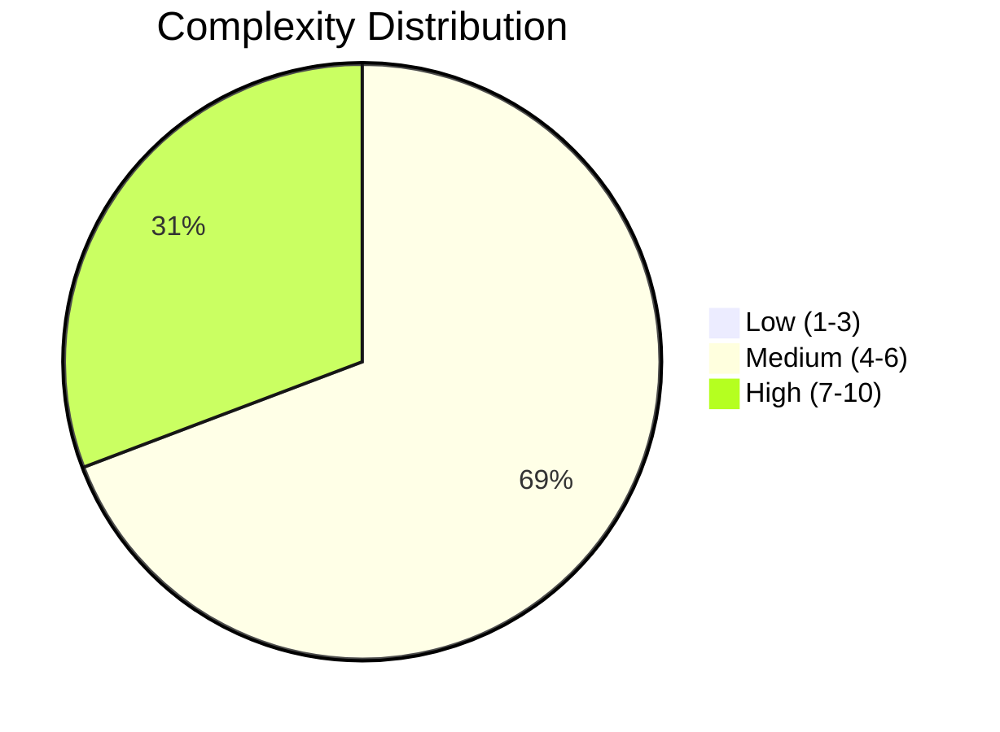
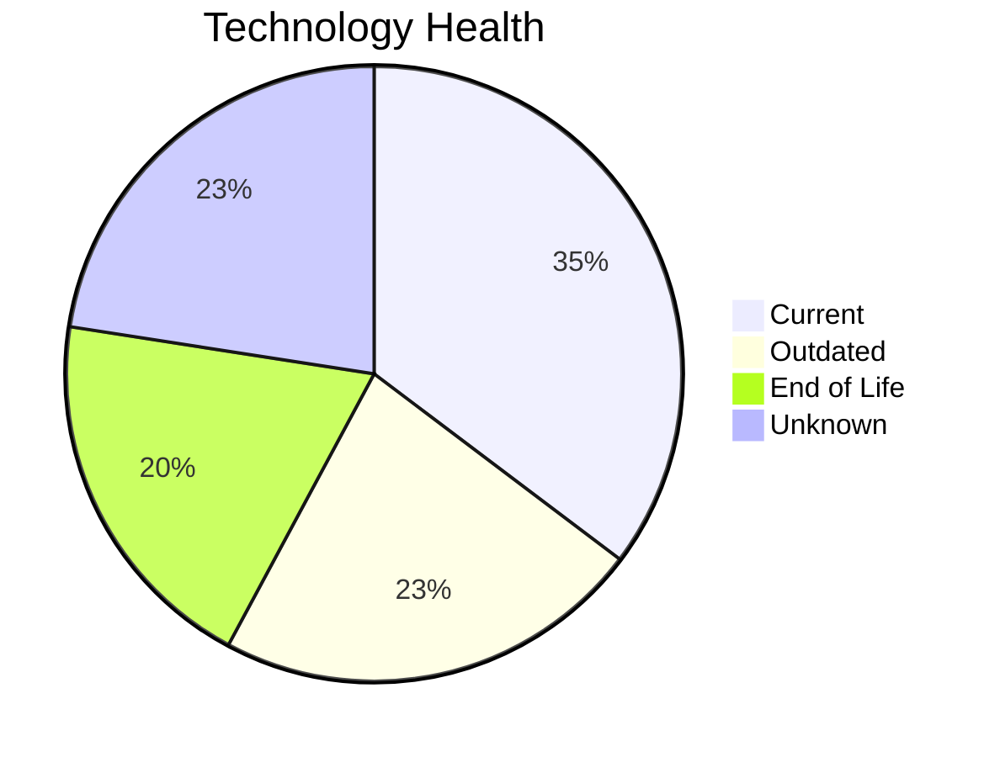

# Portfolio Modernization Report

**Generated:** 2026-05-06  
**Applications Analyzed:** 26 in-scope (4 excluded)

## Executive Summary

The portfolio analysis covers **26 in-scope applications** (4 retired/out-of-scope applications excluded). The assessment identified **24 applications** with modernization opportunities across **65 applicable scenario-application pairs**. Key findings include 20 EOL technology components and 23 outdated components. Top opportunities are containerization, cloud deployment, and open-source database migration. The estimated total one-time investment is **EUR 5,353,952** with projected annual savings of **EUR 2,970,300**, yielding a break-even of approximately **1.8 years**.

## Portfolio Overview

## Top Modernization Opportunities

| Scenario | Apps | Priority | Total Cost | Yearly Savings | ROI |
|----------|:----:|:--------:|-----------:|---------------:|:---:|
| Application Refactoring and De-coupling | 11 | High | EUR 3,229,488 | EUR 1,455,000 | 2.2 |
| Application Containerization | 16 | High | EUR 1,924,366 | EUR 1,380,000 | 1.4 |
| Upgrade Legacy Databases | 9 | High | EUR 109,517 | EUR 90,000 | 1.2 |
| Application Migration to Cloud Infrastructure (Lift & Shift) | 10 | High | EUR 61,298 | EUR 25,800 | 2.4 |
| Operating System Update | 15 | High | EUR 18,133 | EUR 7,500 | 2.4 |
| Applications Server replacement | 1 | Medium | EUR 10,057 | EUR 10,800 | 0.9 |
| Switch to standard Linux Operating System | 3 | Medium | EUR 1,093 | EUR 1,200 | 0.9 |

## Scenario Applicability Matrix

| Application | OS Update | Linux OS | Cloud | Container | Refactor | DB Upgrade | OSS DB | Update | App Srv |
|-------------|:---:|:---:|:---:|:---:|:---:|:---:|:---:|:---:|:---:|
| [ERPApp-001](apps/app001.md) | ✅ | ✅ | ✅ | ✅ | ✅ | ✔️ | ✅ | ✅ | ❌ |
| [CRMApp-002](apps/app002.md) | ✅ | ✔️ | ✔️ | ✅ | ❓ | ✔️ | ✔️ | ✅ | ❓ |
| [AnalyticsApp-003](apps/app003.md) | ✅ | ✔️ | ✔️ | ✔️ | 🔶 | ✅ | ✔️ | ✅ | ✅ |
| [HRApp-004](apps/app004.md) | ✅ | ❌ | ✅ | ✔️ | ✅ | ✔️ | ✅ | ✅ | ❓ |
| [SupportApp-006](apps/app006.md) | ✅ | ✔️ | ✔️ | ✅ | ❓ | ✅ | ✔️ | ✅ | ❓ |
| [InventoryApp-008](apps/app008.md) | ✅ | ✅ | ✅ | ✅ | ✅ | ✔️ | ✅ | ✅ | ❓ |
| [PayrollApp-010](apps/app010.md) | ✔️ | ❌ | ✔️ | ✅ | ❓ | ✔️ | ✔️ | ✅ | ❓ |
| [RouteOptApp-011](apps/app011.md) | ✅ | ✔️ | ✔️ | ✔️ | 🔶 | ✔️ | ✔️ | ✅ | ❓ |
| [IoTSensorApp-012](apps/app012.md) | ✔️ | ❌ | ✔️ | ✔️ | ✅ | ✔️ | ✔️ | ✅ | ❓ |
| [SecurityApp-013](apps/app013.md) | ✅ | ✔️ | ✅ | ✅ | 🔶 | ✔️ | ✅ | ✅ | ❓ |
| [DocumentApp-014](apps/app014.md) | ✔️ | ❌ | ✔️ | ✅ | ✅ | ✔️ | ✔️ | ✅ | ❓ |
| [ReportingApp-015](apps/app015.md) | ✔️ | ❌ | ✔️ | ✅ | ✅ | ✔️ | ✔️ | ✅ | ❓ |
| [MobileApp-016](apps/app016.md) | ✅ | ✔️ | ✔️ | ✔️ | 🔶 | ✔️ | ✅ | ✅ | ❓ |
| [BackupApp-017](apps/app017.md) | ✅ | ✔️ | ✅ | ✅ | ❓ | ✅ | ✅ | ✅ | ❓ |
| [VendorApp-018](apps/app018.md) | ✅ | ✔️ | ✅ | ✅ | 🔶 | ✅ | ✔️ | ✅ | ❓ |
| [QualityApp-019](apps/app019.md) | ✔️ | ✔️ | ❓ | ✅ | 🔶 | ✔️ | ✔️ | ✅ | ❓ |
| [TrainingApp-020](apps/app020.md) | ✅ | ❌ | ✔️ | ✅ | ✅ | ✅ | ✅ | ✅ | ❓ |
| [FleetApp-021](apps/app021.md) | ✔️ | ❌ | ✅ | ✅ | ✅ | ✅ | ✅ | ✅ | ❓ |
| [ComplianceApp-022](apps/app022.md) | ✅ | ✔️ | ✅ | ✔️ | 🔶 | ✔️ | ✔️ | ✅ | ❓ |
| [ChatbotApp-023](apps/app023.md) | ✔️ | ✔️ | ✔️ | ✔️ | 🔶 | ✔️ | ✔️ | ❌ | ❓ |
| [AuditApp-024](apps/app024.md) | ✔️ | ❌ | ✅ | ✅ | ✅ | ✅ | ✅ | ✅ | ❓ |
| [PortalApp-025](apps/app025.md) | ✔️ | ❌ | ✔️ | ✔️ | ✅ | ✔️ | ✔️ | ✅ | ❓ |
| [LegacyFinApp-026](apps/app026.md) | ✅ | ✅ | ✅ | ✅ | ✅ | ✅ | ✅ | ✅ | ❌ |
| [DataWarehouseApp-027](apps/app027.md) | ✅ | ✔️ | ❓ | ✅ | 🔶 | ✔️ | ✅ | ✅ | ❓ |
| [NotificationApp-028](apps/app028.md) | ✔️ | ❌ | ✔️ | ✔️ | ❓ | ✔️ | ✅ | ❌ | ❓ |
| [APIGatewayApp-030](apps/app030.md) | ✔️ | ✔️ | ✔️ | ✔️ | 🔶 | ✅ | ✔️ | ✅ | ❓ |

_Legend: ✅ Applicable | ❌ Not Applicable | ✔️ Fulfilled | 🔶 Partial | 🚫 Blocked | ❓ Unknown_

## Financial Summary

| Metric | Value |
|--------|-------|
| Total One-Time Investment | EUR 5,353,952 |
| Total Annual Savings | EUR 2,970,300 |
| Portfolio Break-Even | 1.8 years |
| Applications with Opportunities | 24/26 |

## Risk Applications

| Application | Complexity | EOL Components | Scenarios |
|-------------|:----------:|:--------------:|:---------:|
| [BackupApp-017](apps/app017.md) | 7/10 (HIGH) | 2 | 6 |
| [InventoryApp-008](apps/app008.md) | 7/10 (HIGH) | 1 | 7 |
| [SecurityApp-013](apps/app013.md) | 7/10 (HIGH) | 1 | 5 |
| [MobileApp-016](apps/app016.md) | 7/10 (HIGH) | 1 | 3 |
| [VendorApp-018](apps/app018.md) | 7/10 (HIGH) | 1 | 5 |
| [TrainingApp-020](apps/app020.md) | 7/10 (HIGH) | 1 | 6 |
| [DataWarehouseApp-027](apps/app027.md) | 7/10 (HIGH) | 1 | 4 |
| [APIGatewayApp-030](apps/app030.md) | 7/10 (HIGH) | 1 | 2 |
| [CRMApp-002](apps/app002.md) | 6/10 (MEDIUM) | 1 | 3 |
| [HRApp-004](apps/app004.md) | 6/10 (MEDIUM) | 1 | 5 |

## Out-of-Scope Applications

| Application | Reason |
|-------------|--------|
| EComApp-005 | RETIRED |
| FinanceApp-007 | RETIRED |
| MarketingApp-009 | RETIRED |
| ConfigApp-029 | RETIRED |

## Per-Application Reports

| Application | Complexity | Report |
|-------------|:----------:|--------|
| ERPApp-001 | 6/10 | [View Report](apps/app001.md) |
| CRMApp-002 | 6/10 | [View Report](apps/app002.md) |
| AnalyticsApp-003 | 5/10 | [View Report](apps/app003.md) |
| HRApp-004 | 6/10 | [View Report](apps/app004.md) |
| SupportApp-006 | 6/10 | [View Report](apps/app006.md) |
| InventoryApp-008 | 7/10 | [View Report](apps/app008.md) |
| PayrollApp-010 | 5/10 | [View Report](apps/app010.md) |
| RouteOptApp-011 | 4/10 | [View Report](apps/app011.md) |
| IoTSensorApp-012 | 5/10 | [View Report](apps/app012.md) |
| SecurityApp-013 | 7/10 | [View Report](apps/app013.md) |
| DocumentApp-014 | 6/10 | [View Report](apps/app014.md) |
| ReportingApp-015 | 6/10 | [View Report](apps/app015.md) |
| MobileApp-016 | 7/10 | [View Report](apps/app016.md) |
| BackupApp-017 | 7/10 | [View Report](apps/app017.md) |
| VendorApp-018 | 7/10 | [View Report](apps/app018.md) |
| QualityApp-019 | 5/10 | [View Report](apps/app019.md) |
| TrainingApp-020 | 7/10 | [View Report](apps/app020.md) |
| FleetApp-021 | 6/10 | [View Report](apps/app021.md) |
| ComplianceApp-022 | 6/10 | [View Report](apps/app022.md) |
| ChatbotApp-023 | 5/10 | [View Report](apps/app023.md) |
| AuditApp-024 | 6/10 | [View Report](apps/app024.md) |
| PortalApp-025 | 6/10 | [View Report](apps/app025.md) |
| LegacyFinApp-026 | 6/10 | [View Report](apps/app026.md) |
| DataWarehouseApp-027 | 7/10 | [View Report](apps/app027.md) |
| NotificationApp-028 | 6/10 | [View Report](apps/app028.md) |
| APIGatewayApp-030 | 7/10 | [View Report](apps/app030.md) |
