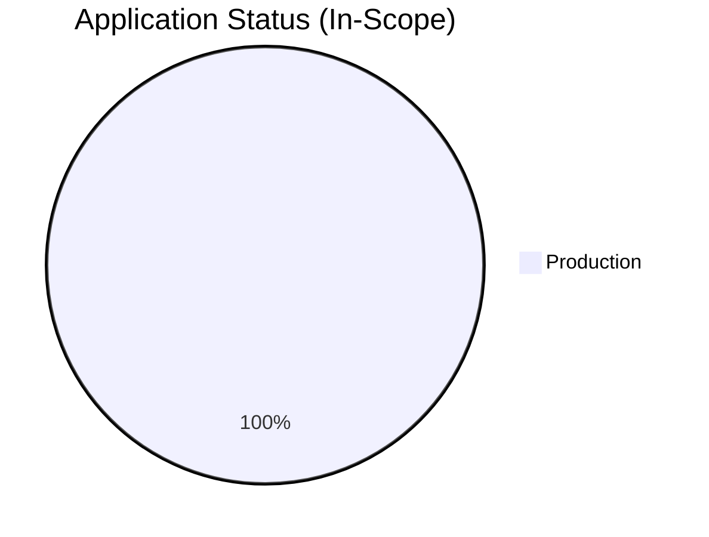
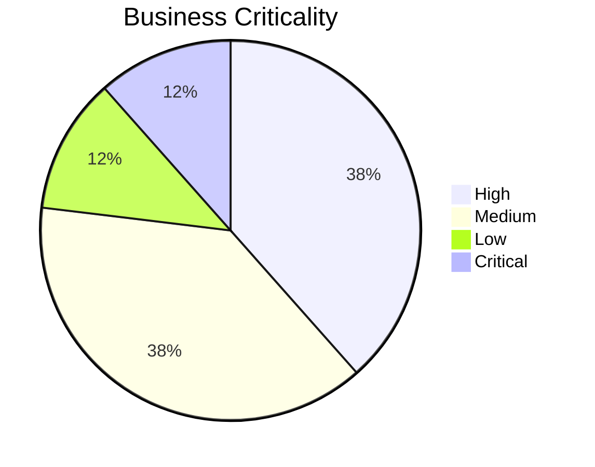
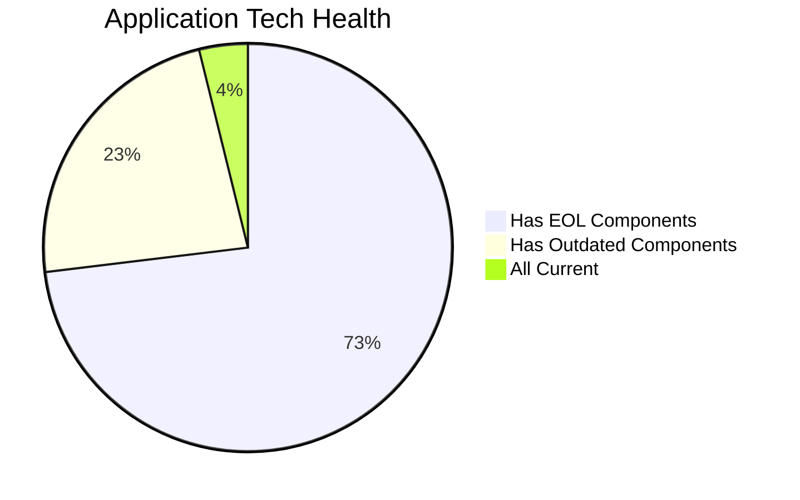

# Portfolio Modernization Report

> Analysis ID: portfolio_analysis_2025 | Timestamp: 2025-07-15T00:00:00Z

## Executive Summary

This portfolio modernization analysis covers **26 in-scope applications** (4 retired applications excluded) across multiple business units. The assessment identifies significant technical debt: **19 applications** have at least one EOL component and **6 applications** have outdated components requiring attention. The total estimated modernization investment is **$6,842,188** with projected annual savings of **$3,823,200**, yielding a payback period of **1.79 years** and a 5-year net benefit of **$12,273,812**. Priority actions include containerizing eligible custom applications, migrating AIX-based legacy systems, and upgrading EOL databases and application servers.

## Portfolio Overview

### Application Status Distribution

### Business Criticality Distribution

### Technology Health Overview

### Portfolio Statistics

| Metric | Value |
|--------|-------|
| Total Applications | 30 |
| In-Scope (Analyzed) | 26 |
| Retired (Out of Scope) | 4 |
| Applications with EOL Components | 19 |
| Applications with Outdated Components | 6 |
| Total Modernization Cost | $6,842,188.17 |
| Total Annual Savings | $3,823,200.00 |
| Payback Period | 1.79 years |
| 5-Year Net Benefit | $12,273,811.83 |

## Top Modernization Opportunities

| App ID | Name | Complexity | Total Cost | Annual Savings | Payback |
|--------|------|-----------|-----------|----------------|---------|
| app017 | BackupApp-017 | 7 (HIGH) | $539,984 | $238,500 | 2.26 yrs |
| app020 | TrainingApp-020 | 6 (MEDIUM) | $469,551 | $265,000 | 1.77 yrs |
| app021 | FleetApp-021 | 6 (MEDIUM) | $456,830 | $253,700 | 1.8 yrs |
| app024 | AuditApp-024 | 6 (MEDIUM) | $456,830 | $253,700 | 1.8 yrs |
| app006 | SupportApp-006 | 6 (MEDIUM) | $440,638 | $250,000 | 1.76 yrs |
| app002 | CRMApp-002 | 6 (MEDIUM) | $429,073 | $240,000 | 1.79 yrs |
| app014 | DocumentApp-014 | 6 (MEDIUM) | $416,351 | $228,700 | 1.82 yrs |
| app010 | PayrollApp-010 | 5 (MEDIUM) | $362,044 | $228,700 | 1.58 yrs |
| app004 | HRApp-004 | 6 (MEDIUM) | $342,333 | $165,000 | 2.07 yrs |
| app001 | ERPApp-001 | 6 (MEDIUM) | $331,115 | $160,900 | 2.06 yrs |

## Scenario Applicability Matrix

| App | OS Secur | Switch t | ARM CPU | App Serv | Cloud De | Containe | Refactor | DB Upgra | Open Sou | Update C |
|-----|---------:|---------:|---------:|---------:|---------:|---------:|---------:|---------:|---------:|---------:|
| [app001](apps/app001.md) | 🔧 | 🔧 | 🚫 | ➖ | 🚫 | 🚫 | 🔧 | 🔧 | 🔧 | 🔧 |
| [app002](apps/app002.md) | 🔧 | ✅ | 🔧 | 🔧 | 🔧 | 🔧 | 🔧 | ✅ | ✅ | 🔧 |
| [app003](apps/app003.md) | 🔧 | ✅ | 🔧 | 🔧 | 🔧 | ✅ | ✅ | 🔧 | ✅ | 🔧 |
| [app004](apps/app004.md) | 🔧 | ➖ | 🔧 | 🔧 | 🔧 | ✅ | 🔧 | ✅ | 🔧 | 🔧 |
| [app006](apps/app006.md) | 🔧 | ✅ | 🔧 | 🔧 | 🔧 | 🔧 | 🔧 | 🔧 | ✅ | 🔧 |
| [app008](apps/app008.md) | 🔧 | 🔧 | 🚫 | 🔧 | 🚫 | 🚫 | 🔧 | ✅ | 🔧 | 🔧 |
| [app010](apps/app010.md) | ✅ | ➖ | 🔧 | ✅ | 🔧 | 🔧 | 🔧 | ✅ | ✅ | 🔧 |
| [app011](apps/app011.md) | 🔧 | ✅ | 🔧 | 🔧 | 🔧 | ✅ | ✅ | ✅ | ✅ | 🔧 |
| [app012](apps/app012.md) | ✅ | ➖ | 🔧 | ✅ | 🔧 | ✅ | 🔧 | ✅ | ✅ | 🔧 |
| [app013](apps/app013.md) | 🔧 | ✅ | 🔧 | 🔧 | 🔧 | 🔧 | ✅ | ✅ | 🔧 | 🔧 |
| [app014](apps/app014.md) | ✅ | ➖ | 🔧 | ✅ | 🔧 | 🔧 | 🔧 | ✅ | ✅ | 🔧 |
| [app015](apps/app015.md) | ✅ | ➖ | 🔧 | ✅ | 🔧 | 🔧 | 🔧 | 🔧 | ✅ | 🔧 |
| [app016](apps/app016.md) | 🔧 | ✅ | 🔧 | 🔧 | 🔧 | ✅ | ✅ | ✅ | 🔧 | 🔧 |
| [app017](apps/app017.md) | 🔧 | ✅ | 🔧 | 🔧 | 🔧 | 🔧 | 🔧 | 🔧 | 🔧 | 🔧 |
| [app018](apps/app018.md) | 🔧 | ✅ | 🔧 | 🔧 | 🔧 | 🔧 | ✅ | 🔧 | ✅ | 🔧 |
| [app019](apps/app019.md) | ✅ | ✅ | 🔧 | ✅ | 🔧 | 🔧 | ✅ | ✅ | ✅ | 🔧 |
| [app020](apps/app020.md) | 🔧 | ➖ | 🔧 | 🔧 | 🔧 | 🔧 | 🔧 | 🔧 | 🔧 | 🔧 |
| [app021](apps/app021.md) | ✅ | ➖ | 🔧 | ✅ | 🔧 | 🔧 | 🔧 | 🔧 | 🔧 | 🔧 |
| [app022](apps/app022.md) | 🔧 | ✅ | 🔧 | ✅ | 🔧 | ✅ | ✅ | ✅ | ✅ | 🔧 |
| [app023](apps/app023.md) | ✅ | ✅ | 🔧 | ✅ | 🔧 | ✅ | ✅ | 🔧 | ✅ | 🔧 |
| [app024](apps/app024.md) | ✅ | ➖ | 🔧 | ✅ | 🔧 | 🔧 | 🔧 | 🔧 | 🔧 | 🔧 |
| [app025](apps/app025.md) | ✅ | ➖ | 🔧 | ✅ | 🔧 | ✅ | 🔧 | ✅ | ✅ | ✅ |
| [app026](apps/app026.md) | 🔧 | 🔧 | 🚫 | ➖ | 🚫 | 🚫 | 🔧 | 🔧 | 🔧 | 🔧 |
| [app027](apps/app027.md) | 🔧 | ✅ | 🔧 | 🔧 | 🔧 | 🔧 | ✅ | ✅ | 🔧 | 🔧 |
| [app028](apps/app028.md) | ✅ | ➖ | 🔧 | ✅ | 🔧 | ✅ | 🔧 | 🔧 | 🔧 | 🔧 |
| [app030](apps/app030.md) | ✅ | ✅ | 🔧 | 🔧 | 🔧 | ✅ | ✅ | 🔧 | ✅ | 🔧 |

## Financial Summary by Application

| App ID | Name | Score | Total Cost | Annual Savings | 5-Yr Benefit |
|--------|------|-------|-----------|----------------|--------------|
| [app001](apps/app001.md) | ERPApp-001 | 6 | $331,115 | $160,900 | $473,385 |
| [app002](apps/app002.md) | CRMApp-002 | 6 | $429,073 | $240,000 | $770,927 |
| [app003](apps/app003.md) | AnalyticsApp-003 | 5 | $31,176 | $25,000 | $93,824 |
| [app004](apps/app004.md) | HRApp-004 | 6 | $342,333 | $165,000 | $482,667 |
| [app006](apps/app006.md) | SupportApp-006 | 6 | $440,638 | $250,000 | $809,362 |
| [app008](apps/app008.md) | InventoryApp-008 | 6 | $331,115 | $161,700 | $477,385 |
| [app010](apps/app010.md) | PayrollApp-010 | 5 | $362,044 | $228,700 | $781,456 |
| [app011](apps/app011.md) | RouteOptApp-011 | 5 | $21,119 | $15,000 | $53,881 |
| [app012](apps/app012.md) | IoTSensorApp-012 | 5 | $261,476 | $138,700 | $432,024 |
| [app013](apps/app013.md) | SecurityApp-013 | 7 | $194,181 | $108,500 | $348,319 |
| [app014](apps/app014.md) | DocumentApp-014 | 6 | $416,351 | $228,700 | $727,149 |
| [app015](apps/app015.md) | ReportingApp-015 | 4 | $323,566 | $238,700 | $869,934 |
| [app016](apps/app016.md) | MobileApp-016 | 6 | $53,200 | $30,000 | $96,800 |
| [app017](apps/app017.md) | BackupApp-017 | 7 | $539,984 | $238,500 | $652,516 |
| [app018](apps/app018.md) | VendorApp-018 | 7 | $174,231 | $103,500 | $343,269 |
| [app019](apps/app019.md) | QualityApp-019 | 5 | $110,625 | $93,700 | $357,875 |
| [app020](apps/app020.md) | TrainingApp-020 | 6 | $469,551 | $265,000 | $855,449 |
| [app021](apps/app021.md) | FleetApp-021 | 6 | $456,830 | $253,700 | $811,670 |
| [app022](apps/app022.md) | ComplianceApp-022 | 6 | $12,722 | $4,200 | $8,278 |
| [app023](apps/app023.md) | ChatbotApp-023 | 5 | $20,114 | $13,700 | $48,386 |
| [app024](apps/app024.md) | AuditApp-024 | 6 | $456,830 | $253,700 | $811,670 |
| [app025](apps/app025.md) | PortalApp-025 | 4 | $227,371 | $138,700 | $466,129 |
| [app026](apps/app026.md) | LegacyFinApp-026 | 6 | $331,115 | $160,900 | $473,385 |
| [app027](apps/app027.md) | DataWarehouseApp-027 | 6 | $168,853 | $120,000 | $431,147 |
| [app028](apps/app028.md) | NotificationApp-028 | 5 | $296,675 | $163,700 | $521,825 |
| [app030](apps/app030.md) | APIGatewayApp-030 | 7 | $39,900 | $23,000 | $75,100 |

## Risk Applications

### Applications with EOL Components

| App ID | Name | Criticality | EOL Components |
|--------|------|------------|----------------|
| [app002](apps/app002.md) | CRMApp-002 | Medium | RHEL 7, Websphere 7.0 |
| [app003](apps/app003.md) | AnalyticsApp-003 | Low | RHEL 7, Apache Tomcat 6.1 |
| [app004](apps/app004.md) | HRApp-004 | High | Windows Server 2012, Microsoft IIS 8.0 |
| [app006](apps/app006.md) | SupportApp-006 | Medium | Debian 6 |
| [app008](apps/app008.md) | InventoryApp-008 | High | AIX 6, Oracle Weblogic 8.0 |
| [app010](apps/app010.md) | PayrollApp-010 | Medium | Ruby 2.7 |
| [app011](apps/app011.md) | RouteOptApp-011 | Medium | CentOS 7, Glassfish 4.0 |
| [app013](apps/app013.md) | SecurityApp-013 | Critical | Debian 7, Websphere 8.0 |
| [app014](apps/app014.md) | DocumentApp-014 | Medium | C# .NET 6 |
| [app016](apps/app016.md) | MobileApp-016 | Medium | RHEL 7, Payara 4.0 |
| [app017](apps/app017.md) | BackupApp-017 | High | RHEL 7, Oracle 12c |
| [app018](apps/app018.md) | VendorApp-018 | Medium | RHEL 7, Java 8, Glassfish 4.5 |
| [app019](apps/app019.md) | QualityApp-019 | High | Python 3.8 |
| [app020](apps/app020.md) | TrainingApp-020 | Low | Windows Server 2012, Microsoft IIS 8.5 |
| [app021](apps/app021.md) | FleetApp-021 | High | Oracle 11g |
| [app022](apps/app022.md) | ComplianceApp-022 | Critical | RHEL 7 |
| [app024](apps/app024.md) | AuditApp-024 | High | SQL Server 2014 |
| [app027](apps/app027.md) | DataWarehouseApp-027 | High | RHEL 7 |
| [app030](apps/app030.md) | APIGatewayApp-030 | High | MySQL 5.7, Glassfish 3.0 |

### Critical Business Applications

| App ID | Name | EOL Components | Outdated Components |
|--------|------|---------------|---------------------|
| [app013](apps/app013.md) | SecurityApp-013 | Debian 7, Websphere 8.0 | None |
| [app022](apps/app022.md) | ComplianceApp-022 | RHEL 7 | None |
| [app026](apps/app026.md) | LegacyFinApp-026 | None | AIX 7.2, FORTRAN 2018, DB2 |

## Per-Application Reports

| App ID | Name | Criticality | Complexity | Report |
|--------|------|------------|-----------|--------|
| app001 | ERPApp-001 | High | 6 (MEDIUM) | [View Report](apps/app001.md) |
| app002 | CRMApp-002 | Medium | 6 (MEDIUM) | [View Report](apps/app002.md) |
| app003 | AnalyticsApp-003 | Low | 5 (MEDIUM) | [View Report](apps/app003.md) |
| app004 | HRApp-004 | High | 6 (MEDIUM) | [View Report](apps/app004.md) |
| app006 | SupportApp-006 | Medium | 6 (MEDIUM) | [View Report](apps/app006.md) |
| app008 | InventoryApp-008 | High | 6 (MEDIUM) | [View Report](apps/app008.md) |
| app010 | PayrollApp-010 | Medium | 5 (MEDIUM) | [View Report](apps/app010.md) |
| app011 | RouteOptApp-011 | Medium | 5 (MEDIUM) | [View Report](apps/app011.md) |
| app012 | IoTSensorApp-012 | High | 5 (MEDIUM) | [View Report](apps/app012.md) |
| app013 | SecurityApp-013 | Critical | 7 (HIGH) | [View Report](apps/app013.md) |
| app014 | DocumentApp-014 | Medium | 6 (MEDIUM) | [View Report](apps/app014.md) |
| app015 | ReportingApp-015 | Low | 4 (MEDIUM) | [View Report](apps/app015.md) |
| app016 | MobileApp-016 | Medium | 6 (MEDIUM) | [View Report](apps/app016.md) |
| app017 | BackupApp-017 | High | 7 (HIGH) | [View Report](apps/app017.md) |
| app018 | VendorApp-018 | Medium | 7 (HIGH) | [View Report](apps/app018.md) |
| app019 | QualityApp-019 | High | 5 (MEDIUM) | [View Report](apps/app019.md) |
| app020 | TrainingApp-020 | Low | 6 (MEDIUM) | [View Report](apps/app020.md) |
| app021 | FleetApp-021 | High | 6 (MEDIUM) | [View Report](apps/app021.md) |
| app022 | ComplianceApp-022 | Critical | 6 (MEDIUM) | [View Report](apps/app022.md) |
| app023 | ChatbotApp-023 | Medium | 5 (MEDIUM) | [View Report](apps/app023.md) |
| app024 | AuditApp-024 | High | 6 (MEDIUM) | [View Report](apps/app024.md) |
| app025 | PortalApp-025 | Medium | 4 (MEDIUM) | [View Report](apps/app025.md) |
| app026 | LegacyFinApp-026 | Critical | 6 (MEDIUM) | [View Report](apps/app026.md) |
| app027 | DataWarehouseApp-027 | High | 6 (MEDIUM) | [View Report](apps/app027.md) |
| app028 | NotificationApp-028 | Medium | 5 (MEDIUM) | [View Report](apps/app028.md) |
| app030 | APIGatewayApp-030 | High | 7 (HIGH) | [View Report](apps/app030.md) |

### Retired Applications (Out of Scope)

| App ID | Name |
|--------|------|
| app005 | EComApp-005 |
| app007 | FinanceApp-007 |
| app009 | MarketingApp-009 |
| app029 | ConfigApp-029 |
